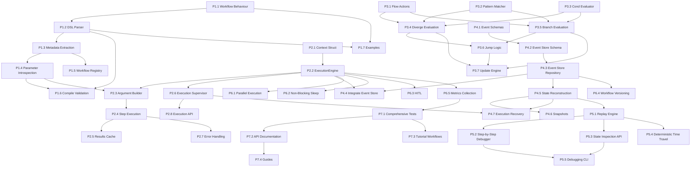

# Implementation Tasks - Cerebelum Core

**Status:** Planning
**Created:** 2025-11-01
**Based on:** [Workflow Syntax Design](../design/workflow-syntax.md)

---

## Table of Contents

1. [Overview](#overview)
2. [Task Organization](#task-organization)
3. [Phase 1: Workflow DSL Foundation](#phase-1-workflow-dsl-foundation)
4. [Phase 2: Execution Engine Core](#phase-2-execution-engine-core)
5. [Phase 3: Flow Control & Pattern Matching](#phase-3-flow-control--pattern-matching)
6. [Phase 4: Event Sourcing & Persistence](#phase-4-event-sourcing--persistence)
7. [Phase 5: Time-Travel Debugging](#phase-5-time-travel-debugging)
8. [Phase 6: Advanced Features](#phase-6-advanced-features)
9. [Phase 7: Testing & Documentation](#phase-7-testing--documentation)
10. [Dependencies Graph](#dependencies-graph)

---

## Overview

This document breaks down the implementation of Cerebelum's code-first workflow system into concrete, actionable tasks.

**Estimated Total:** 190-230 developer days across 7 phases (includes day-1 scalability with Horde, 3-level caching, and 64-partition database)

**Key Architectural Decision**: We use **Horde (distributed supervisor/registry) from Day 1** (Phase 2) instead of migrating later. This ensures the same architecture scales from 1 node to 1000 nodes without code changes. See [Day 1 Scalability](../design/day-1-scalability.md) for rationale.

**Key Principles:**
- Follow Clean Architecture (Domain → Application → Infrastructure → Presentation)
- Test-first development (write tests before implementation)
- Incremental delivery (each phase is independently deployable)
- Maintain backwards compatibility after Phase 2

---

## Task Organization

### Task Format

Each task follows this structure:

```markdown
### [PHASE-ID] Task Name

**Estimate:** X days
**Dependencies:** [TASK-IDs]
**Layer:** Domain/Application/Infrastructure/Presentation
**Priority:** Critical/High/Medium/Low

**Description:** Brief description

**Acceptance Criteria:**
- [ ] Criterion 1
- [ ] Criterion 2

**Implementation Notes:**
- Technical details
- Design considerations

**Testing Requirements:**
- Unit tests
- Integration tests
- Property-based tests (if applicable)
```

### Priority Levels

- **Critical:** Blocking for entire phase
- **High:** Blocking for some tasks
- **Medium:** Important but not blocking
- **Low:** Nice to have, can be deferred

---

## Phase 1: Workflow DSL Foundation

**Goal:** Enable developers to write workflow definitions using the `use Cerebelum.Workflow` macro

**Duration:** 25-30 days

**Deliverables:**
- Working `workflow` macro that parses timeline/diverge/branch blocks
- Compile-time validation of workflow structure
- Workflow metadata extraction
- Basic workflow registry

---

### [P1.1] Create Workflow Behaviour Module

**Estimate:** 2 days
**Dependencies:** None
**Layer:** Domain
**Priority:** Critical

**Description:** Define the core `Cerebelum.Workflow` behaviour that all workflows must implement.

**Acceptance Criteria:**
- [ ] `Cerebelum.Workflow` behaviour module exists
- [ ] Defines required callbacks: `__workflow_metadata__/0`
- [ ] Defines optional callbacks for hooks
- [ ] Module documentation is complete

**Implementation Notes:**
```elixir
defmodule Cerebelum.Workflow do
  @moduledoc """
  Behaviour for defining deterministic workflows.
  """

  @callback __workflow_metadata__() :: %{
    timeline: [atom()],
    diverges: %{atom() => term()},
    branches: %{atom() => term()},
    version: String.t()
  }

  defmacro __using__(_opts) do
    quote do
      @behaviour Cerebelum.Workflow
      import Cerebelum.Workflow.DSL
      Module.register_attribute(__MODULE__, :cerebelum_timeline, accumulate: false)
      Module.register_attribute(__MODULE__, :cerebelum_diverges, accumulate: true)
      Module.register_attribute(__MODULE__, :cerebelum_branches, accumulate: true)
    end
  end
end
```

**Testing Requirements:**
- Unit test: behaviour definition is correct
- Unit test: `__using__` macro sets up module attributes

---

### [P1.2] Implement DSL Macro Parser

**Estimate:** 5 days
**Dependencies:** [P1.1]
**Layer:** Domain
**Priority:** Critical

**Description:** Parse `workflow`, `timeline`, `diverge`, and `branch` blocks from AST.

**Acceptance Criteria:**
- [ ] `workflow` macro extracts timeline, diverge, and branch blocks
- [ ] Timeline parser extracts function call sequence from `|>` pipeline
- [ ] Diverge parser extracts pattern → action mappings
- [ ] Branch parser extracts pattern → action mappings
- [ ] Compile-time error if workflow block is malformed
- [ ] Compile-time error if timeline has invalid syntax

**Implementation Notes:**
```elixir
defmodule Cerebelum.Workflow.DSL do
  defmacro workflow(do: block) do
    {timeline, diverges, branches} = parse_workflow_block(block)

    quote do
      @cerebelum_timeline unquote(timeline)
      @cerebelum_diverges unquote(diverges)
      @cerebelum_branches unquote(branches)

      def __workflow_metadata__ do
        %{
          timeline: @cerebelum_timeline,
          diverges: @cerebelum_diverges |> Enum.into(%{}),
          branches: @cerebelum_branches |> Enum.into(%{}),
          version: compute_version()
        }
      end
    end
  end

  defmacro timeline(do: block) do
    # Parse pipeline into list of function atoms
    parse_timeline_pipeline(block)
  end

  defmacro diverge(opts, do: block) do
    # Parse diverge block
    parse_diverge_block(opts, block)
  end

  defmacro branch(opts, do: block) do
    # Parse branch block
    parse_branch_block(opts, block)
  end

  # Helper to parse AST
  defp parse_timeline_pipeline({:|>, _, [left, right]}) do
    # Recursively walk pipeline
  end

  defp parse_diverge_block([from: function], block) do
    # Extract pattern → action clauses
  end
end
```

**Testing Requirements:**
- Unit test: parse simple timeline with 3 steps
- Unit test: parse timeline with 10+ steps
- Unit test: parse diverge with multiple patterns
- Unit test: parse branch with cond block
- Unit test: raise error on invalid timeline syntax
- Unit test: raise error on missing `from:` in diverge
- Property test: any valid timeline parses correctly

---

### [P1.3] Implement Workflow Metadata Extraction

**Estimate:** 3 days
**Dependencies:** [P1.2]
**Layer:** Domain
**Priority:** Critical

**Description:** Extract function list, dependencies, and graph structure from workflow definition.

**Acceptance Criteria:**
- [ ] `__workflow_metadata__/0` returns complete metadata map
- [ ] Metadata includes timeline as ordered list of atoms
- [ ] Metadata includes diverge definitions
- [ ] Metadata includes branch definitions
- [ ] Metadata includes workflow version (SHA256 of bytecode)
- [ ] Functions can introspect their own dependencies

**Implementation Notes:**
```elixir
defmodule Cerebelum.Workflow.Metadata do
  def extract(module) do
    metadata = module.__workflow_metadata__()

    %{
      module: module,
      timeline: metadata.timeline,
      diverges: metadata.diverges,
      branches: metadata.branches,
      version: metadata.version,
      functions: extract_functions(module, metadata.timeline),
      graph: build_graph(metadata)
    }
  end

  defp extract_functions(module, timeline) do
    Enum.map(timeline, fn function_name ->
      {function_name, introspect_function(module, function_name)}
    end)
    |> Enum.into(%{})
  end

  defp introspect_function(module, function_name) do
    # Use BEAM introspection to get:
    # - Arity
    # - Parameter patterns
    # - Dependencies (from pattern matching)
  end

  defp build_graph(metadata) do
    # Build directed graph from timeline + diverges + branches
  end
end
```

**Testing Requirements:**
- Unit test: extract metadata from simple workflow
- Unit test: extract metadata from complex workflow (bank reconciliation)
- Unit test: version changes when workflow code changes
- Unit test: version stays same when comments change

---

### [P1.4] Implement Function Parameter Introspection

**Estimate:** 5 days
**Dependencies:** [P1.3]
**Layer:** Infrastructure
**Priority:** Critical

**Description:** Use BEAM bytecode introspection to extract function parameter patterns.

**Acceptance Criteria:**
- [ ] Can extract parameter patterns from function definition
- [ ] Can identify context parameter (first param)
- [ ] Can extract atom keys from map pattern (second param)
- [ ] Works with multiple pattern match clauses
- [ ] Works with guards
- [ ] Compile-time warning if function arity doesn't match expected

**Implementation Notes:**
```elixir
defmodule Cerebelum.Workflow.Introspection do
  @doc """
  Extract parameter patterns from a function.

  Returns: {:ok, [:context, [:atom1, :atom2]]} or {:error, reason}
  """
  def introspect_params(module, function_name) do
    with {:ok, abstract_code} <- get_abstract_code(module),
         {:ok, function_ast} <- find_function(abstract_code, function_name),
         {:ok, params} <- extract_params(function_ast) do
      {:ok, params}
    end
  end

  defp get_abstract_code(module) do
    case :beam_lib.chunks(module, [:abstract_code]) do
      {:ok, {^module, [{:abstract_code, {_, abstract_code}}]}} ->
        {:ok, abstract_code}

      error ->
        {:error, error}
    end
  end

  defp find_function(abstract_code, function_name) do
    # Walk AST to find function definition
  end

  defp extract_params(function_ast) do
    # Parse parameter patterns from AST
    # Handle: context, %{atom1: _, atom2: _}
  end
end
```

**Testing Requirements:**
- Unit test: extract params from function with context only
- Unit test: extract params from function with map pattern
- Unit test: extract params with deep pattern matching
- Unit test: extract params with guards
- Unit test: handle function with multiple clauses
- Unit test: error on non-existent function

---

### [P1.5] Implement Workflow Registry

**Estimate:** 3 days
**Dependencies:** [P1.3]
**Layer:** Infrastructure
**Priority:** High

**Description:** Registry to store and lookup workflow modules and metadata.

**Acceptance Criteria:**
- [ ] Can register a workflow module
- [ ] Can lookup workflow by module name
- [ ] Can lookup workflow by version
- [ ] Can list all registered workflows
- [ ] Registry is persistent (survives restarts)
- [ ] Registry detects and stores multiple versions of same workflow

**Implementation Notes:**
```elixir
defmodule Cerebelum.Workflow.Registry do
  use GenServer

  def start_link(_) do
    GenServer.start_link(__MODULE__, [], name: __MODULE__)
  end

  def register(module) do
    metadata = Cerebelum.Workflow.Metadata.extract(module)
    GenServer.call(__MODULE__, {:register, metadata})
  end

  def lookup(module) do
    GenServer.call(__MODULE__, {:lookup, module})
  end

  def lookup_by_version(version) do
    GenServer.call(__MODULE__, {:lookup_version, version})
  end

  # State: %{module => [versions]}
  def init(_) do
    {:ok, %{}}
  end

  def handle_call({:register, metadata}, _from, state) do
    # Store workflow metadata
    # Index by module and version
  end
end
```

**Testing Requirements:**
- Unit test: register and lookup workflow
- Unit test: register multiple versions of same workflow
- Unit test: lookup by version
- Integration test: registry persists across GenServer restarts

---

### [P1.6] Implement Compile-Time Validation

**Estimate:** 4 days
**Dependencies:** [P1.2, P1.4]
**Layer:** Domain
**Priority:** High

**Description:** Validate workflow structure at compile-time.

**Acceptance Criteria:**
- [ ] Error if timeline references non-existent function
- [ ] Error if diverge `from:` references non-existent step
- [ ] Error if branch `from:` references non-existent step
- [ ] Error if function arity doesn't match expected (1 or 2)
- [ ] Error if function dependencies are circular
- [ ] Warning if function is defined but not used in workflow
- [ ] Warning if diverge/branch never matches (dead code)

**Implementation Notes:**
```elixir
defmodule Cerebelum.Workflow.Validator do
  def validate_at_compile_time(module) do
    metadata = module.__workflow_metadata__()

    with :ok <- validate_timeline_functions_exist(module, metadata),
         :ok <- validate_diverge_references(metadata),
         :ok <- validate_branch_references(metadata),
         :ok <- validate_function_arities(module, metadata),
         :ok <- validate_no_circular_deps(metadata) do
      :ok
    else
      {:error, reason} ->
        raise CompileError, description: reason
    end
  end

  defp validate_timeline_functions_exist(module, metadata) do
    # Check each function in timeline exists and is exported
  end
end
```

**Testing Requirements:**
- Unit test: valid workflow passes
- Unit test: error on missing function
- Unit test: error on wrong arity
- Unit test: error on circular dependency
- Unit test: warning on unused function

---

### [P1.7] Create Example Workflows

**Estimate:** 3 days
**Dependencies:** [P1.1, P1.2]
**Layer:** Application
**Priority:** Medium

**Description:** Implement example workflows to validate DSL usability.

**Acceptance Criteria:**
- [ ] Bank reconciliation workflow (from design doc)
- [ ] Simple counter workflow
- [ ] E-commerce order processing workflow
- [ ] All examples compile without errors
- [ ] All examples have comprehensive documentation

**Implementation Notes:**
- Use examples to dogfood the DSL
- Discover usability issues early
- Create templates for common patterns

**Testing Requirements:**
- Unit test: each example workflow compiles
- Unit test: metadata extraction works for each example

---

## Phase 2: Execution Engine Core

**Goal:** Execute workflows step-by-step, managing context and results cache. **Uses Horde for distributed execution from day 1.**

**Duration:** 38-43 days (includes Horde integration + 3-level caching)

**Deliverables:**
- Working execution engine (GenStateMachine)
- State machine with explicit states and transitions
- Context management
- Results cache
- Basic error handling
- Simple timeline execution (no diverge/branch yet)

---

### [P2.1] Define Context Struct

**Estimate:** 2 days
**Dependencies:** None
**Layer:** Domain
**Priority:** Critical

**Description:** Define the immutable Context struct that flows through executions.

**Acceptance Criteria:**
- [ ] `Cerebelum.Context` struct defined
- [ ] All required fields documented
- [ ] Validation function for context
- [ ] Helper functions for common operations (increment_retry, add_tag)
- [ ] Typespec for Context

**Implementation Notes:**
```elixir
defmodule Cerebelum.Context do
  @enforce_keys [:execution_id, :workflow_module, :workflow_version, :started_at]
  defstruct [
    # Identity
    :execution_id,        # UUID
    :workflow_module,     # Module atom
    :workflow_version,    # SHA256
    :correlation_id,      # For distributed tracing

    # Timestamps (deterministic)
    :started_at,
    :updated_at,

    # User inputs (from execute_workflow call)
    inputs: %{},

    # Workflow state
    retry_count: 0,
    iteration: 0,
    current_step: nil,

    # Metadata
    tags: [],
    metadata: %{}
  ]

  @type t :: %__MODULE__{
    execution_id: String.t(),
    workflow_module: module(),
    workflow_version: String.t(),
    # ...
  }

  def new(workflow_module, inputs, opts \\ []) do
    # Create new context
  end

  def increment_retry_count(%__MODULE__{} = context) do
    %{context | retry_count: context.retry_count + 1}
  end

  def add_tag(%__MODULE__{} = context, tag) do
    %{context | tags: [tag | context.tags]}
  end
end
```

**Testing Requirements:**
- Unit test: create valid context
- Unit test: enforce required keys
- Unit test: helper functions work
- Property test: context is always immutable

---

### [P2.2] Implement Execution Engine State Machine

**Estimate:** 7 days
**Dependencies:** [P2.1]
**Layer:** Infrastructure
**Priority:** Critical

**Description:** Core execution engine as a GenStateMachine (gen_statem) that manages workflow execution with explicit states and transitions.

**Acceptance Criteria:**
- [ ] `Cerebelum.ExecutionEngine` using `:gen_statem` behaviour
- [ ] Explicit states defined: :initializing, :executing_step, :evaluating_diverge, :evaluating_branch, :sleeping, :waiting_for_approval, :completed, :failed
- [ ] State transitions are explicit and documented
- [ ] Can start execution with workflow module and inputs
- [ ] Maintains execution data (context, results cache, current step)
- [ ] Executes timeline steps sequentially
- [ ] Handles function return values ({:ok, result}, {:sleep, opts}, {:wait_for_approval, opts})
- [ ] Stores results in cache
- [ ] Stops on completion or failure
- [ ] State timeouts per state (e.g., 5min for step execution)
- [ ] Uses internal events for state transitions

**Implementation Notes:**
```elixir
defmodule Cerebelum.ExecutionEngine do
  @moduledoc """
  Execution engine implemented as a state machine using gen_statem.

  ## States
  - :initializing - Setting up execution
  - :executing_step - Running current step function
  - :evaluating_diverge - Checking diverge conditions (Phase 3)
  - :evaluating_branch - Checking branch conditions (Phase 3)
  - :sleeping - Paused (sleep) (Phase 6)
  - :waiting_for_approval - Paused (HITL) (Phase 6)
  - :completed - Successfully finished
  - :failed - Failed with error

  ## State Transitions
  :initializing -> :executing_step (on start)
  :executing_step -> :evaluating_diverge (after step, if diverge exists)
  :executing_step -> :evaluating_branch (after step, if no diverge)
  :executing_step -> :sleeping (on {:sleep, ...})
  :executing_step -> :waiting_for_approval (on {:wait_for_approval, ...})
  :executing_step -> :failed (on error)
  :evaluating_diverge -> :executing_step (on continue/back_to/skip_to)
  :evaluating_branch -> :executing_step (on continue/skip_to)
  :evaluating_branch -> :completed (if finished)
  :sleeping -> :executing_step (on timeout)
  :waiting_for_approval -> :executing_step (on approval)
  """

  @behaviour :gen_statem

  defstruct [
    :context,
    :workflow_metadata,
    results: %{},
    current_step_index: 0,
    error: nil
  ]

  # Public API
  def start_link(opts) do
    :gen_statem.start_link(__MODULE__, opts, [])
  end

  def get_status(pid) do
    :gen_statem.call(pid, :get_status)
  end

  # gen_statem callbacks
  @impl true
  def callback_mode, do: [:state_functions, :state_enter]

  @impl true
  def init(opts) do
    workflow_module = Keyword.fetch!(opts, :workflow_module)
    inputs = Keyword.fetch!(opts, :inputs)

    data = %__MODULE__{
      context: Context.new(workflow_module, inputs),
      workflow_metadata: Metadata.extract(workflow_module)
    }

    # Start in :initializing state, transition to :executing_step
    {:ok, :initializing, data, [{:next_event, :internal, :start}]}
  end

  # State: :initializing
  def initializing(:internal, :start, data) do
    # Log execution started event
    Logger.info("Starting execution: #{data.context.execution_id}")

    # Transition to first step
    {:next_state, :executing_step, data, [{:next_event, :internal, :execute}]}
  end

  # State: :executing_step
  def executing_step(:enter, _old_state, data) do
    # Entry action: log step start
    Logger.debug("Executing step: #{get_current_step_name(data)}")

    # Set timeout for step execution (5 minutes)
    {:keep_state, data, [{:state_timeout, 5 * 60 * 1000, :step_timeout}]}
  end

  def executing_step(:internal, :execute, data) do
    case execute_current_step(data) do
      {:ok, result, new_data} ->
        # Store result and advance
        data_with_result = store_result(new_data, result)
        next_data = advance_to_next_step(data_with_result)

        # Check if finished
        if finished?(next_data) do
          {:next_state, :completed, next_data}
        else
          # Continue to next step (for Phase 2, no diverge/branch yet)
          {:next_state, :executing_step, next_data, [{:next_event, :internal, :execute}]}
        end

      {:error, reason, new_data} ->
        {:next_state, :failed, %{new_data | error: reason}}
    end
  end

  def executing_step(:state_timeout, :step_timeout, data) do
    Logger.error("Step execution timeout")
    {:next_state, :failed, %{data | error: :step_timeout}}
  end

  def executing_step({:call, from}, :get_status, data) do
    status = %{
      state: :executing_step,
      current_step: get_current_step_name(data),
      progress: "#{data.current_step_index}/#{length(data.workflow_metadata.timeline)}"
    }
    {:keep_state, data, [{:reply, from, {:ok, status}}]}
  end

  # State: :completed
  def completed(:enter, _old_state, data) do
    Logger.info("Execution completed: #{data.context.execution_id}")
    :keep_state_and_data
  end

  # State: :failed
  def failed(:enter, _old_state, data) do
    Logger.error("Execution failed: #{inspect(data.error)}")
    :keep_state_and_data
  end

  # Helpers
  defp execute_current_step(data) do
    # Implementation in P2.4
  end

  defp get_current_step_name(data) do
    Enum.at(data.workflow_metadata.timeline, data.current_step_index)
  end

  defp finished?(data) do
    data.current_step_index >= length(data.workflow_metadata.timeline)
  end

  defp advance_to_next_step(data) do
    %{data | current_step_index: data.current_step_index + 1}
  end

  defp store_result(data, result) do
    step_name = get_current_step_name(data)
    %{data | results: Map.put(data.results, step_name, result)}
  end
end
```

**Testing Requirements:**
- Unit test: engine initializes correctly in :initializing state
- Unit test: transitions from :initializing to :executing_step
- Unit test: executes simple 3-step workflow with state transitions
- Unit test: results are cached correctly
- Unit test: step timeout triggers failure
- Unit test: get_status returns correct state
- Integration test: multiple engines can run concurrently
- Integration test: state transitions are logged correctly

---

### [P2.3] Implement Argument Builder

**Estimate:** 4 days
**Dependencies:** [P1.4, P2.2]
**Layer:** Infrastructure
**Priority:** Critical

**Description:** Build function arguments from context and results cache using introspection.

**Acceptance Criteria:**
- [ ] Can build args for function with just context
- [ ] Can build args for function with context + map pattern
- [ ] Extracts required atom keys from function signature
- [ ] Builds map from results cache with only required keys
- [ ] Error if required result not in cache (dependency not met)
- [ ] Handles optional dependencies (with default pattern matching)

**Implementation Notes:**
```elixir
defmodule Cerebelum.ExecutionEngine.ArgumentBuilder do
  alias Cerebelum.Workflow.Introspection

  def build_args(module, function_name, context, results_cache) do
    {:ok, param_patterns} = Introspection.introspect_params(module, function_name)

    args = Enum.map(param_patterns, fn
      :context ->
        context

      required_atoms when is_list(required_atoms) ->
        build_results_map(required_atoms, results_cache)
    end)

    {:ok, args}
  end

  defp build_results_map(required_atoms, cache) do
    # Extract only required keys from cache
    Map.take(cache, required_atoms)
  end
end
```

**Testing Requirements:**
- Unit test: build args for context-only function
- Unit test: build args for function with 1 dependency
- Unit test: build args for function with 3 dependencies
- Unit test: error if dependency missing from cache
- Unit test: handles partial pattern matching

---

### [P2.4] Implement Step Execution

**Estimate:** 4 days
**Dependencies:** [P2.3]
**Layer:** Infrastructure
**Priority:** Critical

**Description:** Execute a single workflow step (function call).

**Acceptance Criteria:**
- [ ] Calls function with correct arguments
- [ ] Captures return value
- [ ] Handles {:ok, result} returns
- [ ] Handles {:error, reason} returns
- [ ] Updates results cache with function name → result
- [ ] Advances to next step on success
- [ ] Logs execution events
- [ ] Measures step duration

**Implementation Notes:**
```elixir
defmodule Cerebelum.ExecutionEngine.StepExecutor do
  def execute_step(workflow_module, function_name, context, results_cache) do
    with {:ok, args} <- ArgumentBuilder.build_args(workflow_module, function_name, context, results_cache),
         start_time <- now(),
         result <- apply(workflow_module, function_name, args),
         end_time <- now() do

      event = %StepExecutedEvent{
        execution_id: context.execution_id,
        function_name: function_name,
        args: args,
        result: result,
        duration_ms: end_time - start_time
      }

      EventStore.append(event)

      case result do
        {:ok, value} ->
          {:ok, value, event}

        {:error, reason} ->
          {:error, reason, event}
      end
    end
  end
end
```

**Testing Requirements:**
- Unit test: execute successful step
- Unit test: execute failing step
- Unit test: step duration is measured
- Unit test: events are stored
- Integration test: execute full workflow

---

### [P2.5] Implement Results Cache Management

**Estimate:** 2 days
**Dependencies:** [P2.4]
**Layer:** Infrastructure
**Priority:** High

**Description:** Manage the results cache (function name → result mapping).

**Acceptance Criteria:**
- [ ] Can store result for a function
- [ ] Can retrieve result by function name
- [ ] Can check if result exists
- [ ] Can clear cache (for replay)
- [ ] Cache is immutable (returns new cache on update)
- [ ] Cache is efficient for large number of steps (use Map)

**Implementation Notes:**
```elixir
defmodule Cerebelum.ExecutionEngine.ResultsCache do
  @type t :: %{atom() => term()}

  def new, do: %{}

  def put(cache, function_name, result) when is_atom(function_name) do
    Map.put(cache, function_name, result)
  end

  def get(cache, function_name) when is_atom(function_name) do
    Map.fetch(cache, function_name)
  end

  def get!(cache, function_name) when is_atom(function_name) do
    Map.fetch!(cache, function_name)
  end

  def has?(cache, function_name) do
    Map.has_key?(cache, function_name)
  end

  def take(cache, required_atoms) when is_list(required_atoms) do
    Map.take(cache, required_atoms)
  end
end
```

**Testing Requirements:**
- Unit test: store and retrieve results
- Unit test: handle missing results
- Unit test: take multiple results
- Property test: cache is immutable

---

### [P2.6] Implement Distributed Execution Supervisor (Horde)

**Estimate:** 5 days
**Dependencies:** [P2.2]
**Layer:** Infrastructure
**Priority:** Critical

**Description:** Distributed execution supervisor using Horde for day-1 scalability. Same architecture works on 1 node or 100 nodes.

**Acceptance Criteria:**
- [ ] `Horde.Registry` for distributed execution lookup
- [ ] `Horde.DynamicSupervisor` for distributed execution supervision
- [ ] `libcluster` for automatic node discovery
- [ ] Can start new execution (Horde picks best node automatically)
- [ ] Can lookup execution by ID (works from any node in cluster)
- [ ] Can list all running executions (across entire cluster)
- [ ] Can get cluster statistics (nodes, load, executions per node)
- [ ] Executions automatically failover to other nodes on crash
- [ ] Works identically on 1 node (development) and N nodes (production)
- [ ] Zero code changes required when scaling

**Implementation Notes:**
```elixir
defmodule Cerebelum.Application do
  def start(_type, _args) do
    children = [
      Cerebelum.Repo,

      # Auto-discovery (works with 1 node!)
      {Cluster.Supervisor, [topologies(), [name: Cerebelum.ClusterSupervisor]]},

      # Horde Registry - distributed from day 1
      {Horde.Registry,
        name: Cerebelum.DistributedRegistry,
        keys: :unique,
        members: :auto  # Auto-discovery
      },

      # Horde DynamicSupervisor - distributed from day 1
      {Horde.DynamicSupervisor,
        name: Cerebelum.DistributedSupervisor,
        strategy: :one_for_one,
        members: :auto,
        distribution_strategy: Horde.UniformDistribution
      },

      # Task supervisor
      {Task.Supervisor, name: Cerebelum.TaskSupervisor},

      # PubSub
      {Phoenix.PubSub, name: Cerebelum.PubSub},

      # Cache
      Cerebelum.Cache,

      # HTTP
      CerebelumWeb.Endpoint
    ]

    Supervisor.start_link(children, strategy: :one_for_one)
  end

  defp topologies do
    [
      cerebelum: [
        # Production: Kubernetes
        strategy: Cluster.Strategy.Kubernetes.DNS,
        config: [
          service: "cerebelum-headless",
          application_name: "cerebelum",
          polling_interval: 5_000
        ]
      ],
      # Development: Epmd (single node)
      local: [
        strategy: Cluster.Strategy.Epmd,
        config: [hosts: []]
      ]
    ]
  end
end

defmodule Cerebelum.ExecutionSupervisor do
  @moduledoc """
  Distributed execution supervisor using Horde.

  Works on 1 node or 100 nodes - same code!
  """

  alias Horde.DynamicSupervisor

  def start_execution(workflow_module, inputs, opts \\ []) do
    execution_id = generate_execution_id()

    child_spec = {
      Cerebelum.ExecutionEngine,
      [
        workflow_module: workflow_module,
        inputs: inputs,
        execution_id: execution_id,
        # Via Horde.Registry - distributed lookup
        name: {:via, Horde.Registry, {Cerebelum.DistributedRegistry, execution_id}}
      ] ++ opts
    }

    # Horde picks best node automatically
    case DynamicSupervisor.start_child(Cerebelum.DistributedSupervisor, child_spec) do
      {:ok, pid} ->
        Logger.info("Started execution #{execution_id} on node #{node(pid)}")
        {:ok, %{id: execution_id, pid: pid, node: node(pid)}}

      {:error, {:already_started, pid}} ->
        {:ok, %{id: execution_id, pid: pid, node: node(pid)}}

      error ->
        error
    end
  end

  @doc "Lookup execution - works from any node"
  def lookup_execution(execution_id) do
    case Horde.Registry.lookup(Cerebelum.DistributedRegistry, execution_id) do
      [{pid, _}] -> {:ok, pid}
      [] -> {:error, :not_found}
    end
  end

  @doc "List all executions across cluster"
  def list_all_executions do
    Horde.Registry.select(Cerebelum.DistributedRegistry, [
      {{:"$1", :"$2", :"$3"}, [], [{{:"$1", :"$2"}}]}
    ])
  end

  @doc "Cluster statistics"
  def cluster_stats do
    members = Horde.DynamicSupervisor.members(Cerebelum.DistributedSupervisor)

    %{
      total_nodes: length(members),
      nodes: Enum.map(members, fn node_name ->
        %{
          node: node_name,
          executions: count_executions_on_node(node_name)
        }
      end)
    }
  end

  defp count_executions_on_node(node) do
    Horde.Registry.select(Cerebelum.DistributedRegistry, [
      {{:"$1", :"$2", :"$3"}, [{:==, {:node, :"$2"}, node}], [true]}
    ])
    |> length()
  end

  defp generate_execution_id, do: UUID.uuid4()
end
```

**Dependencies to Add:**
```elixir
# mix.exs
defp deps do
  [
    # Distributed supervisor/registry
    {:horde, "~> 0.9"},

    # Clustering
    {:libcluster, "~> 3.3"},

    # UUID generation
    {:uuid, "~> 1.1"},

    # Existing deps...
  ]
end
```

**Testing Requirements:**
- Unit test: start execution with Horde
- Unit test: lookup execution via Horde.Registry
- Unit test: list all executions
- Unit test: cluster stats with 1 node
- Integration test: start 2 nodes, verify Horde clustering
- Integration test: start execution on node 1, lookup from node 2
- Integration test: kill node with execution, verify failover to another node
- Integration test: execution state recovered from events after failover
- Load test: 100K concurrent executions on single node
- Load test: 1M concurrent executions on 10 nodes

---

### [P2.7] Implement Basic Error Handling

**Estimate:** 3 days
**Dependencies:** [P2.4]
**Layer:** Infrastructure
**Priority:** High

**Description:** Handle errors during step execution (without diverge logic yet).

**Acceptance Criteria:**
- [ ] Catches exceptions raised in workflow functions
- [ ] Converts exceptions to {:error, reason} events
- [ ] Stops execution on error
- [ ] Stores error in execution state
- [ ] Logs errors with full stacktrace
- [ ] Returns error reason to caller

**Implementation Notes:**
```elixir
defmodule Cerebelum.ExecutionEngine.ErrorHandler do
  def execute_step_safely(workflow_module, function_name, args, context) do
    try do
      result = apply(workflow_module, function_name, args)
      {:ok, result}
    rescue
      exception ->
        error = %{
          exception: exception,
          stacktrace: __STACKTRACE__,
          function: function_name,
          execution_id: context.execution_id
        }

        Logger.error("Workflow execution failed", error)

        event = %StepFailedEvent{
          execution_id: context.execution_id,
          function_name: function_name,
          error: error
        }

        EventStore.append(event)

        {:error, error}
    end
  end
end
```

**Testing Requirements:**
- Unit test: handle raised exception
- Unit test: handle {:error, reason} return
- Unit test: error event is stored
- Unit test: stacktrace is captured

---

### [P2.8] Create Execution API

**Estimate:** 4 days
**Dependencies:** [P2.6]
**Layer:** Application
**Priority:** Critical

**Description:** Public API for starting and managing workflow executions.

**Acceptance Criteria:**
- [ ] `Cerebelum.execute_workflow/2` function
- [ ] `Cerebelum.get_execution_status/1` function
- [ ] `Cerebelum.stop_execution/1` function
- [ ] `Cerebelum.list_executions/0` function
- [ ] All functions have complete documentation
- [ ] All functions return consistent result tuples

**Implementation Notes:**
```elixir
defmodule Cerebelum do
  @moduledoc """
  Public API for Cerebelum workflow orchestration.
  """

  alias Cerebelum.ExecutionSupervisor

  @doc """
  Execute a workflow.

  ## Parameters
  - workflow_module: Module implementing Cerebelum.Workflow
  - inputs: Map of initial inputs

  ## Returns
  - {:ok, %{id: execution_id, pid: pid}}
  - {:error, reason}
  """
  def execute_workflow(workflow_module, inputs) do
    ExecutionSupervisor.start_execution(workflow_module, inputs)
  end

  @doc """
  Get execution status.

  ## Returns
  - {:ok, %{status: :running | :completed | :failed, ...}}
  - {:error, :not_found}
  """
  def get_execution_status(execution_id) do
    case ExecutionSupervisor.lookup_execution(execution_id) do
      {:ok, pid} ->
        :gen_statem.call(pid, :get_status)

      :error ->
        {:error, :not_found}
    end
  end
end
```

**Testing Requirements:**
- Unit test: execute workflow
- Unit test: get execution status
- Unit test: stop execution
- Integration test: full workflow execution end-to-end

---

### [P2.9] Implement L1 Cache - Persistent Term for Workflow Metadata

**Estimate:** 2 days
**Dependencies:** [P1.3]
**Layer:** Infrastructure
**Priority:** High

**Description:** Cache workflow metadata in Persistent Term for ultra-fast reads (Req 20.41, 20.44).

**Acceptance Criteria:**
- [ ] Store workflow metadata in Persistent Term on first access
- [ ] Cache hit rate >99% for metadata lookups
- [ ] 10ns read latency (BEAM native performance)
- [ ] Selective invalidation when workflow code changes
- [ ] Integrates with Cerebelum.Workflow.Metadata.extract/1

**Implementation Notes:**
```elixir
defmodule Cerebelum.Cache.L1 do
  @moduledoc """
  L1 Cache using Persistent Term for workflow metadata.

  Req 20.41: Persistent Term for immutable workflow metadata
  Req 20.44: >99% hit rate for metadata
  """

  def get_workflow_metadata(module) do
    case :persistent_term.get({:workflow_metadata, module}, nil) do
      nil ->
        # Cache miss - load and store
        metadata = Cerebelum.Workflow.Metadata.extract(module)
        :persistent_term.put({:workflow_metadata, module}, metadata)
        metadata

      metadata ->
        # Cache hit - 10ns read (Req 20.41)
        metadata
    end
  end

  # Req 20.45: Selective cache invalidation
  def invalidate_metadata(module) do
    :persistent_term.erase({:workflow_metadata, module})
  end

  def invalidate_all do
    # Only invalidate workflow metadata, not other persistent terms
    :persistent_term.get()
    |> Enum.filter(fn {{:workflow_metadata, _}, _} -> true; _ -> false end)
    |> Enum.each(fn {{:workflow_metadata, mod}, _} -> invalidate_metadata(mod) end)
  end
end
```

**Testing Requirements:**
- Unit test: cache miss loads and stores metadata
- Unit test: cache hit returns same metadata
- Unit test: invalidation clears cache
- Benchmark: verify <100ns read latency
- Integration test: metadata cached across multiple executions

---

### [P2.10] Implement L2 Cache - ETS for Execution Snapshots

**Estimate:** 3 days
**Dependencies:** [P2.2]
**Layer:** Infrastructure
**Priority:** High

**Description:** Cache execution state snapshots in ETS for fast cross-process access (Req 20.42, 20.46).

**Acceptance Criteria:**
- [ ] Create ETS table with read/write concurrency
- [ ] Store execution snapshots with TTL (1 hour default)
- [ ] 100ns read latency (ETS performance)
- [ ] Automatic TTL-based eviction on memory pressure
- [ ] Integrates with ExecutionEngine state updates
- [ ] Background cleanup process for expired snapshots

**Implementation Notes:**
```elixir
defmodule Cerebelum.Cache.L2 do
  @moduledoc """
  L2 Cache using ETS for execution snapshots.

  Req 20.42: ETS for per-node execution snapshots
  Req 20.46: TTL-based eviction on memory pressure
  """

  use GenServer

  @cleanup_interval 60_000  # 1 minute
  @default_ttl 3600  # 1 hour in seconds

  def start_link(_opts) do
    GenServer.start_link(__MODULE__, [], name: __MODULE__)
  end

  def init(_) do
    # Req 20.42: ETS with read/write concurrency
    :ets.new(:execution_snapshots, [
      :named_table,
      :public,
      read_concurrency: true,
      write_concurrency: true,
      decentralized_counters: true
    ])

    # Schedule periodic cleanup
    schedule_cleanup()

    {:ok, %{}}
  end

  def cache_snapshot(execution_id, snapshot, ttl_seconds \\ @default_ttl) do
    expiry = System.monotonic_time(:second) + ttl_seconds
    :ets.insert(:execution_snapshots, {execution_id, snapshot, expiry})
  end

  def get_snapshot(execution_id) do
    case :ets.lookup(:execution_snapshots, execution_id) do
      [{^execution_id, snapshot, expiry}] ->
        if System.monotonic_time(:second) < expiry do
          {:ok, snapshot}  # 100ns read (Req 20.42)
        else
          # Expired, remove and return miss
          :ets.delete(:execution_snapshots, execution_id)
          :miss
        end

      [] ->
        :miss
    end
  end

  # Req 20.46: TTL-based eviction
  def evict_expired do
    now = System.monotonic_time(:second)
    count = :ets.select_delete(:execution_snapshots, [
      {{:_, :_, :"$1"}, [{:<, :"$1", now}], [true]}
    ])

    if count > 0 do
      Logger.debug("Evicted #{count} expired execution snapshots")
    end

    count
  end

  def handle_info(:cleanup, state) do
    evict_expired()
    schedule_cleanup()
    {:noreply, state}
  end

  defp schedule_cleanup do
    Process.send_after(self(), :cleanup, @cleanup_interval)
  end
end
```

**Testing Requirements:**
- Unit test: store and retrieve snapshot
- Unit test: TTL expiration works
- Unit test: evict expired snapshots
- Unit test: concurrent reads work correctly
- Benchmark: verify <1μs read latency
- Integration test: cache cleanup runs periodically

---

## Phase 3: Flow Control & Pattern Matching

**Goal:** Implement diverge and branch logic with pattern matching

**Duration:** 25-30 days

**Deliverables:**
- Diverge block evaluation (error handling)
- Branch block evaluation (business logic)
- Flow control actions (continue, back_to, skip_to)
- Pattern matching engine
- Cond expression evaluation

---

### [P3.1] Implement Flow Control Actions

**Estimate:** 3 days
**Dependencies:** [P2.2]
**Layer:** Domain
**Priority:** Critical

**Description:** Define flow control actions (continue, back_to, skip_to).

**Acceptance Criteria:**
- [ ] Action structs defined (Continue, BackTo, SkipTo)
- [ ] Functions return actions from diverge/branch blocks
- [ ] Actions are serializable (for event sourcing)
- [ ] Actions have clear documentation

**Implementation Notes:**
```elixir
defmodule Cerebelum.Workflow.Action do
  defmodule Continue do
    @moduledoc "Continue to next step in timeline"
    defstruct []
  end

  defmodule BackTo do
    @moduledoc "Go back to a previous step (retry/loop)"
    @enforce_keys [:target]
    defstruct [:target]
  end

  defmodule SkipTo do
    @moduledoc "Skip ahead to a specific step"
    @enforce_keys [:target]
    defstruct [:target]
  end

  def continue(), do: %Continue{}
  def back_to(target) when is_atom(target), do: %BackTo{target: target}
  def skip_to(target) when is_atom(target), do: %SkipTo{target: target}
end
```

**Testing Requirements:**
- Unit test: create each action type
- Unit test: actions are serializable

---

### [P3.2] Implement Pattern Matcher

**Estimate:** 5 days
**Dependencies:** None
**Layer:** Infrastructure
**Priority:** Critical

**Description:** Engine to evaluate pattern matches from diverge/branch definitions.

**Acceptance Criteria:**
- [ ] Can match simple patterns: {:ok, _}, {:error, _}
- [ ] Can match with guards: when condition
- [ ] Can match nested structures: {:ok, %{major: [_|_]}}
- [ ] Can extract bindings from matches
- [ ] Returns first matching clause
- [ ] Returns nil if no clauses match

**Implementation Notes:**
```elixir
defmodule Cerebelum.ExecutionEngine.PatternMatcher do
  @doc """
  Evaluate diverge/branch clauses against a result.

  Returns: {:ok, action, bindings} | :no_match
  """
  def match_clauses(clauses, result, context) do
    Enum.find_value(clauses, :no_match, fn clause ->
      if clause_matches?(clause, result, context) do
        {:ok, clause.action, extract_bindings(clause, result)}
      end
    end)
  end

  defp clause_matches?(clause, result, context) do
    # Use Elixir pattern matching
    # Check guards
  end
end
```

**Testing Requirements:**
- Unit test: match simple pattern
- Unit test: match with guard
- Unit test: match nested structure
- Unit test: extract bindings
- Unit test: return first match
- Property test: matching is deterministic

---

### [P3.3] Implement Cond Expression Evaluator

**Estimate:** 4 days
**Dependencies:** [P3.2]
**Layer:** Infrastructure
**Priority:** Critical

**Description:** Evaluate `cond` expressions inside diverge/branch blocks.

**Acceptance Criteria:**
- [ ] Can evaluate cond with multiple conditions
- [ ] Evaluates conditions in order
- [ ] Returns action for first true condition
- [ ] Supports `true ->` as default clause
- [ ] Error if no conditions match and no default
- [ ] Can call helper predicate functions

**Implementation Notes:**
```elixir
defmodule Cerebelum.ExecutionEngine.CondEvaluator do
  @doc """
  Evaluate cond block.

  cond_block: [
    {condition_fn, action},
    {condition_fn, action},
    {:true, default_action}
  ]
  """
  def evaluate(cond_block, result, context, workflow_module) do
    Enum.find_value(cond_block, fn
      {:true, action} ->
        {:ok, action}

      {condition_fn, action} ->
        if apply_condition(workflow_module, condition_fn, result, context) do
          {:ok, action}
        end
    end) || {:error, :no_matching_condition}
  end

  defp apply_condition(module, condition_fn, result, context) do
    # Call helper predicate function
    # e.g., has_major_discrepancies?(result)
    apply(module, condition_fn, [result, context])
  end
end
```

**Testing Requirements:**
- Unit test: evaluate cond with 3 conditions
- Unit test: return first true condition
- Unit test: use default true clause
- Unit test: error if no match
- Unit test: call helper predicates

---

### [P3.4] Implement Diverge Evaluation

**Estimate:** 5 days
**Dependencies:** [P3.1, P3.2, P3.3]
**Layer:** Infrastructure
**Priority:** Critical

**Description:** Evaluate diverge blocks after each step.

**Acceptance Criteria:**
- [ ] Check if diverge exists for current step
- [ ] Evaluate diverge pattern/cond
- [ ] Execute action (continue/back_to/skip_to)
- [ ] Update execution state based on action
- [ ] Log diverge events
- [ ] Handle infinite loop detection (max iterations)

**Implementation Notes:**
```elixir
defmodule Cerebelum.ExecutionEngine.DivergeHandler do
  def handle_diverge(step_result, current_step, state) do
    diverges = state.workflow_metadata.diverges

    case Map.get(diverges, current_step) do
      nil ->
        # No diverge for this step, continue normally
        {:continue, state}

      diverge_definition ->
        evaluate_diverge(diverge_definition, step_result, state)
    end
  end

  defp evaluate_diverge(definition, result, state) do
    case CondEvaluator.evaluate(definition.cond_block, result, state.context, state.workflow_metadata.module) do
      {:ok, %Continue{}} ->
        {:continue, state}

      {:ok, %BackTo{target: target}} ->
        # Jump back to target step
        {:back_to, target, state}

      {:ok, %SkipTo{target: target}} ->
        {:skip_to, target, state}

      {:error, reason} ->
        {:error, reason, state}
    end
  end
end
```

**Testing Requirements:**
- Unit test: evaluate diverge with continue
- Unit test: evaluate diverge with back_to (retry)
- Unit test: detect infinite loops
- Integration test: workflow with retry logic

---

### [P3.5] Implement Branch Evaluation

**Estimate:** 4 days
**Dependencies:** [P3.1, P3.2, P3.3]
**Layer:** Infrastructure
**Priority:** Critical

**Description:** Evaluate branch blocks for business logic decisions.

**Acceptance Criteria:**
- [ ] Check if branch exists for current step
- [ ] Evaluate branch pattern/cond
- [ ] Execute action (continue/skip_to)
- [ ] Update execution state based on action
- [ ] Log branch events with chosen path
- [ ] Track branch distribution metrics

**Implementation Notes:**
```elixir
defmodule Cerebelum.ExecutionEngine.BranchHandler do
  def handle_branch(step_result, current_step, state) do
    branches = state.workflow_metadata.branches

    case Map.get(branches, current_step) do
      nil ->
        {:continue, state}

      branch_definition ->
        evaluate_branch(branch_definition, step_result, state)
    end
  end

  defp evaluate_branch(definition, result, state) do
    case CondEvaluator.evaluate(definition.cond_block, result, state.context, state.workflow_metadata.module) do
      {:ok, %Continue{}} ->
        {:continue, state}

      {:ok, %SkipTo{target: target}} ->
        # Log which branch was taken
        event = %BranchTakenEvent{
          execution_id: state.context.execution_id,
          from_step: state.current_step,
          to_step: target,
          reason: definition.description
        }

        EventStore.append(event)
        {:skip_to, target, state}

      {:error, reason} ->
        {:error, reason, state}
    end
  end
end
```

**Testing Requirements:**
- Unit test: evaluate branch with continue
- Unit test: evaluate branch with skip_to
- Unit test: branch events are logged
- Integration test: workflow with approval routing

---

### [P3.6] Implement Jump Logic

**Estimate:** 3 days
**Dependencies:** [P3.4, P3.5]
**Layer:** Infrastructure
**Priority:** High

**Description:** Handle back_to and skip_to actions by updating execution state.

**Acceptance Criteria:**
- [ ] Can jump to any step in timeline by name
- [ ] Validates jump target exists
- [ ] Updates current_step_index correctly
- [ ] Clears results cache for steps after jump target (on back_to)
- [ ] Preserves results cache (on skip_to)
- [ ] Detects infinite loops (max 1000 iterations)

**Implementation Notes:**
```elixir
defmodule Cerebelum.ExecutionEngine.JumpHandler do
  @max_iterations 1000

  def handle_jump(action, state) do
    case action do
      %BackTo{target: target} ->
        do_back_to(target, state)

      %SkipTo{target: target} ->
        do_skip_to(target, state)
    end
  end

  defp do_back_to(target, state) do
    # Find index of target in timeline
    target_index = find_step_index(state.workflow_metadata.timeline, target)

    # Clear results after target (for re-execution)
    new_results = clear_results_after(state.results, state.workflow_metadata.timeline, target_index)

    # Increment iteration count
    new_context = %{state.context | iteration: state.context.iteration + 1}

    # Check for infinite loop
    if new_context.iteration > @max_iterations do
      {:error, :infinite_loop, state}
    else
      {:ok, %{state | current_step_index: target_index, results: new_results, context: new_context}}
    end
  end

  defp do_skip_to(target, state) do
    target_index = find_step_index(state.workflow_metadata.timeline, target)
    {:ok, %{state | current_step_index: target_index}}
  end
end
```

**Testing Requirements:**
- Unit test: back_to clears results
- Unit test: skip_to preserves results
- Unit test: validate jump target exists
- Unit test: detect infinite loop
- Integration test: workflow with retry and skip

---

### [P3.7] Update Execution Engine with Flow Control

**Estimate:** 4 days
**Dependencies:** [P3.4, P3.5, P3.6]
**Layer:** Infrastructure
**Priority:** Critical

**Description:** Integrate diverge, branch, and jump logic into execution engine.

**Acceptance Criteria:**
- [ ] After each step, check for diverge
- [ ] After diverge, check for branch
- [ ] Execute actions from diverge/branch
- [ ] Update execution state based on actions
- [ ] Timeline execution respects jumps
- [ ] All flow control events are logged

**Implementation Notes:**
- Update `execute_current_step/1` in ExecutionEngine
- Add diverge and branch evaluation after step execution
- Handle all action types
- Ensure proper event ordering

**Testing Requirements:**
- Integration test: workflow with diverge (retry)
- Integration test: workflow with branch (approval)
- Integration test: workflow with both diverge and branch
- Integration test: complex workflow (bank reconciliation)

---

## Phase 4: Event Sourcing & Persistence

**Goal:** Persist all execution events for replay and time-travel debugging

**Duration:** 30-35 days

**Deliverables:**
- Event store (PostgreSQL + Ecto)
- Event schemas for all execution events
- Event appending and querying
- Snapshots for performance
- State reconstruction from events

---

### [P4.1] Define Event Schemas

**Estimate:** 5 days
**Dependencies:** None
**Layer:** Domain
**Priority:** Critical

**Description:** Define all event types for workflow execution.

**Acceptance Criteria:**
- [ ] ExecutionStartedEvent
- [ ] StepExecutedEvent
- [ ] StepFailedEvent
- [ ] DivergeTakenEvent
- [ ] BranchTakenEvent
- [ ] ExecutionCompletedEvent
- [ ] ExecutionFailedEvent
- [ ] All events have complete documentation
- [ ] All events are JSON-serializable

**Implementation Notes:**
```elixir
defmodule Cerebelum.Domain.Events do
  defmodule ExecutionStartedEvent do
    @derive Jason.Encoder
    defstruct [
      :event_id,
      :execution_id,
      :workflow_module,
      :workflow_version,
      :inputs,
      :timestamp
    ]
  end

  defmodule StepExecutedEvent do
    @derive Jason.Encoder
    defstruct [
      :event_id,
      :execution_id,
      :step_name,
      :args,
      :result,
      :duration_ms,
      :timestamp
    ]
  end

  # ... other events
end
```

**Testing Requirements:**
- Unit test: all events serialize to JSON
- Unit test: all events deserialize from JSON
- Property test: serialization round-trips correctly

---

### [P4.2] Create Event Store Schema with Partitioning

**Estimate:** 4 days
**Dependencies:** [P4.1]
**Layer:** Infrastructure
**Priority:** Critical

**Description:** Ecto schema and migration for event storage with 64-partition table (Req 20.49-20.52).

**Acceptance Criteria:**
- [ ] `events` parent table partitioned by execution_id hash
- [ ] 64 partition tables created (events_0 to events_63) (Req 20.49)
- [ ] Columns: id, execution_id, event_type, event_data, version, timestamp
- [ ] Independent indexes per partition (Req 20.52)
- [ ] PostgreSQL automatically routes to correct partition
- [ ] Supports p95 <5ms for single-partition queries (Req 20.55)
- [ ] Migration is reversible

**Implementation Notes:**
```elixir
# Migration
defmodule Cerebelum.Repo.Migrations.CreateEventsTable do
  use Ecto.Migration

  def up do
    # Req 20.49: Create partitioned parent table
    execute """
    CREATE TABLE events (
      id UUID PRIMARY KEY DEFAULT gen_random_uuid(),
      execution_id TEXT NOT NULL,
      event_type TEXT NOT NULL,
      event_data JSONB NOT NULL,
      version INTEGER NOT NULL,
      inserted_at TIMESTAMP NOT NULL DEFAULT NOW()
    ) PARTITION BY HASH (execution_id)
    """

    # Req 20.49, 20.52: Create 64 partitions with independent indexes
    for partition <- 0..63 do
      # Create partition table
      execute """
      CREATE TABLE events_#{partition}
      PARTITION OF events
      FOR VALUES WITH (MODULUS 64, REMAINDER #{partition})
      """

      # Req 20.52: Independent index on execution_id per partition
      execute """
      CREATE INDEX events_#{partition}_execution_id_idx
      ON events_#{partition}(execution_id)
      """

      # Req 20.52: Unique index on (execution_id, version) per partition
      execute """
      CREATE UNIQUE INDEX events_#{partition}_execution_id_version_idx
      ON events_#{partition}(execution_id, version)
      """

      # Req 20.55: Index on timestamp for time-range queries
      execute """
      CREATE INDEX events_#{partition}_inserted_at_idx
      ON events_#{partition}(inserted_at)
      """
    end
  end

  def down do
    # Drop all partition tables
    for partition <- 0..63 do
      execute "DROP TABLE IF EXISTS events_#{partition}"
    end

    # Drop parent table
    execute "DROP TABLE IF EXISTS events"
  end
end

# Schema
defmodule Cerebelum.Infrastructure.Persistence.Event do
  use Ecto.Schema

  @primary_key {:id, :binary_id, autogenerate: true}
  schema "events" do
    field :execution_id, :string
    field :event_type, :string
    field :event_data, :map
    field :version, :integer

    timestamps(type: :utc_datetime_usec, updated_at: false)
  end
end
```

**Testing Requirements:**
- Migration test: table is created
- Migration test: indexes are created
- Unit test: schema validates correctly

---

### [P4.3] Implement Event Store Repository with Batching

**Estimate:** 6 days
**Dependencies:** [P4.2]
**Layer:** Infrastructure
**Priority:** Critical

**Description:** Repository for appending and querying events with batch inserts (Req 20.51).

**Acceptance Criteria:**
- [ ] Can append single event (async via GenServer)
- [ ] Batch inserts with <100ms window (Req 20.51)
- [ ] Can query events by execution_id (PostgreSQL routes to correct partition)
- [ ] Can query events by execution_id and version range
- [ ] Can get latest event version
- [ ] Optimistic concurrency control (version numbers)
- [ ] All operations are atomic
- [ ] Automatic partition routing by PostgreSQL

**Implementation Notes:**
```elixir
defmodule Cerebelum.Infrastructure.EventStore do
  use GenServer

  alias Cerebelum.Repo
  alias Cerebelum.Infrastructure.Persistence.Event

  @batch_window_ms 100  # Req 20.51: <100ms batching window

  defstruct batch: [], batch_timer: nil

  # Client API

  def start_link(_opts) do
    GenServer.start_link(__MODULE__, [], name: __MODULE__)
  end

  @doc "Append event asynchronously (batched)"
  def append(execution_id, event, version) do
    GenServer.cast(__MODULE__, {:append, execution_id, event, version})
  end

  @doc "Append event synchronously (immediate)"
  def append_sync(execution_id, event, version) do
    insert_event(execution_id, event, version)
  end

  @doc "Query events - PostgreSQL routes to correct partition automatically"
  def get_events(execution_id) do
    Event
    |> where([e], e.execution_id == ^execution_id)
    |> order_by([e], asc: e.version)
    |> Repo.all()
    |> Enum.map(&deserialize/1)
  end

  def get_events_from_version(execution_id, min_version) do
    Event
    |> where([e], e.execution_id == ^execution_id and e.version >= ^min_version)
    |> order_by([e], asc: e.version)
    |> Repo.all()
    |> Enum.map(&deserialize/1)
  end

  # GenServer callbacks

  def init(_) do
    {:ok, %__MODULE__{}}
  end

  # Req 20.51: Batch events with <100ms window
  def handle_cast({:append, execution_id, event, version}, state) do
    new_batch = [{execution_id, event, version} | state.batch]

    # Cancel existing timer and start new one
    if state.batch_timer do
      Process.cancel_timer(state.batch_timer)
    end

    timer = Process.send_after(self(), :flush_batch, @batch_window_ms)

    {:noreply, %{state | batch: new_batch, batch_timer: timer}}
  end

  def handle_info(:flush_batch, state) do
    if length(state.batch) > 0 do
      # Batch insert - PostgreSQL routes to correct partitions
      insert_batch(state.batch)
      Logger.debug("Flushed #{length(state.batch)} events")
    end

    {:noreply, %{state | batch: [], batch_timer: nil}}
  end

  # Private helpers

  defp insert_event(execution_id, event, version) do
    %Event{}
    |> Event.changeset(%{
      execution_id: execution_id,
      event_type: event_type(event),
      event_data: serialize(event),
      version: version
    })
    |> Repo.insert()
  end

  # Req 20.51: Batch insert with automatic partition routing
  defp insert_batch(events) do
    rows = Enum.map(events, fn {execution_id, event, version} ->
      %{
        id: Ecto.UUID.generate(),
        execution_id: execution_id,
        event_type: event_type(event),
        event_data: serialize(event),
        version: version,
        inserted_at: DateTime.utc_now()
      }
    end)

    # PostgreSQL automatically routes to correct partition
    Repo.insert_all(Event, rows)
  end

  defp event_type(%module{}), do: module |> to_string() |> String.split(".") |> List.last()

  defp serialize(event), do: Map.from_struct(event)

  defp deserialize(%Event{event_type: type, event_data: data}) do
    module = Module.concat([Cerebelum.Domain.Events, type])
    struct(module, data)
  end
end
```

**Testing Requirements:**
- Unit test: append event (async batched)
- Unit test: append event (sync immediate)
- Unit test: batch flush after 100ms
- Unit test: query events from partitioned table
- Unit test: version conflict is detected
- Integration test: concurrent appends handle correctly
- Benchmark: verify 640K events/sec throughput (Req 20.16)

---

### [P4.4] Integrate Event Store with Execution Engine

**Estimate:** 4 days
**Dependencies:** [P4.3, P2.2]
**Layer:** Infrastructure
**Priority:** Critical

**Description:** Update execution engine to append events during execution.

**Acceptance Criteria:**
- [ ] Append ExecutionStartedEvent on init
- [ ] Append StepExecutedEvent after each step
- [ ] Append DivergeTakenEvent when diverge path is taken
- [ ] Append BranchTakenEvent when branch path is taken
- [ ] Append ExecutionCompletedEvent on success
- [ ] Append ExecutionFailedEvent on error
- [ ] All events are appended synchronously
- [ ] Version numbers are sequential

**Implementation Notes:**
- Update ExecutionEngine to track event version
- Append events after each operation
- Handle event store failures gracefully

**Testing Requirements:**
- Integration test: all events are stored for simple workflow
- Integration test: all events are stored for complex workflow
- Integration test: event ordering is correct

---

### [P4.5] Implement State Reconstruction

**Estimate:** 6 days
**Dependencies:** [P4.3]
**Layer:** Infrastructure
**Priority:** High

**Description:** Reconstruct execution state from event stream.

**Acceptance Criteria:**
- [ ] Can rebuild context from events
- [ ] Can rebuild results cache from events
- [ ] Can determine current step from events
- [ ] Can determine execution status from events
- [ ] Handles incomplete executions
- [ ] Handles failed executions

**Implementation Notes:**
```elixir
defmodule Cerebelum.Infrastructure.StateReconstructor do
  def reconstruct(execution_id) do
    events = EventStore.get_events(execution_id)

    Enum.reduce(events, initial_state(), fn event, state ->
      apply_event(event, state)
    end)
  end

  defp initial_state do
    %{
      context: nil,
      results: %{},
      current_step: nil,
      status: :unknown
    }
  end

  defp apply_event(%ExecutionStartedEvent{} = event, state) do
    %{state |
      context: build_context(event),
      status: :running
    }
  end

  defp apply_event(%StepExecutedEvent{} = event, state) do
    %{state |
      results: Map.put(state.results, event.step_name, event.result),
      current_step: event.step_name
    }
  end

  defp apply_event(%DivergeTakenEvent{} = event, state) do
    # Update state based on diverge action
    %{state | current_step: event.next_step}
  end

  # ... other event handlers
end
```

**Testing Requirements:**
- Unit test: reconstruct from simple event stream
- Unit test: reconstruct from complex event stream
- Integration test: reconstructed state matches actual state
- Property test: reconstruction is idempotent

---

### [P4.6] Implement Snapshots

**Estimate:** 5 days
**Dependencies:** [P4.5]
**Layer:** Infrastructure
**Priority:** Medium

**Description:** Snapshot execution state periodically for faster reconstruction.

**Acceptance Criteria:**
- [ ] Snapshot after every N steps (configurable)
- [ ] Snapshot includes: context, results, current_step
- [ ] Snapshots are stored in database
- [ ] Reconstruction starts from latest snapshot
- [ ] Old snapshots are cleaned up

**Implementation Notes:**
```elixir
defmodule Cerebelum.Infrastructure.SnapshotStore do
  def save_snapshot(execution_id, state, event_version) do
    %Snapshot{}
    |> Snapshot.changeset(%{
      execution_id: execution_id,
      state: serialize_state(state),
      event_version: event_version
    })
    |> Repo.insert()
  end

  def get_latest_snapshot(execution_id) do
    Snapshot
    |> where([s], s.execution_id == ^execution_id)
    |> order_by([s], desc: s.event_version)
    |> limit(1)
    |> Repo.one()
  end
end

# In StateReconstructor:
def reconstruct(execution_id) do
  case SnapshotStore.get_latest_snapshot(execution_id) do
    nil ->
      # No snapshot, reconstruct from all events
      reconstruct_from_events(execution_id, 0)

    snapshot ->
      # Start from snapshot
      state = deserialize_state(snapshot.state)
      reconstruct_from_events(execution_id, snapshot.event_version, state)
  end
end
```

**Testing Requirements:**
- Unit test: save snapshot
- Unit test: load snapshot
- Integration test: reconstruction with snapshots is faster
- Integration test: snapshot cleanup works

---

### [P4.7] Implement Execution Recovery

**Estimate:** 4 days
**Dependencies:** [P4.5, P2.6]
**Layer:** Infrastructure
**Priority:** High

**Description:** Recover execution state after engine crash/restart.

**Acceptance Criteria:**
- [ ] On engine restart, check for incomplete executions
- [ ] Reconstruct state from events
- [ ] Resume execution from current step
- [ ] Handle idempotency (don't re-execute completed steps)
- [ ] Configurable recovery strategy (resume vs fail)

**Implementation Notes:**
```elixir
# In ExecutionEngine:
def init(opts) do
  execution_id = Keyword.fetch!(opts, :execution_id)

  case EventStore.get_events(execution_id) do
    [] ->
      # New execution, start fresh
      start_new_execution(opts)

    events ->
      # Recovering from crash, reconstruct state
      state = StateReconstructor.reconstruct(execution_id)
      {:ok, state, {:continue, :execute_next_step}}
  end
end
```

**Testing Requirements:**
- Integration test: engine crashes and recovers
- Integration test: recovered execution continues correctly
- Integration test: completed executions are not restarted

---

## Phase 5: Time-Travel Debugging

**Goal:** Enable debugging by replaying executions step-by-step

**Duration:** 20-25 days

**Deliverables:**
- Replay engine
- Step-by-step replay
- State inspection at any point
- Deterministic replay
- Debugging UI (CLI)

---

### [P5.1] Implement Replay Engine

**Estimate:** 6 days
**Dependencies:** [P4.5]
**Layer:** Infrastructure
**Priority:** High

**Description:** Engine to replay executions from event stream.

**Acceptance Criteria:**
- [ ] Can replay entire execution
- [ ] Can replay up to specific step
- [ ] Can replay up to specific event version
- [ ] Replay is deterministic
- [ ] Replay does not execute actual functions (reads from events)
- [ ] Replay speed is configurable

**Implementation Notes:**
```elixir
defmodule Cerebelum.Debug.ReplayEngine do
  def replay(execution_id, opts \\ []) do
    max_version = Keyword.get(opts, :max_version, :infinity)
    step_by_step = Keyword.get(opts, :step_by_step, false)

    events =
      case max_version do
        :infinity -> EventStore.get_events(execution_id)
        version -> EventStore.get_events_up_to_version(execution_id, version)
      end

    state = Enum.reduce(events, initial_state(), fn event, state ->
      new_state = apply_event(event, state)

      if step_by_step do
        print_state(new_state, event)
        wait_for_user_input()
      end

      new_state
    end)

    {:ok, state}
  end

  defp apply_event(%StepExecutedEvent{} = event, state) do
    # Apply event WITHOUT executing function
    # Just update state based on event data
    %{state |
      results: Map.put(state.results, event.step_name, event.result),
      current_step: event.step_name
    }
  end
end
```

**Testing Requirements:**
- Unit test: replay simple execution
- Unit test: replay complex execution
- Integration test: replay matches original execution
- Property test: replay is deterministic

---

### [P5.2] Implement Step-by-Step Debugger

**Estimate:** 5 days
**Dependencies:** [P5.1]
**Layer:** Application
**Priority:** Medium

**Description:** Interactive debugger to step through execution.

**Acceptance Criteria:**
- [ ] Commands: next, previous, continue, jump <step>
- [ ] Show current step
- [ ] Show current context
- [ ] Show current results cache
- [ ] Show next event
- [ ] Can set breakpoints on steps

**Implementation Notes:**
```elixir
defmodule Cerebelum.Debug.Debugger do
  def start(execution_id) do
    events = EventStore.get_events(execution_id)

    state = %{
      events: events,
      current_index: 0,
      state: initial_state(),
      breakpoints: MapSet.new()
    }

    run_repl(state)
  end

  defp run_repl(state) do
    IO.puts("\nStep #{state.current_index + 1}/#{length(state.events)}")
    IO.puts("Command: (n)ext, (p)revious, (c)ontinue, (s)how, (b)reakpoint, (q)uit")

    case IO.gets("> ") |> String.trim() do
      "n" -> handle_next(state)
      "p" -> handle_previous(state)
      "c" -> handle_continue(state)
      "s" -> handle_show(state)
      "q" -> :ok
      _ -> run_repl(state)
    end
  end

  defp handle_next(state) do
    # Apply next event and advance
  end
end
```

**Testing Requirements:**
- Integration test: can navigate through execution
- Integration test: can set breakpoints
- Integration test: show command displays correct state

---

### [P5.3] Implement State Inspection API

**Estimate:** 3 days
**Dependencies:** [P5.1]
**Layer:** Application
**Priority:** Medium

**Description:** API to inspect execution state at any point in time.

**Acceptance Criteria:**
- [ ] `Cerebelum.Debug.state_at_step(execution_id, step_name)`
- [ ] `Cerebelum.Debug.state_at_version(execution_id, version)`
- [ ] Returns context, results, status
- [ ] Can query specific result by function name
- [ ] Can query execution timeline

**Implementation Notes:**
```elixir
defmodule Cerebelum.Debug do
  def state_at_step(execution_id, step_name) do
    events = EventStore.get_events(execution_id)

    # Find last event for this step
    step_version = find_last_event_for_step(events, step_name)

    state_at_version(execution_id, step_version)
  end

  def state_at_version(execution_id, version) do
    events = EventStore.get_events_up_to_version(execution_id, version)
    StateReconstructor.reconstruct_from_events(events)
  end

  def get_result(execution_id, step_name) do
    state = state_at_latest(execution_id)
    Map.get(state.results, step_name)
  end

  def get_timeline(execution_id) do
    events = EventStore.get_events(execution_id)

    events
    |> Enum.filter(&match?(%StepExecutedEvent{}, &1))
    |> Enum.map(&{&1.step_name, &1.result, &1.duration_ms})
  end
end
```

**Testing Requirements:**
- Unit test: get state at step
- Unit test: get state at version
- Integration test: query results for workflow

---

### [P5.4] Implement Deterministic Time Travel

**Estimate:** 4 days
**Dependencies:** [P5.1]
**Layer:** Infrastructure
**Priority:** High

**Description:** Ensure replay is deterministic even with time/random/external calls.

**Acceptance Criteria:**
- [ ] Time calls return deterministic values during replay
- [ ] Random calls return deterministic values during replay
- [ ] External API calls return memoized values during replay
- [ ] Replay works even after workflow code changes
- [ ] Version-aware replay (use workflow version from event)

**Implementation Notes:**
```elixir
defmodule Cerebelum.Deterministic.TimeProvider do
  def now(context) do
    if replaying?(context) do
      # Return time from event
      get_deterministic_time(context)
    else
      # Return actual time and record event
      actual_time = DateTime.utc_now()
      record_time_event(context, actual_time)
      actual_time
    end
  end
end

# In ReplayEngine:
defp apply_event(%TimeRecordedEvent{} = event, state) do
  # Store deterministic time value
  put_in(state.deterministic_values[:time], event.timestamp)
end
```

**Testing Requirements:**
- Unit test: time is deterministic during replay
- Unit test: random is deterministic during replay
- Integration test: replay with external calls
- Integration test: replay after code change

---

### [P5.5] Create Debugging CLI

**Estimate:** 4 days
**Dependencies:** [P5.2, P5.3]
**Layer:** Presentation
**Priority:** Low

**Description:** Command-line interface for debugging workflows.

**Acceptance Criteria:**
- [ ] `mix cerebelum.debug <execution_id>` command
- [ ] Interactive REPL with commands
- [ ] Syntax highlighting for state output
- [ ] Pretty-print results
- [ ] Export state to JSON

**Implementation Notes:**
```elixir
defmodule Mix.Tasks.Cerebelum.Debug do
  use Mix.Task

  @shortdoc "Debug a workflow execution"

  def run([execution_id]) do
    Mix.Task.run("app.start")
    Cerebelum.Debug.Debugger.start(execution_id)
  end

  def run(_) do
    IO.puts("Usage: mix cerebelum.debug <execution_id>")
  end
end
```

**Testing Requirements:**
- Integration test: CLI starts correctly
- Integration test: can navigate execution
- Manual test: user experience is good

---

## Phase 6: Advanced Features

**Goal:** Implement advanced workflow features (parallel, sleep, HITL)

**Duration:** 28-33 days (includes database metrics)

**Deliverables:**
- Parallel execution
- Sleep without blocking
- Human-in-the-loop (HITL)
- Workflow versioning
- Metrics and observability

---

### [P6.1] Implement Parallel Execution

**Estimate:** 7 days
**Dependencies:** [P2.2]
**Layer:** Infrastructure
**Priority:** High

**Description:** Execute multiple tasks in parallel within a workflow.

**Acceptance Criteria:**
- [ ] Functions can return `{:parallel, [task1, task2], state}`
- [ ] Tasks execute concurrently
- [ ] Results are collected and merged
- [ ] Errors in one task don't crash others
- [ ] Timeouts are enforced
- [ ] All task events are recorded

**Implementation Notes:**
```elixir
# In workflow:
def fetch_bank_movements(context, _) do
  tasks = [
    {:fetch_santander, [account: "123"]},
    {:fetch_bbva, [account: "456"]},
    {:fetch_banco_estado, [account: "789"]}
  ]

  {:parallel, tasks, %{}}
end

# In ExecutionEngine:
defp execute_parallel(tasks, context, workflow_module) do
  tasks
  |> Enum.map(fn {function, args} ->
    Task.async(fn ->
      apply(workflow_module, function, [context, args])
    end)
  end)
  |> Task.await_many(timeout: 30_000)
  |> merge_results()
end
```

**Testing Requirements:**
- Unit test: execute 3 tasks in parallel
- Unit test: handle task failures
- Unit test: timeout is enforced
- Integration test: parallel execution in workflow

---

### [P6.2] Implement Non-Blocking Sleep

**Estimate:** 5 days
**Dependencies:** [P2.2]
**Layer:** Infrastructure
**Priority:** High

**Description:** Pause execution without blocking BEAM processes.

**Acceptance Criteria:**
- [ ] Functions can return `{:sleep, [seconds: N], state}`
- [ ] Execution pauses for N seconds
- [ ] Other executions continue running
- [ ] Sleep events are recorded
- [ ] Can resume after process restart

**Implementation Notes:**
```elixir
# In workflow:
def wait_for_processing(context, _) do
  {:sleep, [seconds: 60], %{status: :waiting}}
end

# In ExecutionEngine (state function for :sleeping):
def sleeping(:enter, _old_state, data) do
  seconds = data.sleep_seconds
  Logger.info("Sleeping for #{seconds} seconds")

  # Store sleep event
  event = %SleepStartedEvent{
    execution_id: data.context.execution_id,
    duration_seconds: seconds
  }
  EventStore.append(event)

  # Set state timeout to wake up
  {:keep_state, data, [{:state_timeout, seconds * 1000, :wake_up}]}
end

def sleeping(:state_timeout, :wake_up, data) do
  Logger.info("Waking up from sleep")

  # Store wake up event
  event = %SleepCompletedEvent{
    execution_id: data.context.execution_id
  }
  EventStore.append(event)

  # Resume execution - transition back to :executing_step
  {:next_state, :executing_step, data, [{:next_event, :internal, :execute}]}
end

# In :executing_step state, handle sleep return:
def executing_step(:internal, :execute, data) do
  case execute_current_step(data) do
    {:sleep, opts, result} ->
      # Extract sleep duration and store in data
      seconds = Keyword.fetch!(opts, :seconds)
      data_with_sleep = %{data | sleep_seconds: seconds}

      # Store result if provided
      data_with_result = if result != %{} do
        store_result(data_with_sleep, result)
      else
        data_with_sleep
      end

      # Transition to :sleeping state
      {:next_state, :sleeping, data_with_result}

    # ... other cases
  end
end
```

**Testing Requirements:**
- Unit test: sleep for 1 second
- Integration test: multiple executions sleep concurrently
- Integration test: recover from sleep after restart

---

### [P6.3] Implement Human-in-the-Loop (HITL)

**Estimate:** 8 days
**Dependencies:** [P2.2]
**Layer:** Infrastructure
**Priority:** Medium

**Description:** Pause execution and wait for human approval/input.

**Acceptance Criteria:**
- [ ] Functions can return `{:wait_for_approval, [type: T], state}`
- [ ] Execution pauses until approval is provided
- [ ] Can submit approval via API
- [ ] Can submit rejection via API
- [ ] Approval events are recorded
- [ ] Can resume after process restart

**Implementation Notes:**
```elixir
# In workflow:
def request_manual_approval(context, %{analyze_discrepancies: analysis}) do
  {:wait_for_approval, [
    type: :financial_review,
    data: analysis
  ], %{}}
end

# Public API:
defmodule Cerebelum.Approval do
  def approve(execution_id, approval_data) do
    case ExecutionSupervisor.lookup_execution(execution_id) do
      {:ok, pid} ->
        :gen_statem.call(pid, {:approve, approval_data})

      :error ->
        {:error, :not_found}
    end
  end

  def reject(execution_id, reason) do
    case ExecutionSupervisor.lookup_execution(execution_id) do
      {:ok, pid} ->
        :gen_statem.call(pid, {:reject, reason})

      :error ->
        {:error, :not_found}
    end
  end
end

# In ExecutionEngine (state function for :waiting_for_approval):
def waiting_for_approval(:enter, _old_state, data) do
  Logger.info("Waiting for approval")

  # Set timeout (e.g., 24 hours)
  timeout_ms = 24 * 60 * 60 * 1000
  {:keep_state, data, [{:state_timeout, timeout_ms, :approval_timeout}]}
end

def waiting_for_approval({:call, from}, {:approve, approval_data}, data) do
  Logger.info("Approval received")

  # Store approval result
  result = %{decision: :approved, data: approval_data}
  data_with_approval = store_result(data, :approval, result)

  # Store approval event
  event = %ApprovalReceivedEvent{
    execution_id: data.context.execution_id,
    decision: :approved,
    data: approval_data
  }
  EventStore.append(event)

  # Resume execution - transition back to :executing_step
  {:next_state, :executing_step, data_with_approval,
   [{:reply, from, :ok}, {:next_event, :internal, :execute}]}
end

def waiting_for_approval({:call, from}, {:reject, reason}, data) do
  Logger.info("Approval rejected: #{inspect(reason)}")

  # Store rejection event
  event = %ApprovalRejectedEvent{
    execution_id: data.context.execution_id,
    reason: reason
  }
  EventStore.append(event)

  # Transition to failed state
  {:next_state, :failed, %{data | error: {:rejected, reason}},
   [{:reply, from, :ok}]}
end

def waiting_for_approval(:state_timeout, :approval_timeout, data) do
  Logger.warn("Approval timeout - no response received")
  {:next_state, :failed, %{data | error: :approval_timeout}}
end
```

**Testing Requirements:**
- Unit test: pause for approval
- Unit test: resume with approval
- Unit test: resume with rejection
- Integration test: HITL workflow end-to-end

---

### [P6.4] Implement Workflow Versioning

**Estimate:** 4 days
**Dependencies:** [P4.3]
**Layer:** Infrastructure
**Priority:** Medium

**Description:** Track workflow code versions and enable version-aware replay.

**Acceptance Criteria:**
- [ ] Workflow version is SHA256 of module bytecode
- [ ] Version is stored in ExecutionStartedEvent
- [ ] Version changes when workflow code changes
- [ ] Can replay execution with old workflow version
- [ ] Version mismatch warning when replaying

**Implementation Notes:**
```elixir
defmodule Cerebelum.Workflow.Versioning do
  def compute_version(module) do
    {:ok, {^module, bytecode}} = :code.get_object_code(module)
    :crypto.hash(:sha256, bytecode) |> Base.encode16(case: :lower)
  end

  def get_version(module) do
    module.__workflow_metadata__().version
  end
end

# In ReplayEngine:
defp verify_version(execution_id) do
  events = EventStore.get_events(execution_id)
  %ExecutionStartedEvent{workflow_version: event_version} = hd(events)

  current_version = Versioning.get_version(workflow_module)

  if event_version != current_version do
    IO.warn("Workflow version mismatch. Execution: #{event_version}, Current: #{current_version}")
  end
end
```

**Testing Requirements:**
- Unit test: version computed correctly
- Unit test: version changes on code change
- Integration test: version mismatch is detected

---

### [P6.5] Implement Metrics Collection

**Estimate:** 5 days
**Dependencies:** [P2.2]
**Layer:** Infrastructure
**Priority:** Medium

**Description:** Collect metrics for observability.

**Acceptance Criteria:**
- [ ] Track execution duration
- [ ] Track step duration
- [ ] Track diverge rate (% of executions that diverge)
- [ ] Track branch distribution (% taking each path)
- [ ] Track error rate
- [ ] Metrics exported to Telemetry

**Implementation Notes:**
```elixir
defmodule Cerebelum.Metrics do
  def track_execution_started(workflow_module) do
    :telemetry.execute(
      [:cerebelum, :execution, :started],
      %{count: 1},
      %{workflow: workflow_module}
    )
  end

  def track_execution_completed(workflow_module, duration_ms) do
    :telemetry.execute(
      [:cerebelum, :execution, :completed],
      %{duration: duration_ms},
      %{workflow: workflow_module}
    )
  end

  def track_step_executed(workflow_module, step_name, duration_ms) do
    :telemetry.execute(
      [:cerebelum, :step, :executed],
      %{duration: duration_ms},
      %{workflow: workflow_module, step: step_name}
    )
  end

  def track_diverge_taken(workflow_module, step_name) do
    :telemetry.execute(
      [:cerebelum, :diverge, :taken],
      %{count: 1},
      %{workflow: workflow_module, step: step_name}
    )
  end
end
```

**Testing Requirements:**
- Unit test: metrics are emitted
- Integration test: metrics collected for workflow execution

---

### [P6.6] Implement Database Metrics Collection

**Estimate:** 3 days
**Dependencies:** [P4.2, P4.3]
**Layer:** Infrastructure
**Priority:** Medium

**Description:** Collect database partition metrics for bottleneck diagnosis (Req 20.56).

**Acceptance Criteria:**
- [ ] Collect partition statistics (size, event count, inserts per partition)
- [ ] Track slow queries (>5ms p95) (Req 20.55)
- [ ] Track replication lag (for read replicas) (Req 20.50)
- [ ] Detect partition skew (uneven distribution)
- [ ] Metrics exposed via Telemetry
- [ ] Dashboard-ready format (compatible with Grafana/Prometheus)

**Implementation Notes:**
```elixir
defmodule Cerebelum.Database.Metrics do
  @moduledoc """
  Database metrics collection for performance monitoring.

  Req 20.56: Metrics for database bottleneck diagnosis
  Req 20.55: Track p95 <5ms for single-partition queries
  Req 20.50: Read replica replication lag
  """

  use GenServer

  @collection_interval 60_000  # 1 minute

  def start_link(_opts) do
    GenServer.start_link(__MODULE__, [], name: __MODULE__)
  end

  def init(_) do
    schedule_collection()
    {:ok, %{}}
  end

  # Req 20.56: Collect partition statistics
  def collect_partition_stats do
    for partition <- 0..63 do
      query = """
      SELECT
        '#{partition}' as partition,
        COUNT(*) as event_count,
        pg_total_relation_size('events_#{partition}') as size_bytes,
        pg_stat_get_tuples_inserted('events_#{partition}'::regclass::oid) as inserts,
        pg_stat_get_tuples_updated('events_#{partition}'::regclass::oid) as updates
      """

      case Cerebelum.Repo.query(query) do
        {:ok, result} ->
          row = hd(result.rows)
          %{
            partition: elem(row, 0),
            event_count: elem(row, 1),
            size_bytes: elem(row, 2),
            inserts: elem(row, 3),
            updates: elem(row, 4)
          }

        {:error, _} ->
          nil
      end
    end
    |> Enum.reject(&is_nil/1)
  end

  # Req 20.55: Track slow queries (p95 >5ms)
  def collect_slow_queries do
    query = """
    SELECT
      query,
      calls,
      mean_exec_time,
      max_exec_time
    FROM pg_stat_statements
    WHERE mean_exec_time > 5
    ORDER BY mean_exec_time DESC
    LIMIT 10
    """

    case Cerebelum.Repo.query(query) do
      {:ok, result} ->
        Enum.map(result.rows, fn [query, calls, mean_time, max_time] ->
          %{
            query: query,
            calls: calls,
            mean_exec_time_ms: mean_time,
            max_exec_time_ms: max_time
          }
        end)

      {:error, _} ->
        []
    end
  end

  # Req 20.50: Read replica replication lag
  def get_replication_lag do
    query = """
    SELECT
      CASE
        WHEN pg_last_wal_receive_lsn() = pg_last_wal_replay_lsn() THEN 0
        ELSE EXTRACT(EPOCH FROM (now() - pg_last_xact_replay_timestamp()))
      END AS lag_seconds
    """

    case Cerebelum.Repo.query(query) do
      {:ok, %{rows: [[lag]]}} -> lag
      {:error, _} -> nil  # Not a replica
    end
  end

  def get_database_health do
    partition_stats = collect_partition_stats()

    %{
      partitions: partition_stats,
      partition_count: length(partition_stats),
      total_events: Enum.sum(Enum.map(partition_stats, & &1.event_count)),
      total_size_mb: Enum.sum(Enum.map(partition_stats, & &1.size_bytes)) / 1_048_576,
      partition_skew: calculate_partition_skew(partition_stats),
      slow_queries: collect_slow_queries(),
      replication_lag_seconds: get_replication_lag(),
      connections: get_connection_count()
    }
  end

  # Calculate partition distribution skew (coefficient of variation)
  defp calculate_partition_skew(partition_stats) do
    event_counts = Enum.map(partition_stats, & &1.event_count)
    mean = Enum.sum(event_counts) / length(event_counts)

    if mean > 0 do
      variance = Enum.reduce(event_counts, 0, fn count, acc ->
        acc + :math.pow(count - mean, 2)
      end) / length(event_counts)

      std_dev = :math.sqrt(variance)
      std_dev / mean  # Coefficient of variation
    else
      0
    end
  end

  defp get_connection_count do
    query = "SELECT count(*) FROM pg_stat_activity"

    case Cerebelum.Repo.query(query) do
      {:ok, %{rows: [[count]]}} -> count
      {:error, _} -> 0
    end
  end

  def handle_info(:collect_metrics, state) do
    health = get_database_health()

    # Emit Telemetry events
    :telemetry.execute(
      [:cerebelum, :database, :health],
      %{
        total_events: health.total_events,
        total_size_mb: health.total_size_mb,
        partition_skew: health.partition_skew,
        slow_query_count: length(health.slow_queries),
        replication_lag_seconds: health.replication_lag_seconds || 0,
        connection_count: health.connections
      },
      %{}
    )

    # Emit per-partition metrics
    Enum.each(health.partitions, fn partition ->
      :telemetry.execute(
        [:cerebelum, :database, :partition],
        %{
          event_count: partition.event_count,
          size_bytes: partition.size_bytes,
          inserts: partition.inserts
        },
        %{partition: partition.partition}
      )
    end)

    schedule_collection()
    {:noreply, state}
  end

  defp schedule_collection do
    Process.send_after(self(), :collect_metrics, @collection_interval)
  end
end
```

**Testing Requirements:**
- Unit test: collect partition stats
- Unit test: detect slow queries
- Unit test: calculate partition skew
- Unit test: get replication lag (with mock)
- Integration test: metrics collected during workflow execution
- Integration test: Telemetry events emitted correctly

---

## Phase 7: Testing & Documentation

**Goal:** Comprehensive testing and documentation

**Duration:** 15-20 days

**Deliverables:**
- Complete test suite
- Documentation
- Examples
- Guides

---

### [P7.1] Write Comprehensive Tests

**Estimate:** 10 days
**Dependencies:** All previous phases
**Layer:** All
**Priority:** Critical

**Description:** Ensure 90%+ test coverage across all layers.

**Acceptance Criteria:**
- [ ] All domain entities have unit tests
- [ ] All use cases have unit tests
- [ ] All infrastructure components have integration tests
- [ ] Property-based tests for core algorithms
- [ ] End-to-end tests for complete workflows
- [ ] Performance tests for large executions
- [ ] Coverage > 90%

**Testing Requirements:**
- Run `mix test` - all pass
- Run `mix test.coverage` - coverage > 90%
- Run property tests with 1000 iterations

---

### [P7.2] Write API Documentation

**Estimate:** 5 days
**Dependencies:** [P7.1]
**Layer:** All
**Priority:** High

**Description:** Complete ExDoc documentation for all public modules.

**Acceptance Criteria:**
- [ ] All public modules have @moduledoc
- [ ] All public functions have @doc
- [ ] All functions have @spec
- [ ] Code examples in docs
- [ ] Generate docs with `mix docs`
- [ ] Docs deployed to hexdocs.pm

**Implementation Notes:**
- Use ExDoc for documentation generation
- Include examples from actual workflows
- Link between related modules

**Testing Requirements:**
- Manual review: docs are clear and helpful
- Run `mix docs` - no warnings

---

### [P7.3] Create Tutorial Workflows

**Estimate:** 3 days
**Dependencies:** [P7.1]
**Layer:** Application
**Priority:** Medium

**Description:** Create tutorial workflows for new users.

**Acceptance Criteria:**
- [ ] Counter workflow (simple)
- [ ] Bank reconciliation (complex)
- [ ] Order processing (with HITL)
- [ ] Data pipeline (with parallel)
- [ ] All tutorials have step-by-step guides

**Implementation Notes:**
- Include in docs/tutorials/
- Each tutorial builds on previous
- Progressive complexity

**Testing Requirements:**
- Manual test: follow each tutorial
- Verify all examples work

---

### [P7.4] Write Guides

**Estimate:** 4 days
**Dependencies:** [P7.2]
**Layer:** Documentation
**Priority:** Medium

**Description:** Comprehensive guides for common use cases.

**Acceptance Criteria:**
- [ ] Getting Started guide
- [ ] Writing Your First Workflow guide
- [ ] Error Handling guide
- [ ] Time-Travel Debugging guide
- [ ] Deployment guide
- [ ] Performance Optimization guide

**Implementation Notes:**
- Include in docs/guides/
- Real-world examples
- Best practices

**Testing Requirements:**
- Manual review: guides are clear
- Technical review by external developer

---

## Phase 8: Multi-Language SDK Implementation

**Goal:** Enable developers using Kotlin, TypeScript, Python, and other languages to define and execute workflows with native syntax

**Requirement Mapping:** Implements **Requirement 35: Multi-Language SDK Support** (93 acceptance criteria) and **Requirement 36: SDK Language Support Roadmap** (34 acceptance criteria)

**Duration:** 60-75 days (parallel workstreams)

**Deliverables:**
- gRPC service in Core BEAM for worker communication
- Kotlin SDK (Priority 1 - MVP)
- TypeScript SDK (Priority 1 - MVP)
- Python SDK (Priority 2 - Post-MVP)
- SDK Generator tool for new languages
- Blueprint validation service
- Worker pooling & task distribution
- Fault tolerance (heartbeat, DLQ, retry)
- SDK documentation & examples

**Architecture:** Dual-mode execution (Local for dev + Distributed for prod) with same workflow code

---

### [P8.1] Implement gRPC Service Interface

**Estimate:** 8 days
**Dependencies:** [P2.8, P4.3]
**Layer:** Infrastructure
**Priority:** Critical

**Description:** Expose gRPC service from Core BEAM for SDK worker communication.

**Acceptance Criteria:**
- [ ] Define `worker_service.proto` with all RPC methods
- [ ] Implement `WorkerService` gRPC server in Elixir
- [ ] Support worker registration (Register RPC)
- [ ] Support heartbeat monitoring (Heartbeat RPC)
- [ ] Support task polling (PollForTask RPC - long-polling)
- [ ] Support result submission (SubmitResult RPC)
- [ ] Support blueprint submission (SubmitBlueprint RPC)
- [ ] Support workflow execution requests (ExecuteWorkflow RPC)
- [ ] Handle both JSON and Protobuf serialization formats
- [ ] gRPC server integrated into OTP supervision tree

**Implementation Notes:**
```protobuf
service WorkerService {
  rpc Register(RegisterRequest) returns (RegisterResponse);
  rpc Heartbeat(HeartbeatRequest) returns (HeartbeatResponse);
  rpc Unregister(UnregisterRequest) returns (Empty);
  rpc PollForTask(PollRequest) returns (Task);
  rpc SubmitResult(TaskResult) returns (Ack);
  rpc SubmitBlueprint(Blueprint) returns (BlueprintValidation);
  rpc ExecuteWorkflow(ExecuteRequest) returns (ExecutionHandle);
}
```

Use `grpc` package for Elixir: https://hex.pm/packages/grpc

**Testing Requirements:**
- Unit test: Proto messages serialize/deserialize correctly
- Integration test: Register worker via gRPC
- Integration test: Heartbeat mechanism works
- Integration test: Long-polling returns task within timeout
- Integration test: Submit result updates execution state
- Load test: 1K concurrent workers polling

---

### [P8.2] Implement Worker Registry & Pool Management

**Estimate:** 5 days
**Dependencies:** [P8.1]
**Layer:** Infrastructure
**Priority:** Critical

**Description:** Manage pool of registered workers with health monitoring.

**Acceptance Criteria:**
- [ ] `Cerebelum.Infrastructure.WorkerRegistry` GenServer
- [ ] Track registered workers (worker_id, language, capabilities, status)
- [ ] Track worker heartbeats (last_seen timestamp)
- [ ] Detect dead workers (3 missed heartbeats = 30s)
- [ ] Automatically deregister dead workers
- [ ] Expose worker pool status via API
- [ ] Support worker draining (graceful shutdown)
- [ ] Store worker metadata in ETS for fast lookup

**Implementation Notes:**
```elixir
defmodule Cerebelum.Infrastructure.WorkerRegistry do
  use GenServer

  def register_worker(worker_id, metadata) do
    GenServer.call(__MODULE__, {:register, worker_id, metadata})
  end

  def heartbeat(worker_id) do
    GenServer.cast(__MODULE__, {:heartbeat, worker_id})
  end

  def get_idle_workers do
    GenServer.call(__MODULE__, :get_idle_workers)
  end

  # Periodically check for dead workers
  def handle_info(:check_health, state) do
    now = System.monotonic_time(:second)
    dead_workers = Enum.filter(state.workers, fn {_id, worker} ->
      now - worker.last_heartbeat > 30  # 30s timeout
    end)

    Enum.each(dead_workers, fn {worker_id, _} ->
      Logger.warn("Worker #{worker_id} is dead, deregistering")
      deregister_worker(worker_id)
      reassign_tasks(worker_id)
    end)

    Process.send_after(self(), :check_health, 10_000)  # Check every 10s
    {:noreply, state}
  end
end
```

**Testing Requirements:**
- Unit test: Register worker adds to pool
- Unit test: Heartbeat updates last_seen timestamp
- Unit test: Dead worker detection after 30s
- Unit test: Dead worker deregistration triggers task reassignment
- Integration test: Multiple workers register successfully
- Property test: Worker pool always consistent

---

### [P8.3] Implement Task Distribution & Routing

**Estimate:** 7 days
**Dependencies:** [P8.2]
**Layer:** Infrastructure
**Priority:** Critical

**Description:** Pull-based task distribution with sticky routing for cache locality.

**Acceptance Criteria:**
- [ ] `Cerebelum.Infrastructure.TaskRouter` module
- [ ] Pull-based task assignment (workers poll for work)
- [ ] Long-polling support (block up to 30s if no tasks available)
- [ ] Sticky routing: route steps of same execution to same worker
- [ ] Fallback to any idle worker if preferred worker unavailable
- [ ] Track execution → worker mapping in ETS
- [ ] Queue tasks when no workers available
- [ ] Reassign tasks when worker dies
- [ ] Support task cancellation via heartbeat response

**Implementation Notes:**
```elixir
defmodule Cerebelum.Infrastructure.TaskRouter do
  def poll_for_task(worker_id, timeout_ms) do
    # Try to get task immediately
    case get_next_task(worker_id) do
      {:ok, task} -> {:ok, task}
      :no_tasks ->
        # Long-poll: wait up to timeout_ms for new task
        receive do
          {:task_available, task} -> {:ok, task}
        after
          timeout_ms -> {:error, :timeout}
        end
    end
  end

  defp get_next_task(worker_id) do
    # Try to get task from executions this worker already handles (sticky routing)
    case get_sticky_task(worker_id) do
      {:ok, task} -> {:ok, task}
      :no_sticky_tasks ->
        # Get any task from global queue
        get_any_task(worker_id)
    end
  end

  defp get_sticky_task(worker_id) do
    # ETS lookup: which executions is this worker handling?
    executions = :ets.lookup(:worker_executions, worker_id)
    |> Enum.map(fn {_, exec_id} -> exec_id end)

    # Check if any of these executions have pending tasks
    Enum.find_value(executions, :no_sticky_tasks, fn exec_id ->
      case pop_task_for_execution(exec_id) do
        {:ok, task} -> {:ok, task}
        :empty -> nil
      end
    end)
  end
end
```

**Testing Requirements:**
- Unit test: Pull-based polling returns task
- Unit test: Long-polling blocks until task available or timeout
- Unit test: Sticky routing assigns same execution to same worker
- Unit test: Fallback to any worker when preferred unavailable
- Unit test: Task reassignment when worker dies
- Integration test: Multiple workers polling concurrently
- Performance test: 1K tasks distributed to 100 workers in <1s

---

### [P8.4] Implement Blueprint Validation Service

**Estimate:** 5 days
**Dependencies:** [P1.3, P8.1]
**Layer:** Application
**Priority:** Critical

**Description:** Validate Blueprint JSON submitted by SDKs before execution.

**Acceptance Criteria:**
- [ ] `Cerebelum.Application.UseCases.ValidateBlueprint` use case
- [ ] Validate JSON structure (required fields present)
- [ ] Validate all timeline steps referenced in steps_metadata
- [ ] Validate diverge patterns reference valid steps
- [ ] Validate branch actions reference valid steps (skip_to, back_to)
- [ ] Detect cycles in back_to chains
- [ ] Validate type consistency (if metadata provides types)
- [ ] Return detailed validation errors with line numbers
- [ ] Store validated blueprints in database
- [ ] Generate workflow_id and version hash

**Implementation Notes:**
```elixir
defmodule Cerebelum.Application.UseCases.ValidateBlueprint do
  def execute(blueprint_json) do
    with {:ok, blueprint} <- Jason.decode(blueprint_json),
         :ok <- validate_structure(blueprint),
         :ok <- validate_references(blueprint),
         :ok <- validate_no_cycles(blueprint),
         :ok <- validate_types(blueprint) do
      workflow_id = generate_workflow_id(blueprint)
      version = compute_version_hash(blueprint)

      {:ok, %{workflow_id: workflow_id, version: version, blueprint: blueprint}}
    else
      {:error, reason} -> {:error, reason}
    end
  end

  defp validate_structure(blueprint) do
    required_fields = ["id", "version", "timeline", "steps_metadata"]

    missing = Enum.filter(required_fields, fn field ->
      not Map.has_key?(blueprint, field)
    end)

    if missing == [] do
      :ok
    else
      {:error, "Missing required fields: #{Enum.join(missing, ", ")}"}
    end
  end

  defp validate_references(%{"timeline" => timeline, "steps_metadata" => steps}) do
    missing_steps = Enum.filter(timeline, fn step ->
      not Map.has_key?(steps, step)
    end)

    if missing_steps == [] do
      :ok
    else
      {:error, "Timeline references undefined steps: #{Enum.join(missing_steps, ", ")}"}
    end
  end

  defp validate_no_cycles(%{"branches" => branches, "timeline" => timeline}) do
    # Check for back_to cycles using graph traversal
    # ...
  end
end
```

**Testing Requirements:**
- Unit test: Valid blueprint passes validation
- Unit test: Missing required fields rejected
- Unit test: Undefined step reference rejected
- Unit test: back_to cycle detected and rejected
- Unit test: Type mismatch detected (Order -> Payment vs Order -> Boolean)
- Integration test: Blueprint validated and stored in database

---

### [P8.5] Implement Kotlin SDK (Priority 1)

**Estimate:** 15 days
**Dependencies:** [P8.1, P8.4]
**Layer:** External SDK
**Priority:** Critical

**Description:** Kotlin SDK with Jetpack Compose-style syntax, type safety, and dual-mode execution.

**Acceptance Criteria:**
- [ ] Project structure: `cerebelum-sdk-kotlin/`
- [ ] Workflow DSL with lambda receivers (Compose-style)
- [ ] Type-safe StepRef<I, O> with phantom types
- [ ] KFunction references (`::functionName`)
- [ ] Compile-time type checking via Kotlin compiler
- [ ] Blueprint serialization to JSON
- [ ] LocalExecutor (in-process, zero infrastructure)
- [ ] DistributedExecutor (gRPC client to Core)
- [ ] Worker implementation (register, heartbeat, poll, execute)
- [ ] JSON serialization (default)
- [ ] Protobuf serialization (opt-in via @ProtoSerializable)
- [ ] Error handling with sealed classes
- [ ] Context object passed to steps
- [ ] Unit tests (>90% coverage)
- [ ] Integration tests with Core BEAM
- [ ] Example workflows (hello world, order processing)
- [ ] README with quick start guide

**Implementation Notes:**
```kotlin
// DSL API
fun <I, O> workflow(id: String, builder: WorkflowBuilder.() -> Unit): Workflow<I, O>
fun <I, O> WorkflowBuilder.step(fn: KFunction<O>): StepRef<I, O>
fun WorkflowBuilder.timeline(builder: TimelineBuilder.() -> Unit)
fun WorkflowBuilder.diverge(on: StepRef<*, *>, builder: DivergeBuilder.() -> Unit)
fun WorkflowBuilder.branch(on: StepRef<*, *>, builder: BranchBuilder.() -> Unit)

// Executors
interface Executor {
    suspend fun <I, O> execute(workflow: Workflow<I, O>, input: I): Result<O>
}

class LocalExecutor : Executor {
    override suspend fun <I, O> execute(workflow: Workflow<I, O>, input: I): Result<O> {
        // In-process execution
    }
}

class DistributedExecutor(coreUrl: String) : Executor {
    private val grpcClient = WorkerServiceGrpcKt.WorkerServiceCoroutineStub(channel)

    override suspend fun <I, O> execute(workflow: Workflow<I, O>, input: I): Result<O> {
        // Submit blueprint, execute via Core BEAM
        val blueprintJson = BlueprintSerializer.toJson(workflow)
        val validation = grpcClient.submitBlueprint(blueprintJson)

        if (!validation.isValid) {
            return Result.failure(ValidationException(validation.errors))
        }

        val executionHandle = grpcClient.executeWorkflow(validation.workflowId, input)
        return waitForCompletion(executionHandle.executionId)
    }
}
```

**Project Structure:**
```
cerebelum-sdk-kotlin/
├── src/main/kotlin/com/cerebelum/sdk/
│   ├── workflow/
│   │   ├── WorkflowBuilder.kt
│   │   ├── StepRef.kt
│   │   ├── Blueprint.kt
│   │   └── BlueprintSerializer.kt
│   ├── executor/
│   │   ├── Executor.kt
│   │   ├── LocalExecutor.kt
│   │   ├── DistributedExecutor.kt
│   │   └── Context.kt
│   ├── grpc/
│   │   ├── WorkerServiceClient.kt
│   │   ├── Worker.kt
│   │   └── generated/  # gRPC stubs
│   ├── serialization/
│   │   ├── JsonSerializer.kt
│   │   └── ProtobufSerializer.kt
│   └── util/
│       ├── Logger.kt
│       └── Retry.kt
├── src/test/kotlin/
├── examples/
│   ├── HelloWorld.kt
│   └── OrderProcessing.kt
├── build.gradle.kts
└── README.md
```

**Testing Requirements:**
- Unit test: Workflow DSL compiles without errors
- Unit test: Type mismatches caught at compile-time
- Unit test: Blueprint serialization correct
- Unit test: LocalExecutor executes workflow in-process
- Integration test: DistributedExecutor connects to Core via gRPC
- Integration test: Worker registers, polls, and executes tasks
- Integration test: End-to-end workflow execution via Core
- Example test: All examples execute successfully

---

### [P8.6] Implement TypeScript SDK (Priority 1)

**Estimate:** 15 days
**Dependencies:** [P8.1, P8.4]
**Layer:** External SDK
**Priority:** Critical

**Description:** TypeScript SDK with builder pattern, full type inference, and dual-mode execution.

**Acceptance Criteria:**
- [ ] Project structure: `cerebelum-sdk-typescript/` (npm package)
- [ ] Workflow builder with type inference
- [ ] Literal types for step names (autocomplete + compile-time checking)
- [ ] Discriminated unions for patterns/actions
- [ ] Blueprint serialization to JSON
- [ ] LocalExecutor (in-process)
- [ ] DistributedExecutor (gRPC client via @grpc/grpc-js)
- [ ] Worker implementation
- [ ] JSON serialization (default)
- [ ] Error handling with Result types
- [ ] Context object passed to steps
- [ ] Unit tests with Jest (>90% coverage)
- [ ] Integration tests with Core BEAM
- [ ] Example workflows
- [ ] README with quick start guide
- [ ] Published to npm as `@cerebelum/sdk`

**Implementation Notes:**
```typescript
// DSL API
interface WorkflowDef<Steps extends Record<string, Function>> {
  id: string;
  steps: Steps;
  timeline: (keyof Steps)[];
  diverge?: Record<keyof Steps, DivergeClauses[]>;
  branch?: Record<keyof Steps, BranchClauses[]>;
}

function workflow<Steps extends Record<string, Function>>(
  def: WorkflowDef<Steps>
): Workflow<Steps>

// Executors
interface Executor {
  execute<I, O>(workflow: Workflow<any>, input: I): Promise<Result<O>>;
}

class LocalExecutor implements Executor {
  async execute<I, O>(workflow: Workflow<any>, input: I): Promise<Result<O>> {
    // In-process execution
  }
}

class DistributedExecutor implements Executor {
  private grpcClient: WorkerServiceClient;

  constructor(config: { coreUrl: string; workerId: string }) {
    this.grpcClient = new WorkerServiceClient(config.coreUrl);
  }

  async execute<I, O>(workflow: Workflow<any>, input: I): Promise<Result<O>> {
    const blueprintJson = BlueprintSerializer.toJson(workflow);
    const validation = await this.grpcClient.submitBlueprint(blueprintJson);

    if (!validation.isValid) {
      return Result.failure(new ValidationError(validation.errors));
    }

    const executionHandle = await this.grpcClient.executeWorkflow(
      validation.workflowId,
      input
    );

    return this.waitForCompletion(executionHandle.executionId);
  }
}
```

**Testing Requirements:**
- Unit test: Workflow definition type-checks correctly
- Unit test: Invalid step names rejected by TypeScript compiler
- Unit test: Blueprint serialization correct
- Unit test: LocalExecutor executes workflow
- Integration test: DistributedExecutor via gRPC
- Integration test: Worker end-to-end
- Example test: All examples execute

---

### [P8.7] Implement Python SDK (Priority 2)

**Estimate:** 12 days
**Dependencies:** [P8.1, P8.4, P8.5]
**Layer:** External SDK
**Priority:** High

**Description:** Python SDK with context managers, type hints, and dual-mode execution.

**Acceptance Criteria:**
- [ ] Project structure: `cerebelum-sdk-python/` (pip package)
- [ ] WorkflowBuilder with context managers (`with` statement)
- [ ] Type hints with mypy validation
- [ ] StepRef with generics
- [ ] Blueprint serialization
- [ ] LocalExecutor (in-process)
- [ ] DistributedExecutor (gRPC via grpcio)
- [ ] Worker implementation
- [ ] JSON serialization (default)
- [ ] Error handling with exceptions
- [ ] Context object
- [ ] Unit tests with pytest (>90% coverage)
- [ ] Integration tests with Core BEAM
- [ ] Example workflows
- [ ] README
- [ ] Published to PyPI as `cerebelum-sdk`

**Implementation Notes:**
```python
# DSL API
class WorkflowBuilder:
    def __init__(self, workflow_id: str):
        self.id = workflow_id
        self.steps_metadata = {}
        self._timeline = []
        self._diverges = {}
        self._branches = {}

    def timeline(self) -> TimelineBuilder:
        return TimelineBuilder(self)

    def diverge(self, on: StepRef) -> DivergeBuilder:
        return DivergeBuilder(self, on)

    def branch(self, on: StepRef) -> BranchBuilder:
        return BranchBuilder(self, on)

# Executors
class Executor(ABC):
    @abstractmethod
    async def execute(self, workflow: Workflow, input: Any) -> Result:
        pass

class LocalExecutor(Executor):
    async def execute(self, workflow: Workflow, input: Any) -> Result:
        # In-process execution
        pass

class DistributedExecutor(Executor):
    def __init__(self, core_url: str, worker_id: str):
        self.grpc_client = WorkerServiceStub(grpc.insecure_channel(core_url))

    async def execute(self, workflow: Workflow, input: Any) -> Result:
        blueprint_json = BlueprintSerializer.to_json(workflow)
        validation = self.grpc_client.SubmitBlueprint(blueprint_json)

        if not validation.is_valid:
            raise ValidationError(validation.errors)

        execution_handle = self.grpc_client.ExecuteWorkflow(
            workflow_id=validation.workflow_id,
            input=input
        )

        return await self.wait_for_completion(execution_handle.execution_id)
```

**Testing Requirements:**
- Unit test: Workflow builder creates correct structure
- Unit test: mypy validates type hints
- Unit test: Blueprint serialization
- Unit test: LocalExecutor executes workflow
- Integration test: DistributedExecutor via gRPC
- Integration test: Worker end-to-end
- Example test: All examples execute

---

### [P8.8] Implement Dead Letter Queue (DLQ)

**Estimate:** 4 days
**Dependencies:** [P8.3, P4.3]
**Layer:** Infrastructure
**Priority:** High

**Description:** Handle failed tasks with retry logic and DLQ for manual intervention.

**Acceptance Criteria:**
- [ ] `Cerebelum.Infrastructure.DLQ` GenServer
- [ ] Automatic retry with exponential backoff (1s, 2s, 4s, ...)
- [ ] Move tasks to DLQ after 3 failed attempts
- [ ] Persist DLQ items to database (dlq_items table)
- [ ] Emit DLQ events to event store
- [ ] API to list DLQ items
- [ ] API to manually retry DLQ item
- [ ] API to mark DLQ item as resolved
- [ ] Metrics for DLQ size
- [ ] Alerts when DLQ size exceeds threshold

**Implementation Notes:**
```elixir
defmodule Cerebelum.Infrastructure.DLQ do
  use GenServer

  def handle_failed_task(task, error, attempts) do
    if attempts >= 3 do
      move_to_dlq(task, error, attempts)
    else
      schedule_retry(task, backoff_delay(attempts))
    end
  end

  defp move_to_dlq(task, error, attempts) do
    dlq_item = %DLQItem{
      task_id: task.id,
      execution_id: task.execution_id,
      workflow_id: task.workflow_id,
      step_name: task.step_name,
      error: error,
      attempts: attempts,
      inserted_at: DateTime.utc_now()
    }

    # Persist to database
    Repo.insert!(dlq_item)

    # Emit event
    EventStore.emit(%DLQEvent{
      task_id: task.id,
      execution_id: task.execution_id,
      error: error,
      attempts: attempts
    })

    # Update metrics
    Telemetry.execute([:dlq, :item_added], %{count: 1})

    # Alert if DLQ size exceeds threshold
    if get_dlq_size() > 100 do
      Alert.send_to_oncall("DLQ size: #{get_dlq_size()}")
    end
  end

  defp backoff_delay(attempts) do
    # Exponential backoff: 1s, 2s, 4s, 8s, ...
    :math.pow(2, attempts - 1) * 1000
  end

  def retry_dlq_item(dlq_item_id) do
    dlq_item = Repo.get!(DLQItem, dlq_item_id)
    task = reconstruct_task(dlq_item)
    TaskRouter.enqueue_task(task)
    Repo.delete!(dlq_item)
  end
end
```

**Testing Requirements:**
- Unit test: Failed task retried with exponential backoff
- Unit test: Task moved to DLQ after 3 failures
- Unit test: DLQ item persisted to database
- Unit test: Manual retry from DLQ works
- Integration test: Full retry flow
- Integration test: DLQ alert triggered

---

### [P8.9] Implement SDK Generator Tool

**Estimate:** 10 days
**Dependencies:** [P8.5, P8.6, P8.7]
**Layer:** Tooling
**Priority:** Medium

**Description:** Code generator to scaffold SDKs for new languages (Priority 3: Swift, Rust, Go, etc.).

**Acceptance Criteria:**
- [ ] CLI tool: `cerebelum-cli generate-sdk`
- [ ] Language templates for: Swift, Rust, Go, Ruby, PHP, C#
- [ ] Generate project structure (70% complete)
- [ ] Generate gRPC stubs from worker_service.proto
- [ ] Generate Blueprint serializer skeleton
- [ ] Generate LocalExecutor skeleton
- [ ] Generate DistributedExecutor skeleton
- [ ] Generate Worker skeleton
- [ ] Generate test templates
- [ ] Generate example workflows
- [ ] Generate README with TODOs
- [ ] Output: ready-to-customize SDK project

**Implementation Notes:**
```bash
# Usage
$ cerebelum-cli generate-sdk --language=swift --output=./cerebelum-sdk-swift

Generating Swift SDK...
✅ Created project structure
✅ Generated gRPC stubs from worker_service.proto
✅ Created Blueprint serializer skeleton
✅ Created LocalExecutor skeleton
✅ Created DistributedExecutor skeleton
✅ Created Worker skeleton
✅ Created test templates
✅ Created example workflows
✅ Created README with implementation guide

Next steps:
1. Implement language-specific DSL syntax (SwiftUI ResultBuilder style)
2. Add Swift-specific type safety (generics with associated types)
3. Implement Swift-idiomatic error handling (Result<T,E>)
4. Write unit tests (aim for >90% coverage)
5. Write integration tests with Core BEAM
6. Run certification test suite: cerebelum-cli certify-sdk ./cerebelum-sdk-swift
```

**Templates:**
- Swift: Use ResultBuilders for DSL, generics with associated types
- Rust: Fluent builder API, traits, Result<T,E>
- Go: Functional options, interfaces, explicit error handling
- Ruby: DSL with blocks, method_missing for type safety
- PHP: Fluent interface, type declarations (PHP 8+)
- C#: LINQ-style fluent API, generics, async/await

**Testing Requirements:**
- Unit test: Generate Swift SDK structure
- Unit test: Generated code compiles without errors
- Manual test: Implement custom step in generated SDK
- Manual test: Generated SDK passes certification suite

---

### [P8.10] Implement SDK Certification Test Suite

**Estimate:** 5 days
**Dependencies:** [P8.9]
**Layer:** Tooling
**Priority:** Medium

**Description:** Automated test suite to certify community-contributed SDKs.

**Acceptance Criteria:**
- [ ] CLI tool: `cerebelum-cli certify-sdk <path>`
- [ ] Test: SDK can define simple workflow (hello world)
- [ ] Test: SDK can define complex workflow (with diverge/branch)
- [ ] Test: SDK generates valid Blueprint JSON
- [ ] Test: LocalExecutor executes workflow correctly
- [ ] Test: DistributedExecutor connects to Core via gRPC
- [ ] Test: Worker registers and polls for tasks
- [ ] Test: Worker executes step and returns result
- [ ] Test: SDK handles errors correctly
- [ ] Test: SDK serializes/deserializes data correctly (JSON + Protobuf)
- [ ] Output: certification report with pass/fail for each test
- [ ] If all tests pass: generate certificate badge

**Implementation Notes:**
```bash
$ cerebelum-cli certify-sdk ./cerebelum-sdk-swift

Running SDK Certification Suite...

✅ Test 1: Simple workflow definition
✅ Test 2: Complex workflow with diverge/branch
✅ Test 3: Blueprint JSON generation
✅ Test 4: Blueprint validation by Core
✅ Test 5: LocalExecutor execution
✅ Test 6: DistributedExecutor gRPC connection
✅ Test 7: Worker registration
✅ Test 8: Worker task polling
✅ Test 9: Worker task execution
✅ Test 10: Error handling
✅ Test 11: JSON serialization
✅ Test 12: Protobuf serialization

All tests passed! 🎉

Certificate generated: ./cerebelum-sdk-swift/CERTIFICATE.md

This SDK is certified for use with Cerebelum Core v1.0.x
```

**Testing Requirements:**
- Unit test: Certification suite runs all tests
- Unit test: Failed test generates detailed report
- Integration test: Certify Kotlin SDK (should pass)
- Integration test: Certify TypeScript SDK (should pass)
- Integration test: Certify Python SDK (should pass)

---

### [P8.11] Write SDK Documentation & Examples

**Estimate:** 8 days
**Dependencies:** [P8.5, P8.6, P8.7]
**Layer:** Documentation
**Priority:** High

**Description:** Comprehensive documentation and examples for SDK users.

**Acceptance Criteria:**
- [ ] SDK Overview guide (what are SDKs, why use them)
- [ ] Quick Start guide for each SDK (Kotlin, TypeScript, Python)
- [ ] Local Mode guide (dev/test workflow)
- [ ] Distributed Mode guide (production setup)
- [ ] Worker deployment guide (Docker, Kubernetes)
- [ ] Type Safety guide (how compile-time checking works)
- [ ] Error Handling guide (diverge patterns)
- [ ] Serialization guide (JSON vs Protobuf)
- [ ] Performance tuning guide
- [ ] Migration guide (from Elixir Core to SDK)
- [ ] Example: Order Processing Workflow (in all 3 languages)
- [ ] Example: Data Pipeline Workflow
- [ ] Example: Human-in-the-Loop Workflow
- [ ] API reference (auto-generated from code)
- [ ] Troubleshooting guide

**Implementation Notes:**
```markdown
# Directory structure
docs/sdk/
├── overview.md
├── quick-start-kotlin.md
├── quick-start-typescript.md
├── quick-start-python.md
├── local-mode.md
├── distributed-mode.md
├── worker-deployment.md
├── type-safety.md
├── error-handling.md
├── serialization.md
├── performance.md
├── migration-guide.md
├── examples/
│   ├── order-processing/
│   │   ├── kotlin/
│   │   ├── typescript/
│   │   └── python/
│   ├── data-pipeline/
│   └── hitl-workflow/
└── troubleshooting.md
```

**Testing Requirements:**
- Manual review: Documentation is clear and accurate
- Manual test: Follow each Quick Start guide end-to-end
- Manual test: Deploy worker using deployment guide
- Manual test: Run all examples successfully
- Technical review: External developer validates docs

---

### [P8.12] Integration Testing (Core + SDKs)

**Estimate:** 6 days
**Dependencies:** [P8.5, P8.6, P8.7, P8.8]
**Layer:** All
**Priority:** High

**Description:** End-to-end integration tests with Core BEAM and all SDKs.

**Acceptance Criteria:**
- [ ] Test: Kotlin SDK end-to-end workflow execution
- [ ] Test: TypeScript SDK end-to-end workflow execution
- [ ] Test: Python SDK end-to-end workflow execution
- [ ] Test: Mixed-language workflow (Kotlin step → TypeScript step)
- [ ] Test: Worker failure and task reassignment
- [ ] Test: Worker heartbeat timeout detection
- [ ] Test: DLQ flow (task fails 3 times → DLQ → manual retry)
- [ ] Test: Sticky routing (same execution → same worker)
- [ ] Test: Long-polling timeout behavior
- [ ] Test: Blueprint validation errors
- [ ] Test: Protobuf serialization end-to-end
- [ ] Load test: 1K concurrent workflows across 100 workers
- [ ] Load test: Worker failure during high load
- [ ] Performance benchmark: Local Mode overhead <5%
- [ ] Performance benchmark: Distributed Mode latency <150ms p99

**Testing Requirements:**
- E2E test: Start Core BEAM + 3 SDK workers + execute workflow
- E2E test: Kill worker mid-execution, verify task reassignment
- E2E test: Submit invalid blueprint, verify error message
- Load test: 100 workers, 10K workflows/sec for 1 minute
- Performance test: Compare Local vs Distributed execution times

---

## Dependencies Graph



---

## Summary

**Total Tasks:** 88 tasks (76 Core + 12 SDK tasks)
**Estimated Duration:** 250-305 developer days (190-230 Core + 60-75 SDK)
**Phases:** 8

**Critical Path:**
1. P1.1 → P1.2 → P1.3 → P1.4 (DSL Foundation)
2. P2.1 → P2.2 → P2.3 → P2.4 → P2.6 (Execution Engine + Horde)
3. P2.9 → P2.10 (3-Level Caching)
4. P3.1 → P3.2 → P3.3 → P3.4/P3.5 → P3.7 (Flow Control)
5. P4.1 → P4.2 → P4.3 → P4.5 (Event Sourcing with Partitioning)
6. P5.1 → P5.4 (Time-Travel)
7. P6.6 (Database Metrics)
8. P8.1 → P8.2 → P8.3 → P8.4 (gRPC Infrastructure)
9. P8.5, P8.6, P8.7 (SDKs - can be parallelized)
10. P8.12 (SDK Integration Testing)

**Key Milestones:**
- **M1 (Day 30):** Workflow DSL working, can write workflows
- **M2 (Day 73):** Execution engine with Horde + 3-level cache - **distributed from day 1**, can run workflows on 1-N nodes with ultra-fast caching
- **M3 (Day 103):** Flow control working, can handle errors and branches
- **M4 (Day 141):** Event sourcing with 64-partition database, can persist 640K events/sec
- **M5 (Day 166):** Time-travel debugging working
- **M6 (Day 199):** Advanced features complete (parallel, sleep, HITL, database metrics)
- **M7 (Day 219):** Testing and documentation complete (Elixir Core)
- **M8 (Day 244):** gRPC service ready, worker infrastructure operational
- **M9 (Day 289):** Kotlin, TypeScript, and Python SDKs complete (parallel development)
- **M10 (Day 305):** Multi-language SDK support fully operational with integration tests passing

**Architectural Highlights:**
- **Phase 2** includes Horde (distributed supervisor/registry) - same code scales from 1 to 1000 nodes
- **3-Level Caching** (Persistent Term + ETS + Horde) - 10ns to 1ms read latency
- **64-Partition Database** - 640K events/sec throughput with automatic routing
- **Phase 8** adds multi-language SDKs - Kotlin, TypeScript, Python with native syntax per language
- **Dual-Mode Execution** - Local (dev/test, zero infra) + Distributed (prod, gRPC workers)
- **Type Safety** - Compile-time verification via generics, phantom types, language-specific features
- **No migration required** when scaling - architecture is distributed from day 1
- **Competitive advantage** vs Temporal.io: simpler operations, same scalability, better observability, more language SDKs

**Next Steps:**
1. Review and approve this implementation plan
2. Set up project management (GitHub issues, milestones)
3. Begin Phase 1 implementation
4. Regular progress reviews after each phase

---

**End of Document**
