# Design Document - Tab Bar Navigation y Configuración de Usuario

## Introduction

Este documento describe el diseño técnico de la implementación del sistema de navegación mediante tab bar y la funcionalidad de configuración de terminales de pago en Toteat Mobile. La solución se implementará como un módulo independiente (`feature_configuration`) siguiendo Clean Architecture y los principios SOLID en Kotlin Multiplatform.

### Design Goals

1. **Modularidad**: Implementar como feature module independiente con dependencias claras
2. **Multiplataforma**: Código compartido máximo entre Android e iOS (>85%)
3. **Testabilidad**: Arquitectura que facilite testing en todos los niveles
4. **Escalabilidad**: Diseño extensible para agregar nuevos payment gateways sin modificar código existente
5. **Seguridad**: Almacenamiento cifrado de credenciales con implementaciones nativas
6. **Performance**: Navegación fluida (<300ms) y operaciones I/O asíncronas

---

## Architecture Overview

### System Architecture

El sistema sigue Clean Architecture con tres capas claramente separadas, implementadas en Kotlin Multiplatform:

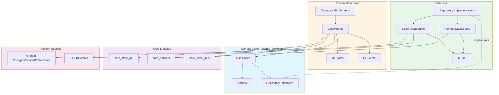

### Module Dependency Graph

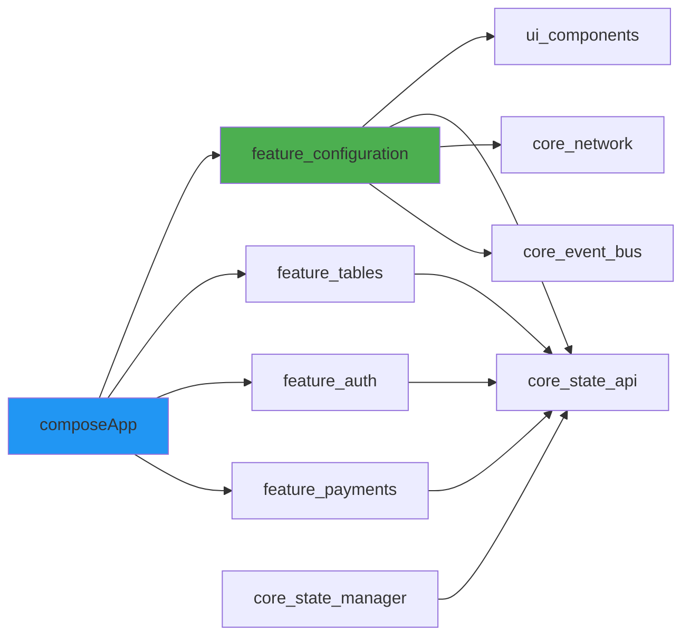

---

## Component Architecture

### Feature Configuration Module Structure

```
feature_configuration/
├── src/
│   ├── commonMain/kotlin/com/toteat/feature/configuration/
│   │   ├── domain/
│   │   │   ├── model/
│   │   │   │   ├── TerminalConfiguration.kt
│   │   │   │   ├── PaymentGateway.kt
│   │   │   │   ├── UserProfile.kt
│   │   │   │   └── ValidationResult.kt
│   │   │   ├── repository/
│   │   │   │   ├── ConfigurationRepository.kt
│   │   │   │   └── UserRepository.kt
│   │   │   └── usecase/
│   │   │       ├── GetConfigurationUseCase.kt
│   │   │       ├── SaveConfigurationUseCase.kt
│   │   │       ├── ValidatePaymentCredentialsUseCase.kt
│   │   │       ├── GetUserProfileUseCase.kt
│   │   │       └── LogoutUseCase.kt
│   │   ├── data/
│   │   │   ├── repository/
│   │   │   │   ├── ConfigurationRepositoryImpl.kt
│   │   │   │   └── UserRepositoryImpl.kt
│   │   │   ├── datasource/
│   │   │   │   ├── local/
│   │   │   │   │   ├── ConfigurationLocalDataSource.kt
│   │   │   │   │   └── SecureStorage.kt (expect/actual)
│   │   │   │   └── remote/
│   │   │   │       ├── ConfigurationRemoteDataSource.kt
│   │   │   │       └── UserRemoteDataSource.kt
│   │   │   └── model/
│   │   │       ├── ConfigurationDto.kt
│   │   │       ├── PaymentGatewayDto.kt
│   │   │       └── UserProfileDto.kt
│   │   └── presentation/
│   │       ├── navigation/
│   │       │   └── ConfigurationNavigation.kt
│   │       ├── profile/
│   │       │   ├── ProfileViewModel.kt
│   │       │   ├── ProfileUiState.kt
│   │       │   └── ProfileScreen.kt
│   │       ├── configuration/
│   │       │   ├── ConfigurationViewModel.kt
│   │       │   ├── ConfigurationUiState.kt
│   │       │   ├── ConfigurationEvent.kt
│   │       │   └── ConfigurationScreen.kt
│   │       ├── tabbar/
│   │       │   ├── TabBarViewModel.kt
│   │       │   ├── TabBarUiState.kt
│   │       │   └── TabBarComponent.kt
│   │       └── mapper/
│   │           ├── ConfigurationMapper.kt
│   │           └── UserProfileMapper.kt
│   ├── androidMain/kotlin/com/toteat/feature/configuration/
│   │   └── data/datasource/local/
│   │       └── AndroidSecureStorage.kt
│   ├── iosMain/kotlin/com/toteat/feature/configuration/
│   │   └── data/datasource/local/
│   │       └── IosSecureStorage.kt
│   ├── commonTest/kotlin/
│   │   ├── domain/usecase/
│   │   ├── data/repository/
│   │   └── presentation/viewmodel/
│   └── androidUnitTest/kotlin/
└── build.gradle.kts
```

---

## Domain Layer Design

### Domain Models

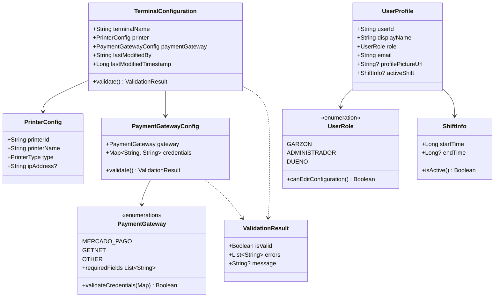

### Use Cases

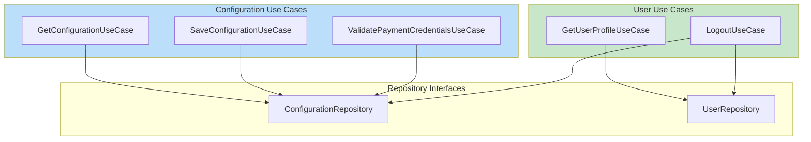

**Use Case Contracts:**

```kotlin
// GetConfigurationUseCase
interface GetConfigurationUseCase {
    suspend operator fun invoke(): Result<TerminalConfiguration>
}

// SaveConfigurationUseCase
interface SaveConfigurationUseCase {
    suspend operator fun invoke(
        config: TerminalConfiguration,
        userId: String
    ): Result<Unit>
}

// ValidatePaymentCredentialsUseCase
interface ValidatePaymentCredentialsUseCase {
    suspend operator fun invoke(
        gateway: PaymentGateway,
        credentials: Map<String, String>
    ): ValidationResult
}

// GetUserProfileUseCase
interface GetUserProfileUseCase {
    suspend operator fun invoke(): Result<UserProfile>
}

// LogoutUseCase
interface LogoutUseCase {
    suspend operator fun invoke(): Result<Unit>
}
```

---

## Data Layer Design

### Repository Pattern

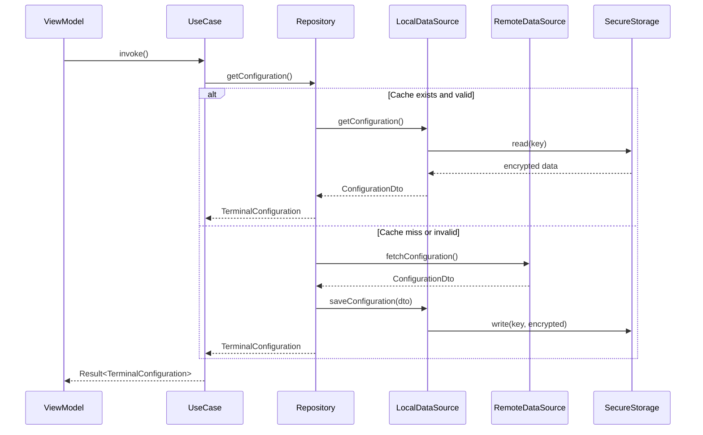

### Data Source Implementations

**ConfigurationLocalDataSource (Common)**

```kotlin
class ConfigurationLocalDataSource(
    private val secureStorage: SecureStorage,
    private val encryptionManager: EncryptionManager
) {
    suspend fun getConfiguration(): ConfigurationDto? {
        return secureStorage.read(KEY_CONFIGURATION)?.let { encrypted ->
            encryptionManager.decrypt(encrypted)
        }?.let { json ->
            Json.decodeFromString(json)
        }
    }

    suspend fun saveConfiguration(config: ConfigurationDto) {
        val json = Json.encodeToString(config)
        val encrypted = encryptionManager.encrypt(json)
        secureStorage.write(KEY_CONFIGURATION, encrypted)
    }

    suspend fun clear() {
        secureStorage.delete(KEY_CONFIGURATION)
    }

    companion object {
        private const val KEY_CONFIGURATION = "terminal_configuration"
    }
}
```

**SecureStorage (expect/actual)**

```kotlin
// commonMain
expect class SecureStorage {
    suspend fun write(key: String, value: String)
    suspend fun read(key: String): String?
    suspend fun delete(key: String)
    suspend fun clear()
}

// androidMain
actual class SecureStorage(context: Context) {
    private val encryptedPrefs = EncryptedSharedPreferences.create(
        context,
        "toteat_secure_prefs",
        MasterKey.Builder(context)
            .setKeyScheme(MasterKey.KeyScheme.AES256_GCM)
            .build(),
        EncryptedSharedPreferences.PrefKeyEncryptionScheme.AES256_SIV,
        EncryptedSharedPreferences.PrefValueEncryptionScheme.AES256_GCM
    )

    actual suspend fun write(key: String, value: String) = withContext(Dispatchers.IO) {
        encryptedPrefs.edit().putString(key, value).apply()
    }

    actual suspend fun read(key: String): String? = withContext(Dispatchers.IO) {
        encryptedPrefs.getString(key, null)
    }

    actual suspend fun delete(key: String) = withContext(Dispatchers.IO) {
        encryptedPrefs.edit().remove(key).apply()
    }

    actual suspend fun clear() = withContext(Dispatchers.IO) {
        encryptedPrefs.edit().clear().apply()
    }
}

// iosMain
actual class SecureStorage {
    private val keychain = KeychainAccess(service: "com.toteat.mobile")

    actual suspend fun write(key: String, value: String) = withContext(Dispatchers.IO) {
        keychain.set(value, forKey: key)
    }

    actual suspend fun read(key: String): String? = withContext(Dispatchers.IO) {
        keychain.get(key)
    }

    actual suspend fun delete(key: String) = withContext(Dispatchers.IO) {
        keychain.remove(key)
    }

    actual suspend fun clear() = withContext(Dispatchers.IO) {
        keychain.removeAll()
    }
}
```

---

## Presentation Layer Design

### State Management Architecture

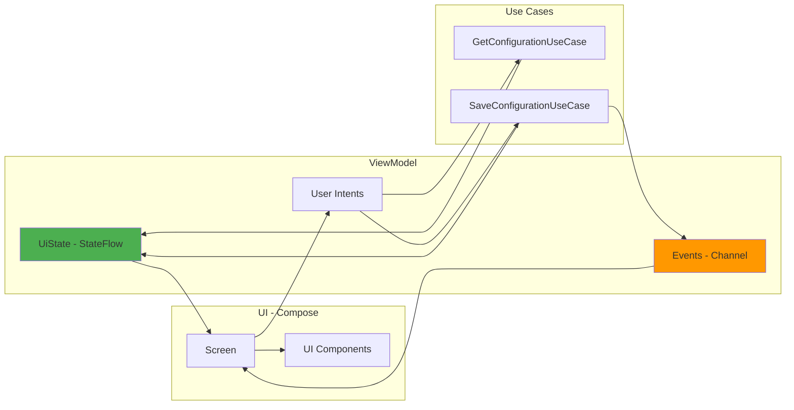

### Configuration ViewModel Design

```kotlin
data class ConfigurationUiState(
    val terminalName: String = "",
    val selectedPrinter: PrinterConfig? = null,
    val availablePrinters: List<PrinterConfig> = emptyList(),
    val selectedGateway: PaymentGateway = PaymentGateway.MERCADO_PAGO,
    val credentials: Map<String, String> = emptyMap(),
    val isLoading: Boolean = false,
    val hasUnsavedChanges: Boolean = false,
    val validationErrors: Map<String, String> = emptyMap(),
    val isEditable: Boolean = false, // based on user role
    val isSaving: Boolean = false
) {
    val canSave: Boolean
        get() = hasUnsavedChanges &&
                validationErrors.isEmpty() &&
                terminalName.isNotBlank() &&
                !isSaving

    val requiredFields: List<String>
        get() = selectedGateway.requiredFields
}

sealed interface ConfigurationEvent {
    data object SaveSuccess : ConfigurationEvent
    data class SaveError(val message: String) : ConfigurationEvent
    data object NavigateBack : ConfigurationEvent
    data class ShowDiscardChangesDialog(val onConfirm: () -> Unit) : ConfigurationEvent
}

class ConfigurationViewModel(
    private val getConfigurationUseCase: GetConfigurationUseCase,
    private val saveConfigurationUseCase: SaveConfigurationUseCase,
    private val validateCredentialsUseCase: ValidatePaymentCredentialsUseCase,
    private val getUserProfileUseCase: GetUserProfileUseCase
) : ViewModel() {

    private val _uiState = MutableStateFlow(ConfigurationUiState())
    val uiState: StateFlow<ConfigurationUiState> = _uiState.asStateFlow()

    private val _events = Channel<ConfigurationEvent>(Channel.BUFFERED)
    val events = _events.receiveAsFlow()

    init {
        loadConfiguration()
        checkUserPermissions()
    }

    fun onTerminalNameChange(name: String) {
        _uiState.update {
            it.copy(
                terminalName = name,
                hasUnsavedChanges = true,
                validationErrors = it.validationErrors - "terminalName"
            )
        }
    }

    fun onGatewayChange(gateway: PaymentGateway) {
        _uiState.update {
            it.copy(
                selectedGateway = gateway,
                credentials = emptyMap(), // Clear previous credentials
                hasUnsavedChanges = true,
                validationErrors = emptyMap()
            )
        }
    }

    fun onCredentialChange(fieldName: String, value: String) {
        _uiState.update {
            it.copy(
                credentials = it.credentials + (fieldName to value),
                hasUnsavedChanges = true,
                validationErrors = it.validationErrors - fieldName
            )
        }

        // Debounced validation
        validateCredentialsDebounced()
    }

    fun onSaveClick() {
        viewModelScope.launch {
            val state = _uiState.value

            // Validate before saving
            val validationResult = validateCredentialsUseCase(
                gateway = state.selectedGateway,
                credentials = state.credentials
            )

            if (!validationResult.isValid) {
                _uiState.update {
                    it.copy(validationErrors = validationResult.errors.associateBy { it })
                }
                return@launch
            }

            _uiState.update { it.copy(isSaving = true) }

            val config = TerminalConfiguration(
                terminalName = state.terminalName,
                printer = state.selectedPrinter!!,
                paymentGateway = PaymentGatewayConfig(
                    gateway = state.selectedGateway,
                    credentials = state.credentials
                )
            )

            saveConfigurationUseCase(config, getCurrentUserId())
                .onSuccess {
                    _uiState.update { it.copy(isSaving = false, hasUnsavedChanges = false) }
                    _events.send(ConfigurationEvent.SaveSuccess)
                }
                .onFailure { error ->
                    _uiState.update { it.copy(isSaving = false) }
                    _events.send(ConfigurationEvent.SaveError(error.message ?: "Error desconocido"))
                }
        }
    }

    fun onBackPressed() {
        if (_uiState.value.hasUnsavedChanges) {
            viewModelScope.launch {
                _events.send(
                    ConfigurationEvent.ShowDiscardChangesDialog(
                        onConfirm = { navigateBack() }
                    )
                )
            }
        } else {
            navigateBack()
        }
    }

    private fun navigateBack() {
        viewModelScope.launch {
            _events.send(ConfigurationEvent.NavigateBack)
        }
    }

    private val validateJob = Job()
    private fun validateCredentialsDebounced() {
        validateJob.cancel()
        viewModelScope.launch(validateJob) {
            delay(300) // Debounce
            val state = _uiState.value
            val result = validateCredentialsUseCase(
                state.selectedGateway,
                state.credentials
            )
            _uiState.update {
                it.copy(validationErrors = result.errors.associateBy { it })
            }
        }
    }

    private fun loadConfiguration() {
        viewModelScope.launch {
            _uiState.update { it.copy(isLoading = true) }
            getConfigurationUseCase()
                .onSuccess { config ->
                    _uiState.update {
                        it.copy(
                            terminalName = config.terminalName,
                            selectedPrinter = config.printer,
                            selectedGateway = config.paymentGateway.gateway,
                            credentials = config.paymentGateway.credentials,
                            isLoading = false
                        )
                    }
                }
                .onFailure {
                    _uiState.update { it.copy(isLoading = false) }
                }
        }
    }

    private fun checkUserPermissions() {
        viewModelScope.launch {
            getUserProfileUseCase()
                .onSuccess { profile ->
                    _uiState.update {
                        it.copy(isEditable = profile.role.canEditConfiguration())
                    }
                }
        }
    }
}
```

---

## Navigation Architecture

### Tab Bar Navigation Flow

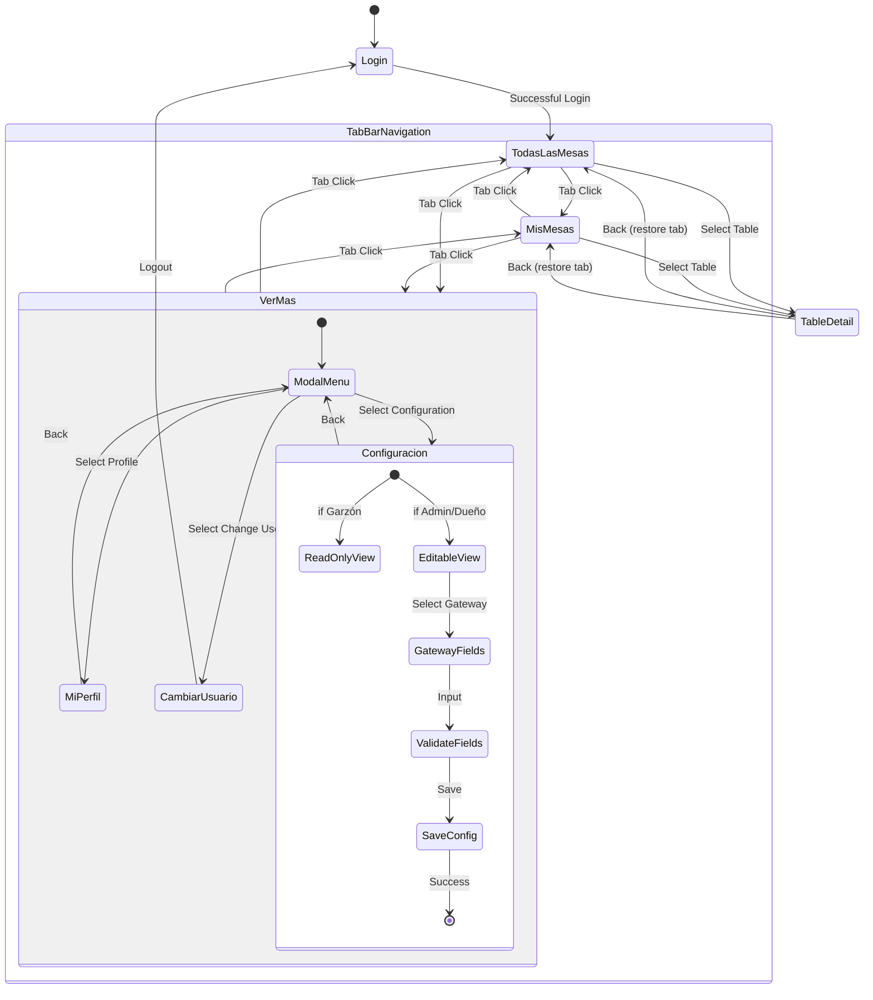

### Navigation Component Integration

```kotlin
// Navigation setup in composeApp module
@Composable
fun ToteatApp() {
    val navController = rememberNavController()
    val currentUser by viewModel.currentUser.collectAsState()

    Scaffold(
        bottomBar = {
            if (currentUser != null && shouldShowTabBar(navController)) {
                TabBarComponent(
                    selectedTab = currentTab,
                    onTabSelected = { tab ->
                        navController.navigate(tab.route) {
                            popUpTo(navController.graph.startDestinationId) {
                                saveState = true
                            }
                            launchSingleTop = true
                            restoreState = true
                        }
                    }
                )
            }
        }
    ) { paddingValues ->
        NavHost(
            navController = navController,
            startDestination = "todas_las_mesas",
            modifier = Modifier.padding(paddingValues)
        ) {
            composable("todas_las_mesas") { TodasLasMesasScreen() }
            composable("mis_mesas") { MisMesasScreen() }
            composable("ver_mas") { VerMasModalScreen() }
            composable("mi_perfil") { ProfileScreen() }
            composable("configuracion") { ConfigurationScreen() }
            composable("cambiar_usuario") {
                LaunchedEffect(Unit) {
                    // Clear session and navigate to login
                }
            }
            composable("table_detail/{tableId}") { TableDetailScreen() }
        }
    }
}

fun shouldShowTabBar(navController: NavController): Boolean {
    val currentRoute = navController.currentDestination?.route
    return currentRoute in listOf(
        "todas_las_mesas",
        "mis_mesas",
        "ver_mas"
    )
}
```

---

## Payment Gateway Strategy Pattern

### Gateway Abstraction

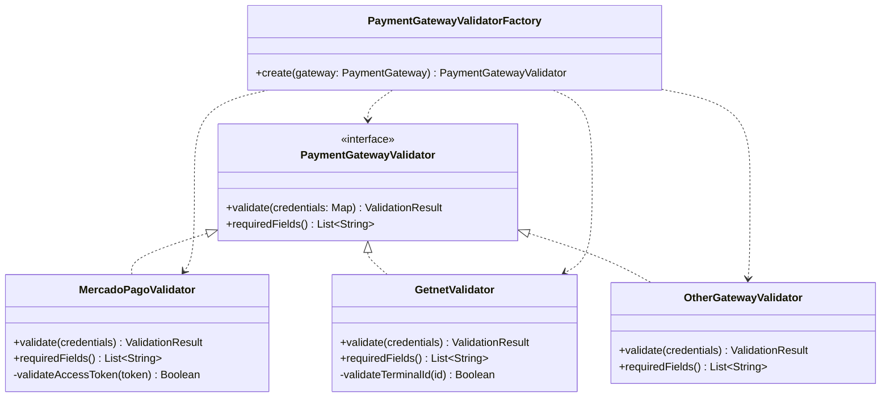

**Implementation:**

```kotlin
interface PaymentGatewayValidator {
    fun validate(credentials: Map<String, String>): ValidationResult
    fun requiredFields(): List<String>
}

class MercadoPagoValidator : PaymentGatewayValidator {
    override fun requiredFields() = listOf("accessToken")

    override fun validate(credentials: Map<String, String>): ValidationResult {
        val accessToken = credentials["accessToken"]

        val errors = buildList {
            if (accessToken.isNullOrBlank()) {
                add("Access Token es requerido")
            } else if (!accessToken.startsWith("APP_USR-")) {
                add("Access Token debe comenzar con 'APP_USR-'")
            } else if (accessToken.length < 20) {
                add("Access Token inválido (muy corto)")
            }
        }

        return ValidationResult(
            isValid = errors.isEmpty(),
            errors = errors
        )
    }
}

class GetnetValidator : PaymentGatewayValidator {
    override fun requiredFields() = listOf("terminalId")

    override fun validate(credentials: Map<String, String>): ValidationResult {
        val terminalId = credentials["terminalId"]

        val errors = buildList {
            if (terminalId.isNullOrBlank()) {
                add("ID de Terminal es requerido")
            } else {
                val id = terminalId.toIntOrNull()
                if (id == null) {
                    add("ID de Terminal debe ser numérico")
                } else if (id <= 0) {
                    add("ID de Terminal debe ser mayor a 0")
                } else if (id > 999999) {
                    add("ID de Terminal no puede exceder 999999")
                }
            }
        }

        return ValidationResult(
            isValid = errors.isEmpty(),
            errors = errors
        )
    }
}

class OtherGatewayValidator : PaymentGatewayValidator {
    override fun requiredFields() = listOf("identifier1", "identifier2")

    override fun validate(credentials: Map<String, String>): ValidationResult {
        val errors = buildList {
            if (credentials["identifier1"].isNullOrBlank()) {
                add("Identificador 1 es requerido")
            }
            if (credentials["identifier2"].isNullOrBlank()) {
                add("Identificador 2 es requerido")
            }
        }

        return ValidationResult(
            isValid = errors.isEmpty(),
            errors = errors
        )
    }
}

class PaymentGatewayValidatorFactory {
    fun create(gateway: PaymentGateway): PaymentGatewayValidator {
        return when (gateway) {
            PaymentGateway.MERCADO_PAGO -> MercadoPagoValidator()
            PaymentGateway.GETNET -> GetnetValidator()
            PaymentGateway.OTHER -> OtherGatewayValidator()
        }
    }
}
```

---

## UI Component Design

### Configuration Screen Layout

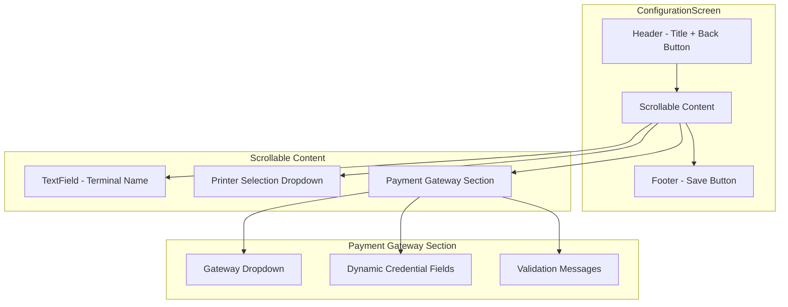

**Dynamic Fields Rendering:**

```kotlin
@Composable
fun PaymentGatewaySection(
    selectedGateway: PaymentGateway,
    credentials: Map<String, String>,
    validationErrors: Map<String, String>,
    onGatewayChange: (PaymentGateway) -> Unit,
    onCredentialChange: (String, String) -> Unit,
    isEditable: Boolean
) {
    Column(
        modifier = Modifier
            .fillMaxWidth()
            .padding(16.dp)
    ) {
        Text(
            text = "Pasarela de Pago",
            style = MaterialTheme.typography.titleMedium,
            modifier = Modifier.padding(bottom = 8.dp)
        )

        // Gateway Dropdown
        ExposedDropdownMenuBox(
            expanded = dropdownExpanded,
            onExpandedChange = { dropdownExpanded = it }
        ) {
            OutlinedTextField(
                value = selectedGateway.displayName,
                onValueChange = {},
                readOnly = true,
                enabled = isEditable,
                trailingIcon = { ExposedDropdownMenuDefaults.TrailingIcon(expanded = dropdownExpanded) },
                modifier = Modifier
                    .menuAnchor()
                    .fillMaxWidth()
            )

            ExposedDropdownMenu(
                expanded = dropdownExpanded,
                onDismissRequest = { dropdownExpanded = false }
            ) {
                PaymentGateway.values().forEach { gateway ->
                    DropdownMenuItem(
                        text = { Text(gateway.displayName) },
                        onClick = {
                            onGatewayChange(gateway)
                            dropdownExpanded = false
                        }
                    )
                }
            }
        }

        Spacer(modifier = Modifier.height(16.dp))

        // Dynamic credential fields based on selected gateway
        when (selectedGateway) {
            PaymentGateway.MERCADO_PAGO -> {
                CredentialTextField(
                    label = "Access Token",
                    value = credentials["accessToken"] ?: "",
                    onValueChange = { onCredentialChange("accessToken", it) },
                    error = validationErrors["accessToken"],
                    enabled = isEditable,
                    placeholder = "APP_USR-xxxxxxxxxxxx"
                )
            }

            PaymentGateway.GETNET -> {
                CredentialTextField(
                    label = "ID de Terminal (Número Correlativo)",
                    value = credentials["terminalId"] ?: "",
                    onValueChange = { onCredentialChange("terminalId", it) },
                    error = validationErrors["terminalId"],
                    enabled = isEditable,
                    keyboardType = KeyboardType.Number,
                    placeholder = "123456"
                )
            }

            PaymentGateway.OTHER -> {
                CredentialTextField(
                    label = "Identificador 1",
                    value = credentials["identifier1"] ?: "",
                    onValueChange = { onCredentialChange("identifier1", it) },
                    error = validationErrors["identifier1"],
                    enabled = isEditable
                )

                Spacer(modifier = Modifier.height(8.dp))

                CredentialTextField(
                    label = "Identificador 2",
                    value = credentials["identifier2"] ?: "",
                    onValueChange = { onCredentialChange("identifier2", it) },
                    error = validationErrors["identifier2"],
                    enabled = isEditable
                )
            }
        }
    }
}

@Composable
private fun CredentialTextField(
    label: String,
    value: String,
    onValueChange: (String) -> Unit,
    error: String?,
    enabled: Boolean,
    keyboardType: KeyboardType = KeyboardType.Text,
    placeholder: String = ""
) {
    OutlinedTextField(
        value = value,
        onValueChange = onValueChange,
        label = { Text(label) },
        placeholder = { Text(placeholder) },
        enabled = enabled,
        isError = error != null,
        supportingText = error?.let { { Text(it, color = MaterialTheme.colorScheme.error) } },
        keyboardOptions = KeyboardOptions(keyboardType = keyboardType),
        modifier = Modifier.fillMaxWidth(),
        visualTransformation = if (!enabled && value.isNotBlank()) {
            MaskedVisualTransformation()
        } else {
            VisualTransformation.None
        }
    )
}

class MaskedVisualTransformation : VisualTransformation {
    override fun filter(text: AnnotatedString): TransformedText {
        return TransformedText(
            AnnotatedString("•".repeat(8)),
            OffsetMapping.Identity
        )
    }
}
```

---

## Error Handling Strategy

### Error Hierarchy

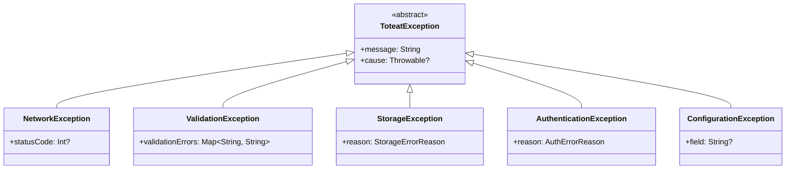

### Error Flow

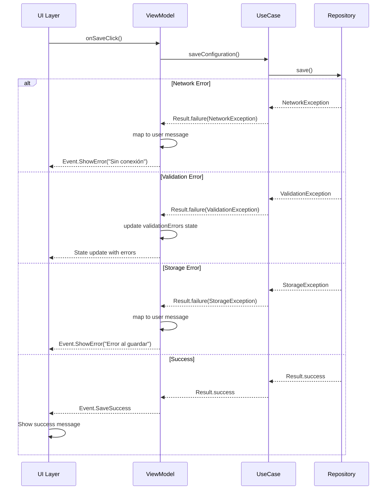

**Error Mapping in ViewModel:**

```kotlin
private fun Throwable.toUserMessage(): String {
    return when (this) {
        is NetworkException -> when (statusCode) {
            401 -> "Sesión expirada. Por favor inicia sesión nuevamente"
            403 -> "No tienes permisos para realizar esta acción"
            404 -> "Configuración no encontrada"
            500 -> "Error del servidor. Intenta más tarde"
            else -> "Error de conexión. Verifica tu internet"
        }
        is ValidationException -> "Por favor corrige los errores en el formulario"
        is StorageException -> "Error al guardar los datos localmente"
        is AuthenticationException -> "Error de autenticación"
        is ConfigurationException -> "Error en la configuración: ${field ?: "campo desconocido"}"
        else -> "Error inesperado: ${message ?: "Sin detalles"}"
    }
}
```

---

## Testing Strategy

### Test Pyramid

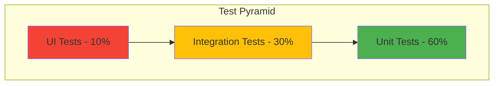

### Unit Test Examples

**Use Case Test:**

```kotlin
class SaveConfigurationUseCaseTest {
    private lateinit var useCase: SaveConfigurationUseCase
    private val repository: ConfigurationRepository = mockk()

    @BeforeTest
    fun setup() {
        useCase = SaveConfigurationUseCase(repository)
    }

    @Test
    fun `when save configuration succeeds then return success`() = runTest {
        // Given
        val config = TerminalConfiguration(
            terminalName = "Terminal 1",
            printer = PrinterConfig("printer-1", "HP LaserJet", PrinterType.NETWORK),
            paymentGateway = PaymentGatewayConfig(
                gateway = PaymentGateway.MERCADO_PAGO,
                credentials = mapOf("accessToken" to "APP_USR-test123")
            )
        )
        val userId = "user-123"

        coEvery { repository.saveConfiguration(config, userId) } returns Result.success(Unit)

        // When
        val result = useCase(config, userId)

        // Then
        assertTrue(result.isSuccess)
        coVerify(exactly = 1) { repository.saveConfiguration(config, userId) }
    }

    @Test
    fun `when repository throws exception then return failure`() = runTest {
        // Given
        val config = mockk<TerminalConfiguration>()
        val exception = NetworkException("Connection failed")

        coEvery { repository.saveConfiguration(any(), any()) } returns Result.failure(exception)

        // When
        val result = useCase(config, "user-123")

        // Then
        assertTrue(result.isFailure)
        assertEquals(exception, result.exceptionOrNull())
    }
}
```

**ViewModel Test:**

```kotlin
class ConfigurationViewModelTest {
    private lateinit var viewModel: ConfigurationViewModel
    private val getConfigurationUseCase: GetConfigurationUseCase = mockk()
    private val saveConfigurationUseCase: SaveConfigurationUseCase = mockk()
    private val validateCredentialsUseCase: ValidatePaymentCredentialsUseCase = mockk()
    private val getUserProfileUseCase: GetUserProfileUseCase = mockk()

    @BeforeTest
    fun setup() {
        Dispatchers.setMain(StandardTestDispatcher())

        coEvery { getUserProfileUseCase() } returns Result.success(
            UserProfile("user-1", "Test User", UserRole.ADMINISTRADOR, "test@toteat.com")
        )

        viewModel = ConfigurationViewModel(
            getConfigurationUseCase,
            saveConfigurationUseCase,
            validateCredentialsUseCase,
            getUserProfileUseCase
        )
    }

    @AfterTest
    fun tearDown() {
        Dispatchers.resetMain()
    }

    @Test
    fun `when terminal name changes then state updates and marks unsaved changes`() = runTest {
        // When
        viewModel.onTerminalNameChange("New Terminal Name")

        // Then
        viewModel.uiState.test {
            val state = awaitItem()
            assertEquals("New Terminal Name", state.terminalName)
            assertTrue(state.hasUnsavedChanges)
        }
    }

    @Test
    fun `when gateway changes then credentials are cleared`() = runTest {
        // Given
        viewModel.onCredentialChange("accessToken", "APP_USR-old")

        // When
        viewModel.onGatewayChange(PaymentGateway.GETNET)

        // Then
        viewModel.uiState.test {
            val state = awaitItem()
            assertEquals(PaymentGateway.GETNET, state.selectedGateway)
            assertTrue(state.credentials.isEmpty())
            assertTrue(state.validationErrors.isEmpty())
        }
    }

    @Test
    fun `when save succeeds then emit SaveSuccess event`() = runTest {
        // Given
        val config = mockk<TerminalConfiguration>()
        coEvery { saveConfigurationUseCase(any(), any()) } returns Result.success(Unit)
        coEvery { validateCredentialsUseCase(any(), any()) } returns ValidationResult(true, emptyList())

        // Setup state
        viewModel.onTerminalNameChange("Terminal")
        // ... setup other required fields

        // When
        viewModel.onSaveClick()

        // Then
        viewModel.events.test {
            val event = awaitItem()
            assertTrue(event is ConfigurationEvent.SaveSuccess)
        }
    }
}
```

---

## Performance Optimizations

### Key Performance Metrics

| Operation | Target | Strategy |
|-----------|--------|----------|
| Tab Switch | < 300ms | Cached ViewModels, saved state |
| Configuration Load | < 500ms | Local cache first, background sync |
| Credential Encryption | < 100ms | Native crypto APIs, background thread |
| Field Validation | < 50ms | Debounced (300ms), local rules |
| Configuration Save | < 1s | Optimistic UI, background persistence |
| Screen Render | 60fps | Compose recomposition optimization |

### Caching Strategy

```kotlin
class ConfigurationRepositoryImpl(
    private val localDataSource: ConfigurationLocalDataSource,
    private val remoteDataSource: ConfigurationRemoteDataSource
) : ConfigurationRepository {

    private var cachedConfig: TerminalConfiguration? = null
    private var lastFetchTimestamp: Long = 0
    private val cacheTTL = 5.minutes.inWholeMilliseconds

    override suspend fun getConfiguration(): Result<TerminalConfiguration> {
        // Check memory cache first
        if (isCacheValid()) {
            return Result.success(cachedConfig!!)
        }

        // Then check local storage
        return localDataSource.getConfiguration()
            ?.let { dto ->
                val entity = dto.toEntity()
                cachedConfig = entity
                lastFetchTimestamp = System.currentTimeMillis()
                Result.success(entity)
            }
            ?: fetchFromRemote()
    }

    private suspend fun fetchFromRemote(): Result<TerminalConfiguration> {
        return remoteDataSource.fetchConfiguration()
            .map { dto ->
                // Save to local cache
                localDataSource.saveConfiguration(dto)

                val entity = dto.toEntity()
                cachedConfig = entity
                lastFetchTimestamp = System.currentTimeMillis()
                entity
            }
    }

    private fun isCacheValid(): Boolean {
        return cachedConfig != null &&
               (System.currentTimeMillis() - lastFetchTimestamp) < cacheTTL
    }

    override suspend fun saveConfiguration(
        config: TerminalConfiguration,
        userId: String
    ): Result<Unit> {
        // Optimistic update
        cachedConfig = config
        lastFetchTimestamp = System.currentTimeMillis()

        // Save locally first (fast)
        localDataSource.saveConfiguration(config.toDto())

        // Then sync to remote (background)
        return remoteDataSource.saveConfiguration(config.toDto(), userId)
            .onFailure {
                // Revert cache on failure
                cachedConfig = null
            }
    }
}
```

---

## Dependency Injection Configuration

### Koin Modules

```kotlin
// domain/di/DomainModule.kt
val configurationDomainModule = module {
    factory<GetConfigurationUseCase> {
        GetConfigurationUseCase(get())
    }

    factory<SaveConfigurationUseCase> {
        SaveConfigurationUseCase(get())
    }

    factory<ValidatePaymentCredentialsUseCase> {
        ValidatePaymentCredentialsUseCase(get())
    }

    factory<GetUserProfileUseCase> {
        GetUserProfileUseCase(get())
    }

    factory<LogoutUseCase> {
        LogoutUseCase(get(), get())
    }

    single { PaymentGatewayValidatorFactory() }
}

// data/di/DataModule.kt
val configurationDataModule = module {
    single<ConfigurationRepository> {
        ConfigurationRepositoryImpl(
            localDataSource = get(),
            remoteDataSource = get()
        )
    }

    single<UserRepository> {
        UserRepositoryImpl(
            remoteDataSource = get()
        )
    }

    single {
        ConfigurationLocalDataSource(
            secureStorage = get(),
            encryptionManager = get()
        )
    }

    single {
        ConfigurationRemoteDataSource(
            httpClient = get() // from core_network
        )
    }

    single {
        UserRemoteDataSource(
            httpClient = get()
        )
    }

    single { EncryptionManager() }
}

// presentation/di/PresentationModule.kt
val configurationPresentationModule = module {
    factory {
        ConfigurationViewModel(
            getConfigurationUseCase = get(),
            saveConfigurationUseCase = get(),
            validateCredentialsUseCase = get(),
            getUserProfileUseCase = get()
        )
    }

    factory {
        ProfileViewModel(
            getUserProfileUseCase = get()
        )
    }

    factory {
        TabBarViewModel(
            // dependencies
        )
    }
}

// Platform-specific modules
// androidMain/di/PlatformModule.kt
actual val platformModule = module {
    single { SecureStorage(get()) } // Context provided by app module
}

// iosMain/di/PlatformModule.kt
actual val platformModule = module {
    single { SecureStorage() }
}

// Module aggregation
val featureConfigurationModules = listOf(
    configurationDomainModule,
    configurationDataModule,
    configurationPresentationModule,
    platformModule
)
```

---

## Security Considerations

### Encryption Flow

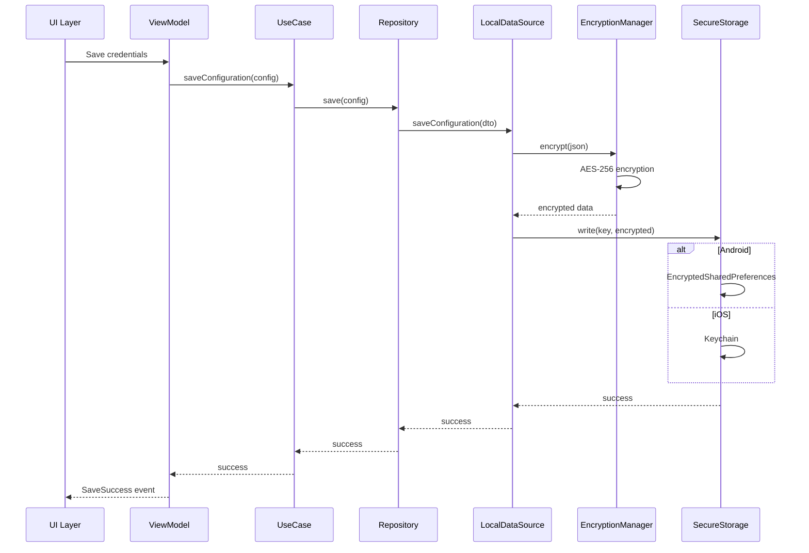

### Key Security Measures

1. **Credential Encryption**
   - AES-256-GCM encryption for credentials before storage
   - Platform-specific secure storage (EncryptedSharedPreferences / Keychain)
   - Keys never stored in plain text

2. **Transport Security**
   - All API calls over HTTPS/TLS
   - Certificate pinning (optional, recommended for production)
   - No credentials in URL parameters or headers (body only)

3. **Access Control**
   - Role-based access control (RBAC) enforced in ViewModel
   - Server-side validation of user permissions
   - Masked credentials in read-only mode

4. **Audit Logging**
   - All configuration changes logged with user ID and timestamp
   - Logs stored server-side for compliance
   - No sensitive data in logs

---

## Build Configuration

### feature_configuration/build.gradle.kts

```kotlin
plugins {
    alias(libs.plugins.kotlinMultiplatform)
    alias(libs.plugins.androidLibrary)
    alias(libs.plugins.kotlinSerialization)
    alias(libs.plugins.compose)
}

kotlin {
    androidTarget {
        compilations.all {
            kotlinOptions {
                jvmTarget = "17"
            }
        }
    }

    listOf(
        iosX64(),
        iosArm64(),
        iosSimulatorArm64()
    ).forEach { iosTarget ->
        iosTarget.binaries.framework {
            baseName = "FeatureConfiguration"
            isStatic = true
        }
    }

    sourceSets {
        commonMain.dependencies {
            // Compose Multiplatform
            implementation(compose.runtime)
            implementation(compose.foundation)
            implementation(compose.material3)
            implementation(compose.ui)
            implementation(compose.components.resources)

            // Coroutines
            implementation(libs.kotlinx.coroutines.core)

            // Serialization
            implementation(libs.kotlinx.serialization.json)

            // Dependency Injection
            implementation(libs.koin.core)
            implementation(libs.koin.compose)

            // Project modules
            implementation(projects.coreStateApi)
            implementation(projects.coreNetwork)
            implementation(projects.coreEventBus)
            implementation(projects.uiComponents)
        }

        androidMain.dependencies {
            // Android Security
            implementation(libs.androidx.security.crypto)

            // Koin Android
            implementation(libs.koin.android)
        }

        iosMain.dependencies {
            // iOS Keychain wrapper (e.g., KeychainAccess)
        }

        commonTest.dependencies {
            implementation(libs.kotlin.test)
            implementation(libs.kotlinx.coroutines.test)
            implementation(libs.turbine)
            implementation(libs.mockk.common)
        }

        androidUnitTest.dependencies {
            implementation(libs.mockk.android)
        }
    }
}

android {
    namespace = "com.toteat.feature.configuration"
    compileSdk = libs.versions.android.compileSdk.get().toInt()

    defaultConfig {
        minSdk = libs.versions.android.minSdk.get().toInt()
    }

    compileOptions {
        sourceCompatibility = JavaVersion.VERSION_17
        targetCompatibility = JavaVersion.VERSION_17
    }
}
```

---

## Summary

Este diseño técnico proporciona:

✅ **Arquitectura clara** con Clean Architecture y separación de capas
✅ **Código compartido** maximizado en Kotlin Multiplatform (>85%)
✅ **Seguridad robusta** con encriptación AES-256 y almacenamiento nativo seguro
✅ **Extensibilidad** mediante Strategy Pattern para payment gateways
✅ **Testabilidad** con inyección de dependencias y mocks
✅ **Performance optimizado** con caching y operaciones asíncronas
✅ **Navegación fluida** con tab bar y manejo de estado consistente
✅ **Manejo de errores** robusto con jerarquía de excepciones

La implementación sigue los principios SOLID, facilita la incorporación de nuevos payment gateways, y mantiene consistencia con la arquitectura existente del proyecto Toteat.
