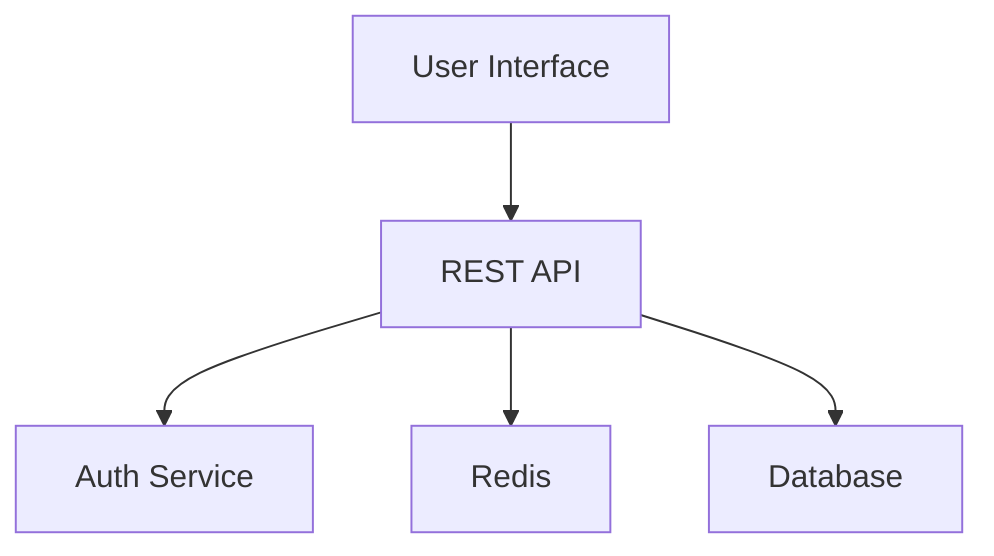
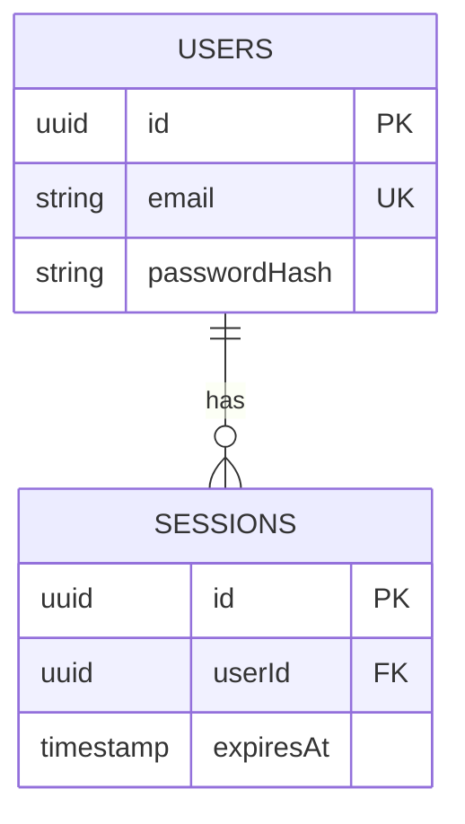

# Workflow Explained - Complete Guide

A comprehensive explanation of how OpenSpecification's 3-phase workflow operates, including business rules, state management, and data flow.

## Table of Contents
1. [Overview](#overview)
2. [Complete User Journey](#complete-user-journey)
3. [The Three Phases](#the-three-phases)
4. [State Machine](#state-machine)
5. [Business Rules](#business-rules)
6. [Data Flow](#data-flow)
7. [Error Handling](#error-handling)

---

## Overview

OpenSpecification transforms a feature description into a complete technical specification through **3 mandatory sequential phases**:

```
┌─────────────────┐
│   User Input    │
│  + Context      │
└────────┬────────┘
         │
         ▼
┌─────────────────┐
│  REQUIREMENTS   │  ← Phase 1: EARS format requirements
│   (10-15 sec)   │
└────────┬────────┘
         │ (Approve)
         ▼
┌─────────────────┐
│     DESIGN      │  ← Phase 2: Architecture + Diagrams
│   (20-25 sec)   │
└────────┬────────┘
         │ (Approve)
         ▼
┌─────────────────┐
│     TASKS       │  ← Phase 3: Implementation Plan
│   (15-20 sec)   │
└────────┬────────┘
         │ (Approve)
         ▼
┌─────────────────┐
│    COMPLETE     │  ← Ready for export
└─────────────────┘
```

**Key Characteristics:**
- **Sequential**: Must complete phases in order
- **Gated**: Each phase requires approval
- **Progressive**: Each phase builds on previous approved content
- **Iterative**: Can refine any phase before approving

---

## Complete User Journey

### Step 0: Setup (Initial Configuration)

```
┌────────────────────────────────────────┐
│ 1. API Key Entry                       │
├────────────────────────────────────────┤
│ - User enters OpenRouter API key       │
│ - System validates against API         │
│ - Stored in sessionStorage             │
│ - Format: sk-or-v1-...                 │
└────────────────────────────────────────┘
         │
         ▼
┌────────────────────────────────────────┐
│ 2. Model Selection                     │
├────────────────────────────────────────┤
│ - Fetch available models from API      │
│ - Display with pricing & capabilities  │
│ - User selects (e.g., Claude 3 Sonnet) │
│ - Stored in sessionStorage             │
└────────────────────────────────────────┘
         │
         ▼
┌────────────────────────────────────────┐
│ 3. Feature Description                 │
├────────────────────────────────────────┤
│ - User writes description (min 10 char)│
│ - Upload context files (optional)      │
│ - Files: .md, .txt, .json, .ts, etc.  │
│ - Max: 2KB/file, 5KB total            │
│ - Stored in sessionStorage             │
└────────────────────────────────────────┘
         │
         ▼
┌────────────────────────────────────────┐
│ 4. Generate Requirements               │
└────────────────────────────────────────┘
```

### Phase 1: Requirements Generation

```
[User clicks "Generate Requirements"]
         │
         ▼
┌─────────────────────────────────────────┐
│ Validation                              │
├─────────────────────────────────────────┤
│ ✓ API key valid                         │
│ ✓ Model selected                        │
│ ✓ Description > 10 characters           │
│ ✓ Check for prompt changes              │
└─────────────────────────────────────────┘
         │
         ▼
┌─────────────────────────────────────────┐
│ Filter Context Files                    │
├─────────────────────────────────────────┤
│ - Remove images (too large)             │
│ - Remove files > 2KB                    │
│ - Limit total to 5KB                    │
│ - Truncate if needed                    │
└─────────────────────────────────────────┘
         │
         ▼
┌─────────────────────────────────────────┐
│ Build Prompt                            │
├─────────────────────────────────────────┤
│ System: REQUIREMENTS_PROMPT             │
│ User: Feature + Description + Context   │
└─────────────────────────────────────────┘
         │
         ▼
┌─────────────────────────────────────────┐
│ Token Validation                        │
├─────────────────────────────────────────┤
│ - Estimate tokens (length / 3.7)        │
│ - Check against 32,768 limit            │
│ - Error if exceeded                     │
└─────────────────────────────────────────┘
         │
         ▼
┌─────────────────────────────────────────┐
│ API Call                                │
├─────────────────────────────────────────┤
│ POST /api/generate                      │
│ - Server-side token clamping            │
│ - Call OpenRouter API                   │
│ - Return content + usage                │
└─────────────────────────────────────────┘
         │
         ▼
┌─────────────────────────────────────────┐
│ Update State                            │
├─────────────────────────────────────────┤
│ state.requirements = content            │
│ state.approvals.requirements = false    │
│ state.timing.requirements = {...}       │
│ state.apiResponses.requirements = {...} │
│ Save to localStorage                    │
└─────────────────────────────────────────┘
         │
         ▼
┌─────────────────────────────────────────┐
│ User Reviews Requirements               │
├─────────────────────────────────────────┤
│ Option 1: Approve → Auto-gen Design     │
│ Option 2: Refine → Improve content      │
│ Option 3: Reject → Reset workflow       │
└─────────────────────────────────────────┘
```

### Phase 2 & 3: Design and Tasks

Similar flow as Phase 1, but:
- **Design** uses only `state.requirements` (not original input)
- **Tasks** uses both `state.requirements` + `state.design`
- Each phase auto-generates after approval of previous phase

---

## The Three Phases

### Phase 1: Requirements (EARS Format)

**Purpose:** Convert user's informal description into formal, testable requirements.

**Input:**
```typescript
{
  featureName: string,
  description: string,
  contextFiles: ContextFile[]
}
```

**Processing:**
1. Filter context files (size limits, no images)
2. Truncate description if > 5000 characters
3. Build requirements prompt
4. Validate tokens
5. Generate via OpenRouter API

**Output Structure:**
```markdown
# Requirements Document

## Introduction
[Purpose, scope, value proposition]

## Requirements

### Requirement 1: User Authentication
**User Story:** As a user, I want to login so that I can access my account

#### Acceptance Criteria
1. WHEN user enters valid credentials THEN system SHALL grant access
2. IF password is incorrect THEN system SHALL display error message
3. WHILE session is active THEN system SHALL maintain authentication
4. WHERE 2FA is enabled THEN system SHALL require second factor

### Requirement 2: [Next requirement...]
```

**Validation Rules:**
- Must use EARS keywords (WHEN, IF, WHILE, WHERE)
- All requirements must use "SHALL" keyword
- Hierarchical numbering required
- Each requirement needs user story
- Acceptance criteria must be testable

**State Updates:**
```typescript
state.requirements = generatedContent
state.approvals.requirements = false  // Pending approval
state.timing.requirements = {
  startTime: Date,
  endTime: Date,
  elapsed: milliseconds
}
state.apiResponses.requirements = {
  model: "anthropic/claude-3.5-sonnet",
  tokens: {prompt: 340, completion: 2150, total: 2490},
  cost: {prompt: 0.0000102, completion: 0.0000645, total: 0.0000747},
  duration: 13000,
  timestamp: Date
}
```

### Phase 2: Design (Architecture)

**Purpose:** Transform requirements into technical architecture with diagrams.

**Input:**
```typescript
{
  requirements: state.requirements  // Only approved requirements
}
```

**Output Structure:**
```markdown
# Design Document

## Overview
[Architectural approach, key decisions]

## Architecture


## Components and Interfaces
- **AuthService**: Handles authentication and sessions
- **UserService**: Manages user data
- **DatabaseLayer**: Data access layer

## Data Models


## Error Handling
[Strategy for handling errors gracefully]

## Testing Strategy
[Unit, integration, E2E testing approach]
```

**Validation Rules:**
- Must address all requirements
- Mermaid diagrams must be valid
- Design decisions must be justified
- All components must be described

**Critical Rule:**
⚠️ **NO original user input is used** - only approved requirements. This prevents informal descriptions from contaminating technical design.

### Phase 3: Tasks (Implementation Plan)

**Purpose:** Create actionable, developer-ready task list from design.

**Input:**
```typescript
{
  requirements: state.requirements,  // For traceability
  design: state.design              // For implementation guidance
}
```

**Output Structure:**
```markdown
# Implementation Plan

- [ ] 1. Setup Authentication Infrastructure
  - Create database schema for users and sessions
  - Setup JWT token generation and validation
  - Configure password hashing with bcrypt
  - _Requirements: 1.1, 1.2_

- [ ] 2. Implement Authentication Endpoints
  - [ ] 2.1 User Registration
    - Create POST /auth/register endpoint
    - Validate email format and password strength
    - Hash password and store user
    - Send verification email
    - Write unit tests for registration flow
    - _Requirements: 1.1_

  - [ ] 2.2 User Login
    - Create POST /auth/login endpoint
    - Validate credentials against database
    - Generate JWT token with user claims
    - Return token in httpOnly cookie
    - Write unit tests for login flow
    - _Requirements: 1.2_

- [ ] 3. Build Protected Routes Middleware
  - Create JWT validation middleware
  - Handle token expiration errors
  - Add role-based access control
  - Write integration tests
  - _Requirements: 1.3_
```

**Validation Rules:**
- Checkbox format (`- [ ]`) required
- 2-level hierarchy maximum
- Each task must reference requirements
- Deliverables must be specific
- Tasks must be 1-3 days of work

---

## State Machine

### States

```typescript
type WorkflowPhase = 'requirements' | 'design' | 'tasks' | 'complete'

interface SpecState {
  phase: WorkflowPhase
  requirements: string
  design: string
  tasks: string
  approvals: {
    requirements: boolean
    design: boolean
    tasks: boolean
  }
  isGenerating: boolean
  error: string | null
}
```

### State Transitions

```
                START
                  │
                  ▼
        ┌──────────────────┐
        │  requirements    │
        └──────────────────┘
                  │
                  │ approveAndProceed()
                  ▼
        ┌──────────────────┐
        │     design       │◄──┐
        └──────────────────┘   │
                  │             │ refineCurrentPhase()
                  │             │ (stays in same phase)
                  │             │
                  │ approveAndProceed()
                  ▼             │
        ┌──────────────────┐   │
        │      tasks       │◄──┘
        └──────────────────┘
                  │
                  │ approveAndProceed()
                  ▼
        ┌──────────────────┐
        │    complete      │
        └──────────────────┘
                  │
                  ▼
                EXPORT
```

### Transition Rules

| From State | Action | To State | Conditions |
|------------|--------|----------|------------|
| requirements | approveAndProceed() | design | requirements approved, not generating |
| requirements | refineCurrentPhase() | requirements | has content, not generating |
| requirements | reset() | requirements | any time |
| design | approveAndProceed() | tasks | design approved, not generating |
| design | refineCurrentPhase() | design | has content, not generating |
| tasks | approveAndProceed() | complete | tasks approved, not generating |
| tasks | refineCurrentPhase() | tasks | has content, not generating |
| complete | reset() | requirements | any time |

**Forbidden Transitions:**
- ❌ Cannot skip phases
- ❌ Cannot go backwards (no undo)
- ❌ Cannot transition while generating
- ❌ Cannot approve without content

---

## Business Rules

### Rule 1: Sequential Phase Progression

**Description:** Phases must be completed in order: Requirements → Design → Tasks

**Enforcement:**
```typescript
const phases = ['requirements', 'design', 'tasks', 'complete']
const currentIndex = phases.indexOf(state.phase)
const nextPhase = phases[currentIndex + 1]

// Can only proceed if current phase is approved
const canProceed = state.approvals[state.phase] && !state.isGenerating
```

**Why:** Each phase refines and formalizes the previous, building a coherent specification.

### Rule 2: Approval Gates

**Description:** Each phase requires explicit user approval before proceeding.

**Enforcement:**
```typescript
canProceedToNext = Boolean(
  nextPhase &&
  state.approvals[state.phase] === true &&
  !state.isGenerating
)
```

**Why:** Prevents propagating errors/ambiguity to subsequent phases.

### Rule 3: Context Isolation by Phase

**Description:** Each phase only uses specific inputs:

| Phase | Uses | Ignores |
|-------|------|---------|
| Requirements | User description, context files | (nothing) |
| Design | Approved requirements | Original description, context |
| Tasks | Approved requirements, design | Original description, context |

**Enforcement:**
```typescript
// Requirements
const userPrompt = buildRequirementsPrompt(featureName, description, context)

// Design - ONLY requirements
const userPrompt = buildDesignPrompt(state.requirements)

// Tasks - requirements + design
const userPrompt = buildTasksPrompt(state.requirements, state.design)
```

**Why:** Progressive formalization. Informal input doesn't contaminate technical phases.

### Rule 4: Prompt Change Detection

**Description:** If user significantly changes description during Requirements phase, auto-reset entire workflow.

**Detection:**
```typescript
function hasPromptChanged(stored, newDesc, storedName, newName) {
  // Extract keywords (words > 3 chars)
  const storedWords = extractKeywords(stored + storedName)
  const newWords = extractKeywords(newDesc + newName)

  // Calculate overlap
  const overlap = intersection(storedWords, newWords).length /
                  max(storedWords.length, newWords.length)

  // < 40% overlap = significant change
  return overlap < 0.4
}
```

**Why:** Prevents design/tasks from being generated based on obsolete requirements.

### Rule 5: Token Limits

**Description:** Strict token limits enforced client and server-side.

**Limits:**
- Total: 32,768 tokens per API call
- Output: 8,192 tokens reserved
- Input budget: 24,576 tokens
- Context files: Max 2KB per file, 5KB total

**Enforcement:**
```typescript
// Client: Pre-validation
const validation = validateTokenLimits(systemPrompt, userPrompt, 8192, 32768)
if (!validation.valid) throw new Error(validation.error)

// Server: Clamping if exceeded
const {system, user, clamped} = clampPrompts(systemPrompt, userPrompt, 32768, 8192)
if (clamped) console.warn('Prompts clamped to fit token limit')
```

**Why:** OpenRouter API hard limits. Exceeding causes API errors.

### Rule 6: State Persistence

**Description:** All workflow state persists in localStorage, except sensitive data.

**Storage:**
```typescript
// sessionStorage (cleared on browser close)
'openspec-api-key'          // Security-sensitive
'openspec-selected-model'   // User preference
'openspec-prompt'           // Current input
'openspec-context-files'    // Uploaded files

// localStorage (persists indefinitely)
'openspec-workflow-state'   // Complete workflow state
```

**Why:** Users can close browser and resume without losing progress.

### Rule 7: Generation Lock

**Description:** Once Requirements are generated, cannot edit description/context or change model.

**Enforcement:**
```typescript
useEffect(() => {
  if (state.requirements && state.requirements.trim().length > 0) {
    if (currentStep < 4) {
      setCurrentStep(4)  // Force to workflow step
    }
  }
}, [state.requirements])
```

**Why:** Prevents inconsistent specifications from mixed inputs.

---

## Data Flow

### Complete Request/Response Cycle

```
┌─────────────┐
│   Browser   │
└──────┬──────┘
       │ 1. POST /api/generate
       │    {apiKey, model, systemPrompt, userPrompt, options}
       ▼
┌─────────────────────────────────────┐
│    Next.js API Route                │
│    /api/generate/route.ts           │
├─────────────────────────────────────┤
│ 2. Validate request                 │
│ 3. Strip binary content             │
│ 4. Estimate tokens                  │
│ 5. Clamp if exceeds limits          │
└──────┬──────────────────────────────┘
       │ 6. POST to OpenRouter API
       │    https://openrouter.ai/api/v1/chat/completions
       ▼
┌─────────────────────────────────────┐
│    OpenRouter API                   │
├─────────────────────────────────────┤
│ 7. Forward to selected model        │
│    (e.g., Claude 3.5 Sonnet)        │
│ 8. Generate completion              │
│ 9. Return response                  │
└──────┬──────────────────────────────┘
       │ 10. {content, usage, model}
       ▼
┌─────────────────────────────────────┐
│    Next.js API Route                │
├─────────────────────────────────────┤
│ 11. Extract content and usage       │
│ 12. Return JSON                     │
└──────┬──────────────────────────────┘
       │ 13. {content, usage, model}
       ▼
┌─────────────────────────────────────┐
│    Browser (useSpecWorkflow)        │
├─────────────────────────────────────┤
│ 14. Update state                    │
│     - Save content to phase field   │
│     - Record timing                 │
│     - Calculate cost                │
│     - Save to localStorage          │
└──────┬──────────────────────────────┘
       │ 15. Trigger UI update
       ▼
┌─────────────────────────────────────┐
│    UI Components                    │
│    (app/page.tsx)                   │
├─────────────────────────────────────┤
│ 16. Display generated content       │
│ 17. Show approval controls          │
│ 18. Render MarkdownPreview          │
└─────────────────────────────────────┘
```

---

## Error Handling

### API Errors

**Scenario:** OpenRouter API returns error (invalid key, rate limit, etc.)

**Handling:**
```typescript
try {
  const response = await fetch('/api/generate', {...})
  if (!response.ok) {
    const errorData = await response.json()
    throw new Error(errorData.error?.message || 'Generation failed')
  }
} catch (error) {
  setState(prev => ({
    ...prev,
    isGenerating: false,
    error: error.message,
    timing: {...}  // Record attempt timing
  }))
  onError?.(error, state.phase)
}
```

**User Experience:**
- Error message displayed in UI
- Can retry generation
- State preserved (no data loss)

### Token Limit Exceeded

**Scenario:** User input + context exceeds token limit

**Handling:**
```typescript
// Client validation
const validation = validateTokenLimits(systemPrompt, userPrompt, 8192, 32768)
if (!validation.valid) {
  throw new Error(`Content exceeds token limit. ${validation.error}`)
}

// Server clamping (fallback)
const {system, user, clamped} = clampPrompts(systemPrompt, userPrompt)
if (clamped) {
  // Middle-out truncation: keep start and end, remove middle
  userPrompt = start + '[...truncated...]' + end
}
```

**User Experience:**
- Client: Prevented before API call
- Server: Automatic truncation with warning
- User can reduce context or description length

### Network Timeout

**Scenario:** API call takes > 3 minutes

**Handling:**
```typescript
const controller = new AbortController()
const timeoutId = setTimeout(() => controller.abort(), 180000)

try {
  const response = await fetch('/api/generate', {
    signal: controller.signal,
    ...
  })
  clearTimeout(timeoutId)
} catch (error) {
  if (error.name === 'AbortError') {
    throw new Error('Request timed out after 3 minutes. Try shorter prompt.')
  }
}
```

**User Experience:**
- Clear timeout message
- Can retry with shorter input

### State Corruption

**Scenario:** localStorage has inconsistent state (e.g., has design but phase = requirements)

**Handling:**
```typescript
useEffect(() => {
  // Auto-correct phase regression
  if (state.design && state.phase === 'requirements') {
    console.warn('[StateCorruption] Auto-correcting phase')
    setState(prev => ({
      ...prev,
      phase: 'design',
      approvals: {...prev.approvals, requirements: true}
    }))
  }
}, [state.design, state.phase])
```

**User Experience:**
- Transparent auto-correction
- No user intervention needed
- Logs warning for debugging

---

## Summary

OpenSpecification's workflow is:
1. **Linear**: Requirements → Design → Tasks → Complete
2. **Gated**: Each phase requires approval
3. **Progressive**: Each phase refines previous
4. **Persistent**: State saved to localStorage
5. **Validated**: Token limits enforced
6. **Resilient**: Comprehensive error handling

This ensures consistent, high-quality technical specifications every time.
