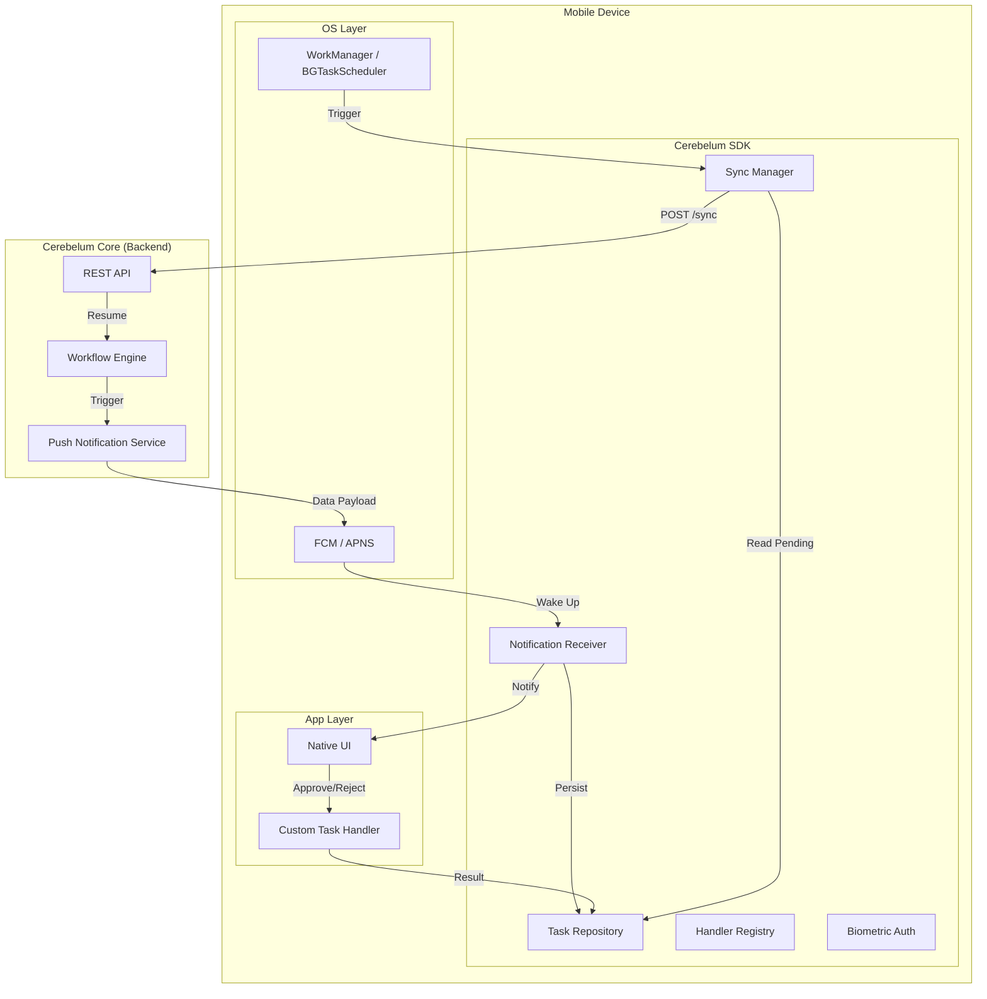
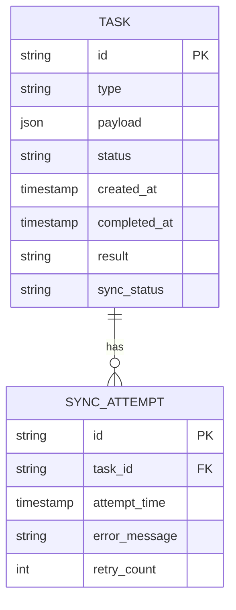

# Design Document

## Overview
The Cerebelum Mobile SDK is designed as a lightweight, offline-first Kotlin Multiplatform (KMP) library. It bridges the gap between the Cerebelum Core backend (Elixir) and native mobile applications (Android/iOS). The architecture prioritizes resilience and user experience by decoupling the human interaction from the backend workflow state using a "Store & Forward" synchronization pattern.

## Architecture



## Components and Interfaces

### 1. Notification Receiver
*   **Responsibility:** Intercepts incoming Data Notifications from FCM/APNS.
*   **Inputs:** RemoteMessage (Android) / UNNotification (iOS).
*   **Outputs:** Parsed `Task` object stored in `TaskRepository`.
*   **Behavior:** Extracts `task_id`, `type`, and `payload`. Persists immediately to avoid data loss. Triggers local notification if app is in background.

### 2. Task Repository
*   **Responsibility:** Local persistence source of truth.
*   **Technology:** SQLDelight (KMP compatible).
*   **Operations:** `saveTask()`, `getPendingTasks()`, `markTaskCompleted()`, `updateSyncStatus()`.

### 3. Handler Registry
*   **Responsibility:** Maps task types (strings) to developer-defined callbacks.
*   **Interface:**
    ```kotlin
    fun registerTaskHandler(type: String, handler: (Task) -> TaskResult)
    ```

### 4. Sync Manager
*   **Responsibility:** Handles reliable upload of completed tasks.
*   **Behavior:**
    *   Triggered by: Immediate user action OR Background Scheduler (WorkManager).
    *   Logic: Reads tasks with `status=PENDING_SYNC`. Batches them. Sends to API.
    *   Retry: Uses exponential backoff for failed requests.

### 5. Biometric Authenticator
*   **Responsibility:** Wraps platform-specific biometric APIs (BiometricPrompt on Android, LocalAuthentication on iOS).
*   **Output:** Cryptographic signature or boolean success flag.

## Data Models



*   **Task Status:** `NEW`, `VIEWED`, `COMPLETED`
*   **Sync Status:** `NOT_SYNCED`, `SYNCING`, `SYNCED`, `FAILED`

## Error Handling

### Network Failures
*   **Strategy:** "Store & Forward".
*   **UX:** User sees "Saved offline" toast. Sync happens transparently in background.
*   **Retry:** Exponential backoff (15min, 30min, 1h, 4h) managed by platform schedulers.

### Biometric Failure
*   **Strategy:** Fail fast.
*   **UX:** "Authentication failed. Please try again."
*   **Security:** Do not persist approval if auth fails.

### Unregistered Handler
*   **Strategy:** Log and Ignore.
*   **UX:** User sees notification but clicking it might just open the app home screen (fallback). Developer sees warning in logs.

## Testing Strategy

### Unit Testing
*   Test `TaskRepository` logic using in-memory SQLDelight driver.
*   Test `SyncManager` retry logic with mocked API client.

### Integration Testing
*   Test `HandlerRegistry` ensures callbacks are invoked correctly.

### Platform Testing
*   **Android:** Instrumented tests for `WorkManager` constraints.
*   **iOS:** XCTest for background fetch simulation.
