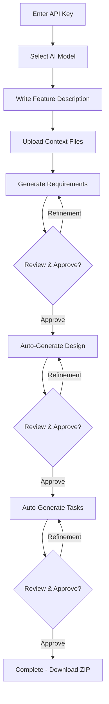

# OpenSpecification Documentation

Comprehensive documentation for understanding and working with OpenSpecification's AI-powered specification generation system.

## 📚 Table of Contents

### Core Concepts
1. [**Workflow Explained**](./workflow-explained.md) - Complete explanation of the 3-phase workflow
2. [**Prompts System**](./prompts-system.md) - Detailed breakdown of all AI prompts used
3. [**Business Rules**](./business-rules.md) - Validation rules and constraints

### Technical Details
4. [**State Machine**](./diagrams/state-machine.md) - Visual representation of the workflow state machine
5. [**Data Flow**](./diagrams/workflow-flow.md) - How data flows through the system

### Examples
6. [**Examples Directory**](./examples/README.md) - Complete end-to-end examples
   - Chat Application
   - E-commerce Shopping Cart
   - Analytics Dashboard

## 🎯 Quick Start Guide

OpenSpecification generates technical specifications in 3 phases:

```
Requirements (EARS format)
    ↓
Design (Architecture + Diagrams)
    ↓
Tasks (Implementation Plan)
```

### The 3-Phase Process

| Phase | Input | Output | Duration |
|-------|-------|--------|----------|
| **Requirements** | User description + context files | Requirements document in EARS format | ~10-15s |
| **Design** | Approved requirements | Technical design with Mermaid diagrams | ~20-25s |
| **Tasks** | Approved requirements + design | Implementation task list with checkboxes | ~15-20s |

**Total:** ~45-60 seconds for complete specification

## 🔑 Key Concepts

### EARS Format (Requirements Phase)
EARS = Enhanced At a Glance Requirements Specification

Uses 4 keywords for acceptance criteria:
- **WHEN** - Event that triggers behavior
- **IF** - Precondition that must be true
- **WHILE** - Behavior during a condition
- **WHERE** - Context or specific location

Example:
```
WHEN user clicks "Send" THEN system SHALL deliver message in < 1 second
IF message contains attachment THEN system SHALL validate file type and size
WHILE message is sending THEN system SHALL display sending indicator
WHERE user is offline THEN system SHALL queue message for later delivery
```

### Progressive Refinement
Each phase builds on the previous:
- **Requirements** uses raw user input
- **Design** uses only approved requirements (ignores original input)
- **Tasks** uses approved requirements + design

This ensures formalization and prevents ambiguity from propagating.

### Approval Gates
Each phase requires explicit approval before proceeding:
- Cannot skip phases
- Cannot go back after approval
- Can request refinement unlimited times before approving

## 🚀 Usage Flow



## 📊 What Gets Generated

### Requirements Document
- Introduction and scope
- User stories
- EARS-formatted acceptance criteria
- Edge cases and constraints
- ~1500-3000 words

### Design Document
- Architecture overview
- Component descriptions
- Mermaid diagrams (architecture, ERD)
- Error handling strategy
- Testing approach
- ~2000-4000 words

### Implementation Plan
- Numbered task list with checkboxes
- 2-level hierarchy (1, 1.1, 1.2, 2, 2.1...)
- Specific deliverables per task
- Requirement traceability
- Testing tasks included
- ~50-100 tasks

## 🔧 Advanced Features

### Context Files
- Supported: .md, .txt, .json, .yaml, .ts, .js, .py, etc.
- Max size: 2KB per file, 5KB total
- Images are excluded (too large for token limits)
- Only used in Requirements phase

### Prompt Change Detection
If you significantly change your description during Requirements phase:
- System auto-detects change (< 40% word overlap)
- Auto-resets entire workflow
- Prevents inconsistent specifications

### Token Management
- Total limit: 32,768 tokens per API call
- Output reserved: 8,192 tokens
- Input budget: ~24,000 tokens
- Server-side clamping if exceeded

### Refinement History
- Each refinement is versioned
- Can track changes over time
- Feedback is stored with each version

## 📖 Reading Guide

**For Developers:**
1. Start with [Workflow Explained](./workflow-explained.md)
2. Read [Prompts System](./prompts-system.md) to understand AI interactions
3. Review [Examples](./examples/README.md) for practical understanding

**For Project Managers:**
1. Start with [Examples](./examples/README.md) to see outputs
2. Read [Workflow Explained](./workflow-explained.md) for process understanding
3. Review [Business Rules](./business-rules.md) for constraints

**For AI Engineers:**
1. Start with [Prompts System](./prompts-system.md)
2. Study [State Machine](./diagrams/state-machine.md)
3. Review [Data Flow](./diagrams/workflow-flow.md)

## 🤝 Contributing to Documentation

When adding documentation:
- Follow existing structure
- Include concrete examples
- Add diagrams where helpful
- Cross-reference related docs

## 📞 Support

For questions about the system:
- Check [Examples](./examples/README.md) first
- Review [Workflow Explained](./workflow-explained.md)
- See main [README.md](../README.md) for project info
