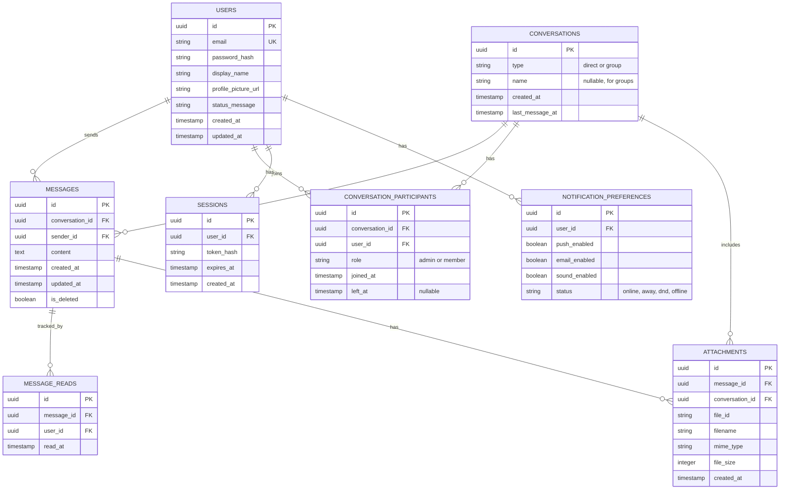

# Design Document - Chat Application

## Overview

This design implements a real-time messaging platform using a modern web stack with WebSocket for live communication and REST APIs for CRUD operations. The architecture separates concerns across presentation (React frontend), business logic (Node.js backend), and data layers (PostgreSQL + Redis). The system is designed to handle 1000+ concurrent WebSocket connections while maintaining sub-second message delivery latency.

### Key Design Decisions

1. **WebSocket for Real-time**: Uses Socket.io for bidirectional communication with automatic reconnection
2. **Stateless REST API**: All HTTP endpoints are stateless, allowing horizontal scaling
3. **Redis for Caching**: Implements Redis for session management, online user tracking, and message caching
4. **PostgreSQL for Persistence**: Relational database for messages, users, and conversations with proper indexing
5. **JWT for Authentication**: Token-based auth stored in httpOnly cookies for security
6. **S3-compatible Storage**: Decoupled file storage for scalability
7. **Type Safety**: TypeScript across frontend and backend for reliability

---

## Architecture

### High-Level System Architecture


### Component Architecture


---

## Components and Interfaces

### Frontend Components

#### 1. Authentication Module
**Responsibility:** Handle user authentication, registration, and session management

**Interfaces:**
- `register(email, password, displayName): Promise<User>`
- `login(email, password): Promise<{user: User, token: string}>`
- `logout(): Promise<void>`
- `resetPassword(email): Promise<void>`

**State Management:** React Context API for auth state
**Storage:** JWT token in httpOnly cookie

#### 2. WebSocket Client Manager
**Responsibility:** Manage WebSocket connection lifecycle, reconnection, and event handling

**Interfaces:**
- `connect(token): void`
- `disconnect(): void`
- `sendMessage(conversationId, content): void`
- `joinRoom(conversationId): void`
- `emitTyping(conversationId): void`

**Events Handled:**
- `message:new` - Incoming message
- `message:read` - Read receipt update
- `user:typing` - Typing indicator
- `user:status` - Online/offline status
- `connection:lost` - Connection dropped
- `connection:restored` - Reconnected

**Reconnection Strategy:** Exponential backoff (1s, 2s, 4s, 8s, 16s, 30s cap)

#### 3. Conversation List Component
**Responsibility:** Display and manage list of conversations with sorting and filtering

**Props:**
- `conversations: Conversation[]`
- `selectedId: string | null`
- `onSelect: (id: string) => void`

**Features:**
- Sort by last message timestamp
- Display unread badges
- Show message previews
- Infinite scroll for large lists
- Search/filter conversations

#### 4. Message View Component
**Responsibility:** Display message thread with infinite scroll and real-time updates

**Props:**
- `conversationId: string`
- `messages: Message[]`
- `onSendMessage: (content: string) => void`

**Features:**
- Virtual scrolling for performance (react-window)
- Lazy load older messages on scroll
- Optimistic UI updates
- Typing indicators
- Message status (sending, delivered, read)
- File attachment previews

#### 5. File Upload Component
**Responsibility:** Handle file selection, validation, and upload with progress

**Interfaces:**
- `uploadFile(file: File, conversationId: string): Promise<Attachment>`
- `validateFile(file: File): {valid: boolean, error?: string}`

**Validation:**
- File types: images (jpg, png, gif), documents (pdf, doc, docx)
- Max size: 20MB
- Malware scan before upload

### Backend Services

#### 1. Authentication Service
**Responsibility:** User registration, login, session management, password reset

**Interfaces:**
```typescript
class AuthService {
  register(email: string, password: string, displayName: string): Promise<User>
  login(email: string, password: string): Promise<{user: User, token: string}>
  verifyToken(token: string): Promise<User>
  generateToken(userId: string): string
  hashPassword(password: string): Promise<string>
  comparePassword(plain: string, hash: string): Promise<boolean>
  requestPasswordReset(email: string): Promise<void>
  resetPassword(token: string, newPassword: string): Promise<void>
}
```

**Security:**
- bcrypt for password hashing (12 rounds)
- JWT with HMAC-SHA256 signing
- Token expiry: 7 days
- Rate limiting: 5 login attempts per 15 minutes per IP

#### 2. Message Service
**Responsibility:** Create, retrieve, search messages, handle delivery and read status

**Interfaces:**
```typescript
class MessageService {
  sendMessage(senderId: string, conversationId: string, content: string): Promise<Message>
  getMessages(conversationId: string, limit: number, offset: number): Promise<Message[]>
  markAsRead(messageId: string, userId: string): Promise<void>
  deleteMessage(messageId: string, userId: string): Promise<void>
  searchMessages(userId: string, query: string): Promise<SearchResult[]>
  broadcastToConversation(conversationId: string, message: Message): void
}
```

**Caching Strategy:**
- Cache last 50 messages per conversation in Redis (TTL: 1 hour)
- Cache hit = avoid DB query, cache miss = query DB and populate cache
- Invalidate cache on new message

**Database Queries:**
```sql
-- Get recent messages with pagination
SELECT * FROM messages
WHERE conversation_id = $1
ORDER BY created_at DESC
LIMIT $2 OFFSET $3

-- Search messages
SELECT m.*, c.* FROM messages m
JOIN conversations c ON m.conversation_id = c.id
JOIN conversation_participants cp ON c.id = cp.conversation_id
WHERE cp.user_id = $1 AND m.content ILIKE $2
ORDER BY m.created_at DESC
LIMIT 50
```

#### 3. User Service
**Responsibility:** User profile management, search, online status

**Interfaces:**
```typescript
class UserService {
  getUserById(userId: string): Promise<User>
  updateProfile(userId: string, updates: ProfileUpdate): Promise<User>
  searchUsers(query: string, requesterId: string): Promise<User[]>
  setOnlineStatus(userId: string, status: 'online' | 'away' | 'offline'): Promise<void>
  getOnlineStatus(userId: string): Promise<{status: string, lastSeen?: Date}>
}
```

**Online Status Tracking:**
- Store in Redis with key `user:${userId}:status`
- TTL: 5 minutes (refreshed on activity)
- Publish status changes to Redis pub/sub

#### 4. Conversation Service
**Responsibility:** Create conversations, manage participants, handle groups

**Interfaces:**
```typescript
class ConversationService {
  createDirectConversation(user1Id: string, user2Id: string): Promise<Conversation>
  createGroupConversation(name: string, participantIds: string[]): Promise<Conversation>
  addParticipant(conversationId: string, userId: string): Promise<void>
  removeParticipant(conversationId: string, userId: string): Promise<void>
  getConversations(userId: string): Promise<Conversation[]>
  getConversationById(conversationId: string): Promise<Conversation>
}
```

#### 5. File Service
**Responsibility:** Handle file uploads, generate secure URLs, validate files

**Interfaces:**
```typescript
class FileService {
  uploadFile(file: Buffer, filename: string, mimeType: string): Promise<{fileId: string, url: string}>
  getSignedUrl(fileId: string, userId: string, conversationId: string): Promise<string>
  deleteFile(fileId: string): Promise<void>
  validateFile(file: Buffer, mimeType: string): {valid: boolean, error?: string}
}
```

**Storage:**
- S3-compatible storage (AWS S3, MinIO, etc.)
- File naming: `{conversationId}/{messageId}/{uuid}-{filename}`
- Access control: Verify user is conversation participant
- Signed URLs: TTL 1 hour for security

#### 6. Notification Service
**Responsibility:** Send push notifications, emails, manage notification preferences

**Interfaces:**
```typescript
class NotificationService {
  sendPushNotification(userId: string, message: PushMessage): Promise<void>
  sendEmail(to: string, subject: string, body: string): Promise<void>
  queueNotification(userId: string, notification: Notification): Promise<void>
  getNotificationPreferences(userId: string): Promise<NotificationPreferences>
  updatePreferences(userId: string, prefs: Partial<NotificationPreferences>): Promise<void>
}
```

**Notification Rules:**
- Don't send if user is active in conversation
- Batch notifications if multiple messages in short period
- Respect user's Do Not Disturb status

---

## Data Models

### Entity Relationship Diagram



### Database Indexes

```sql
-- Performance-critical indexes
CREATE INDEX idx_messages_conversation_created ON messages(conversation_id, created_at DESC);
CREATE INDEX idx_messages_sender ON messages(sender_id);
CREATE INDEX idx_messages_content_gin ON messages USING gin(to_tsvector('english', content));
CREATE INDEX idx_conversations_last_message ON conversations(last_message_at DESC);
CREATE INDEX idx_participants_user ON conversation_participants(user_id);
CREATE INDEX idx_participants_conversation ON conversation_participants(conversation_id);
CREATE INDEX idx_message_reads_message ON message_reads(message_id);
CREATE INDEX idx_sessions_user ON sessions(user_id);
CREATE INDEX idx_sessions_token ON sessions(token_hash);
```

### Redis Data Structures

```typescript
// Online users set
SET user:{userId}:status "online" EX 300  // 5 min TTL

// Cached messages (list)
LPUSH conversation:{conversationId}:messages {messageJSON}
LTRIM conversation:{conversationId}:messages 0 49  // Keep last 50

// Typing indicators (set with TTL)
SETEX typing:{conversationId}:{userId} 5 "1"  // 5 sec TTL

// Unread counts (hash)
HINCRBY unread:{userId} {conversationId} 1

// Pub/Sub channels
PUBLISH conversation:{conversationId} {messageJSON}
PUBLISH user:{userId}:status {statusUpdate}
```

---

## API Endpoints

### Authentication Endpoints

```
POST   /api/auth/register          # Register new user
POST   /api/auth/login             # Login user
POST   /api/auth/logout            # Logout user
POST   /api/auth/refresh           # Refresh JWT token
POST   /api/auth/forgot-password   # Request password reset
POST   /api/auth/reset-password    # Reset password with token
GET    /api/auth/verify            # Verify current session
```

### User Endpoints

```
GET    /api/users/me               # Get current user profile
PUT    /api/users/me               # Update profile
POST   /api/users/me/avatar        # Upload profile picture
GET    /api/users/search           # Search users (query param: q)
GET    /api/users/:id              # Get user by ID
PUT    /api/users/:id/status       # Update online status
```

### Conversation Endpoints

```
GET    /api/conversations          # Get all user's conversations
POST   /api/conversations          # Create new conversation
GET    /api/conversations/:id      # Get conversation details
PUT    /api/conversations/:id      # Update conversation (name, settings)
DELETE /api/conversations/:id      # Leave/delete conversation
POST   /api/conversations/:id/participants  # Add participant
DELETE /api/conversations/:id/participants/:userId  # Remove participant
```

### Message Endpoints

```
GET    /api/conversations/:id/messages       # Get messages (pagination)
POST   /api/conversations/:id/messages       # Send message
PUT    /api/messages/:id                     # Edit message
DELETE /api/messages/:id                     # Delete message
POST   /api/messages/:id/read                # Mark as read
GET    /api/messages/search                  # Search messages (query param: q)
```

### File Endpoints

```
POST   /api/files/upload           # Upload file attachment
GET    /api/files/:id              # Get file (redirects to signed URL)
DELETE /api/files/:id              # Delete file
```

### WebSocket Events

```
// Client → Server
message:send                        # Send new message
message:read                        # Mark message as read
typing:start                        # User started typing
typing:stop                         # User stopped typing
conversation:join                   # Join conversation room
conversation:leave                  # Leave conversation room

// Server → Client
message:new                         # New message received
message:delivered                   # Message delivered
message:read                        # Message read by recipient
user:typing                         # User is typing
user:status                         # User status changed (online/offline)
conversation:updated                # Conversation metadata changed
error                               # Error occurred
```

---

## Error Handling

### Error Types and Handling Strategy

```typescript
// Error hierarchy
class AppError extends Error {
  constructor(
    public statusCode: number,
    public message: string,
    public code: string
  ) {}
}

class ValidationError extends AppError {
  constructor(message: string) {
    super(400, message, 'VALIDATION_ERROR')
  }
}

class AuthenticationError extends AppError {
  constructor(message: string = 'Authentication required') {
    super(401, message, 'AUTH_ERROR')
  }
}

class AuthorizationError extends AppError {
  constructor(message: string = 'Access denied') {
    super(403, message, 'FORBIDDEN')
  }
}

class NotFoundError extends AppError {
  constructor(resource: string) {
    super(404, `${resource} not found`, 'NOT_FOUND')
  }
}

class ConflictError extends AppError {
  constructor(message: string) {
    super(409, message, 'CONFLICT')
  }
}

class RateLimitError extends AppError {
  constructor() {
    super(429, 'Too many requests', 'RATE_LIMIT')
  }
}
```

### Error Response Format

```json
{
  "error": {
    "code": "VALIDATION_ERROR",
    "message": "Email is required",
    "details": {
      "field": "email",
      "value": null
    },
    "timestamp": "2024-01-15T10:30:00Z",
    "requestId": "req_abc123"
  }
}
```

### WebSocket Error Handling

```typescript
// Connection errors
socket.on('connect_error', (error) => {
  // Log error and attempt reconnection
  logger.error('WebSocket connection error', {error})
  // Exponential backoff handled by Socket.io
})

// Message delivery errors
socket.on('message:error', (error) => {
  // Show retry option to user
  displayError('Failed to send message. Retry?')
  // Queue message for retry
  queueForRetry(message)
})
```

### Database Error Handling

```typescript
try {
  await query(sql, params)
} catch (error) {
  if (error.code === '23505') {
    // Unique constraint violation
    throw new ConflictError('Resource already exists')
  } else if (error.code === '23503') {
    // Foreign key violation
    throw new ValidationError('Referenced resource does not exist')
  } else {
    // Generic database error
    logger.error('Database error', {error, sql})
    throw new AppError(500, 'Database operation failed', 'DB_ERROR')
  }
}
```

---

## Testing Strategy

### Unit Testing

**Tools:** Jest, TypeScript

**Coverage Targets:**
- Services: 90%+ coverage
- Utilities: 100% coverage
- Critical paths: 100% coverage

**Example Tests:**
```typescript
describe('MessageService', () => {
  describe('sendMessage', () => {
    it('should create message and broadcast to participants', async () => {
      const message = await messageService.sendMessage(userId, convId, 'Hello')
      expect(message.content).toBe('Hello')
      expect(broadcastSpy).toHaveBeenCalledWith(convId, message)
    })

    it('should reject message if user not participant', async () => {
      await expect(
        messageService.sendMessage(nonParticipant, convId, 'Hello')
      ).rejects.toThrow(AuthorizationError)
    })
  })
})
```

### Integration Testing

**Tools:** Jest, Supertest

**Focus:** API endpoint testing with database

**Example Tests:**
```typescript
describe('POST /api/conversations/:id/messages', () => {
  it('should send message and return 201', async () => {
    const response = await request(app)
      .post(`/api/conversations/${convId}/messages`)
      .set('Authorization', `Bearer ${token}`)
      .send({content: 'Test message'})
      .expect(201)

    expect(response.body.message.content).toBe('Test message')

    // Verify stored in database
    const stored = await db.query(
      'SELECT * FROM messages WHERE id = $1',
      [response.body.message.id]
    )
    expect(stored.rows[0]).toBeDefined()
  })
})
```

### WebSocket Testing

**Tools:** Socket.io-client, Jest

**Example Tests:**
```typescript
describe('WebSocket Events', () => {
  it('should broadcast message to all conversation participants', (done) => {
    const client1 = io(server, {auth: {token: token1}})
    const client2 = io(server, {auth: {token: token2}})

    client1.emit('conversation:join', convId)
    client2.emit('conversation:join', convId)

    client2.on('message:new', (message) => {
      expect(message.content).toBe('Hello')
      expect(message.senderId).toBe(user1Id)
      done()
    })

    client1.emit('message:send', {
      conversationId: convId,
      content: 'Hello'
    })
  })
})
```

### End-to-End Testing

**Tools:** Playwright, Cypress

**Scenarios:**
1. User registration and login flow
2. Create conversation and send messages
3. File upload and download
4. Real-time message delivery
5. Typing indicators
6. Online status updates
7. Message search

**Example Test:**
```typescript
test('full conversation flow', async ({page}) => {
  // Login
  await page.goto('/login')
  await page.fill('[name=email]', 'user@test.com')
  await page.fill('[name=password]', 'password')
  await page.click('button[type=submit]')

  // Create conversation
  await page.click('[data-testid=new-conversation]')
  await page.fill('[data-testid=user-search]', 'john')
  await page.click('[data-testid=user-result-0]')

  // Send message
  await page.fill('[data-testid=message-input]', 'Hello John!')
  await page.click('[data-testid=send-button]')

  // Verify message appears
  await expect(page.locator('[data-testid=message-0]'))
    .toContainText('Hello John!')
})
```

### Performance Testing

**Tools:** Artillery, k6

**Load Tests:**
- 1000 concurrent WebSocket connections
- 100 messages/second throughput
- API response times under 500ms (p95)

**Example Artillery Config:**
```yaml
config:
  target: 'wss://localhost:3000'
  phases:
    - duration: 60
      arrivalRate: 10
      name: "Warm up"
    - duration: 300
      arrivalRate: 50
      name: "Sustained load"
scenarios:
  - name: "Send messages"
    engine: socketio
    flow:
      - emit:
          channel: "message:send"
          data:
            conversationId: "{{conversationId}}"
            content: "Load test message"
```

---

## Deployment Architecture

### Infrastructure


### Scaling Strategy

**Horizontal Scaling:**
- API servers: Stateless, can scale infinitely behind load balancer
- WebSocket servers: Sticky sessions via user ID, Redis pub/sub for cross-server communication
- Database: Read replicas for query scaling, connection pooling

**Caching:**
- Redis for hot data (recent messages, online users, session tokens)
- CDN for static assets (React app, images, documents)
- Browser caching for API responses where appropriate

**Monitoring:**
- Metrics: Prometheus + Grafana
- Logs: ELK stack (Elasticsearch, Logstash, Kibana)
- Alerts: PagerDuty for critical errors
- APM: New Relic or DataDog for performance monitoring

---

## Security Considerations

### Authentication & Authorization
- JWT tokens with short expiry (7 days)
- httpOnly cookies to prevent XSS
- Refresh token rotation on renewal
- Rate limiting on auth endpoints (5 attempts / 15 min)

### Data Protection
- TLS 1.3 for all connections
- Password hashing with bcrypt (12 rounds)
- SQL parameterization to prevent injection
- Input sanitization for XSS prevention
- CORS configuration to restrict origins

### File Upload Security
- File type validation (whitelist only)
- File size limits (20MB max)
- Malware scanning before storage
- Signed URLs with expiration
- Access control verification

### Infrastructure Security
- Network segmentation (public, private, data subnets)
- Database encryption at rest
- Secrets management (AWS Secrets Manager, HashiCorp Vault)
- Security groups / firewall rules
- Regular security audits and penetration testing

---

## Conclusion

This design provides a scalable, secure, and maintainable architecture for a real-time chat application. Key strengths include:
- WebSocket for sub-second message delivery
- Redis caching for performance
- Horizontal scalability via stateless design
- Comprehensive error handling
- Strong security measures
- Full test coverage strategy

The system is designed to support 50-100 users initially while having the architecture to scale to 1000+ concurrent users with minimal changes.
