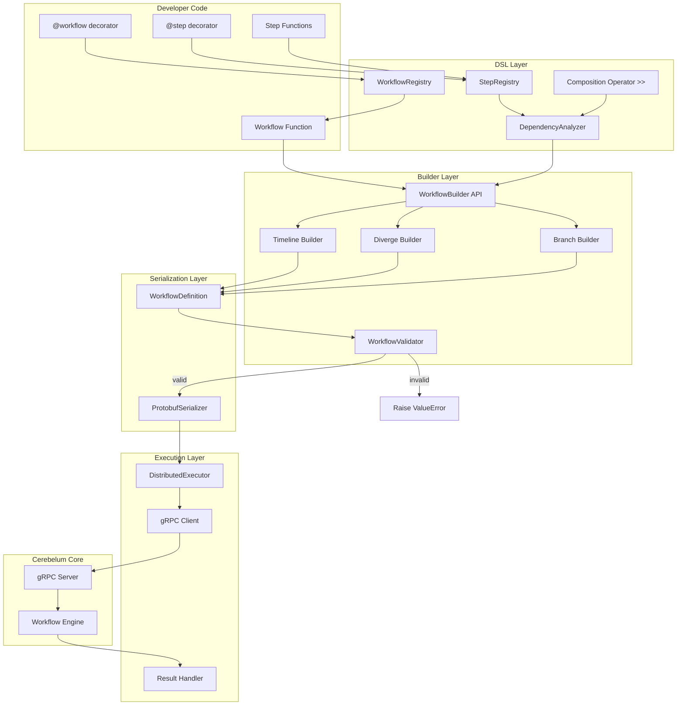
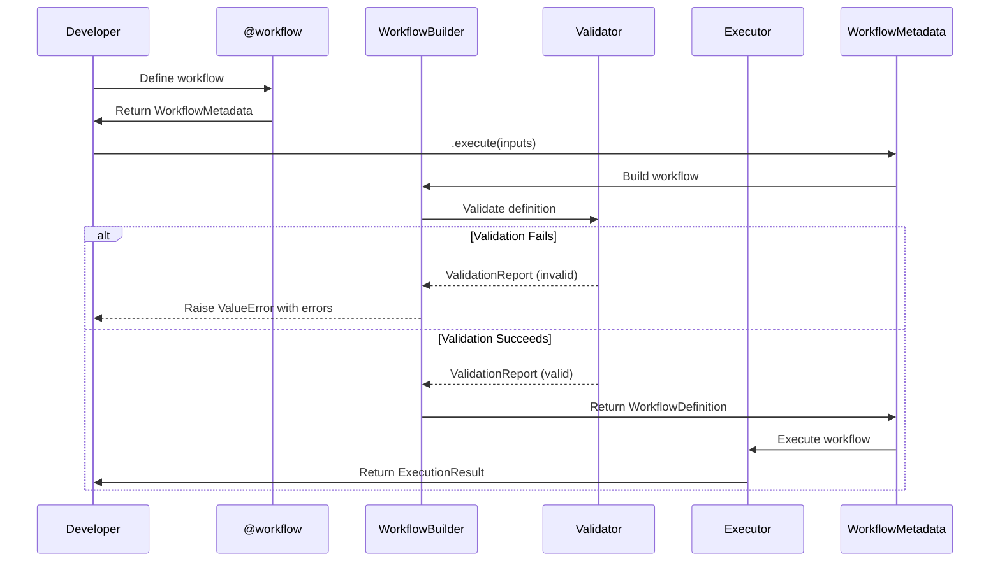
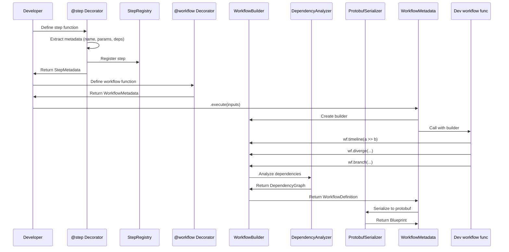
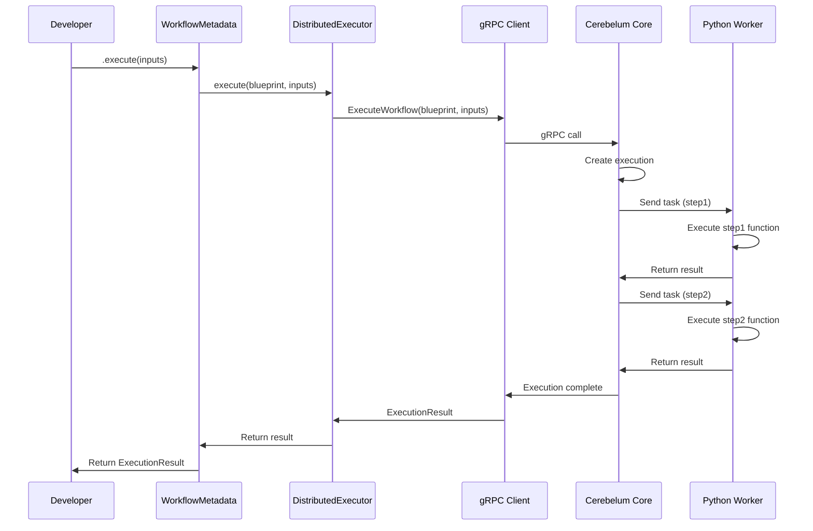
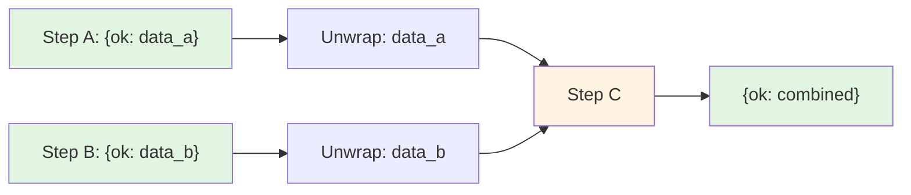

# Design Document - Cerebelum Python DSL

## Document Information

**Version:** 1.0
**Status:** Draft
**Last Updated:** 2025-11-20
**Based On:** Requirements Document v1.0

---

## Table of Contents

1. [Overview](#overview)
2. [Architecture](#architecture)
3. [Component Design](#component-design)
4. [Data Flow](#data-flow)
5. [Error Handling Strategy](#error-handling-strategy)
6. [Testing Strategy](#testing-strategy)
7. [Implementation Considerations](#implementation-considerations)
8. [Appendix](#appendix)

---

## Overview

### Purpose

This document describes the technical design for implementing a declarative DSL (Domain-Specific Language) for the Cerebelum Python SDK. The DSL enables developers to define workflows using Python decorators, composition operators, and automatic dependency resolution.

### Design Goals

1. **Pythonic Syntax** - Use Python idioms (decorators, operators, type hints)
2. **Zero Configuration** - Automatic dependency resolution and parallelism
3. **Type Safety** - Full type hints for IDE support and static analysis
4. **Backward Compatible** - Maintain existing gRPC protocol with Core
5. **Performance** - O(n log n) dependency analysis, <100ms definition time
6. **Developer Experience** - Clear error messages with step names and locations

### Constraints

- **No Core Changes** - Must work with existing Cerebelum Core (Elixir)
- **Existing Protobuf** - Must use current gRPC definitions
- **Python 3.9+** - Minimum supported version
- **Breaking Change** - Old WorkflowBuilder API will be deprecated

---

## Architecture

### High-Level Architecture



### Layer Responsibilities

| Layer | Responsibility | Inputs | Outputs |
|-------|---------------|--------|---------|
| **DSL Layer** | Parse decorators, build step registry, analyze dependencies | Python functions | StepMetadata, DependencyGraph |
| **Builder Layer** | Construct workflow structure, validate integrity (timeline, diverge, branch) | Step compositions | WorkflowDefinition (validated) |
| **Serialization Layer** | Convert to protobuf | WorkflowDefinition | Blueprint protobuf |
| **Execution Layer** | Send to Core via gRPC, handle results | Blueprint, inputs | ExecutionResult |

---

## Component Design

### 1. Decorator System

#### 1.1 Step Decorator (`@step`)

**Purpose:** Transform async functions into workflow steps with metadata extraction.

**Design:**

```python
# File: cerebelum/dsl/decorators.py

from typing import Callable, TypeVar, ParamSpec
from inspect import signature, iscoroutinefunction
import functools

P = ParamSpec('P')
R = TypeVar('R')

class StepMetadata:
    """Metadata for a decorated step function."""

    def __init__(
        self,
        name: str,
        function: Callable,
        parameters: list[str],
        has_context: bool,
        has_inputs: bool,
        dependencies: list[str],
    ):
        self.name = name
        self.function = function
        self.parameters = parameters
        self.has_context = has_context
        self.has_inputs = has_inputs
        self.dependencies = dependencies

    def __rshift__(self, other: 'StepMetadata') -> 'StepComposition':
        """Enable >> operator for composition."""
        return StepComposition([self, other])


class StepComposition:
    """Represents a chain of steps composed with >>."""

    def __init__(self, steps: list[StepMetadata]):
        self.steps = steps

    def __rshift__(self, other):
        """Allow chaining: a >> b >> c."""
        if isinstance(other, StepMetadata):
            return StepComposition(self.steps + [other])
        elif isinstance(other, StepComposition):
            return StepComposition(self.steps + other.steps)
        else:
            raise TypeError(f"Cannot compose with {type(other)}")


def step(func: Callable[P, R]) -> StepMetadata:
    """
    Decorator to mark an async function as a workflow step.

    Validates:
    - Function must be async
    - Function must return dict with "ok" or "error" key

    Extracts:
    - Parameter names (for dependency resolution)
    - Presence of 'context' parameter
    - Presence of 'inputs' parameter

    Example:
        @step
        async def my_step(context, inputs):
            return {"ok": "result"}
    """
    # Validation
    if not iscoroutinefunction(func):
        raise TypeError(f"Step functions must be async. '{func.__name__}' is not async.")

    # Extract metadata
    sig = signature(func)
    params = list(sig.parameters.keys())

    # First param must be 'context'
    if not params or params[0] != 'context':
        raise ValueError(
            f"Step '{func.__name__}' must have 'context' as first parameter. "
            f"Got: {params}"
        )

    # Determine dependencies (all params except 'context' and 'inputs')
    has_context = 'context' in params
    has_inputs = 'inputs' in params
    dependencies = [p for p in params if p not in ('context', 'inputs')]

    # Create metadata
    metadata = StepMetadata(
        name=func.__name__,
        function=func,
        parameters=params,
        has_context=has_context,
        has_inputs=has_inputs,
        dependencies=dependencies,
    )

    # Register in global registry
    StepRegistry.register(metadata)

    # Return metadata (not wrapped function)
    # This allows using the step directly in workflow definitions
    return metadata
```

**Key Design Decisions:**

1. **Return StepMetadata, not wrapped function** - Allows `step1 >> step2` syntax
2. **Validate at decoration time** - Fail fast if function is not async
3. **Extract dependencies from signature** - Automatic from parameter names
4. **Store in global registry** - Accessible from workflow decorator

#### 1.2 Workflow Decorator (`@workflow`)

**Purpose:** Transform a function into an executable workflow with builder API.

**Design:**

```python
# File: cerebelum/dsl/decorators.py

class WorkflowMetadata:
    """Metadata for a decorated workflow function."""

    def __init__(
        self,
        name: str,
        definition_func: Callable,
        core_url: str = "localhost:9090",
    ):
        self.name = name
        self.definition_func = definition_func
        self.core_url = core_url
        self._built_definition: Optional[WorkflowDefinition] = None

    async def execute(self, inputs: dict) -> ExecutionResult:
        """Execute the workflow with given inputs."""
        # Build if not already built
        if not self._built_definition:
            self._build()

        # Create executor
        executor = DistributedExecutor(core_url=self.core_url)

        # Execute
        return await executor.execute(self._built_definition, inputs)

    def _build(self) -> None:
        """Build the workflow definition by calling the definition function."""
        from .builder import WorkflowBuilder

        # Create builder
        builder = WorkflowBuilder(workflow_id=self.name)

        # Call user's definition function with builder
        self.definition_func(builder)

        # Build final definition
        self._built_definition = builder.build()


def workflow(
    func: Optional[Callable] = None,
    *,
    core_url: str = "localhost:9090"
):
    """
    Decorator to mark a function as a workflow definition.

    The function receives a WorkflowBuilder and defines the workflow structure.

    Example:
        @workflow
        def my_workflow(wf):
            wf.timeline(step1 >> step2 >> step3)

        # Execute
        result = await my_workflow.execute({"user_id": 123})
    """
    def decorator(f: Callable) -> WorkflowMetadata:
        # Validation
        if iscoroutinefunction(f):
            raise TypeError(
                f"Workflow functions must not be async. '{f.__name__}' is async."
            )

        # Create metadata
        metadata = WorkflowMetadata(
            name=f.__name__,
            definition_func=f,
            core_url=core_url,
        )

        # Register
        WorkflowRegistry.register(metadata)

        return metadata

    # Support both @workflow and @workflow(core_url="...")
    if func is None:
        return decorator
    else:
        return decorator(func)
```

**Key Design Decisions:**

1. **Lazy building** - Build on first execute() call
2. **Builder injection** - Pass WorkflowBuilder to user function
3. **Non-async validation** - Workflow definitions should be sync
4. **Return WorkflowMetadata** - Provides .execute() method

---

### 2. Composition Operator (`>>`)

**Purpose:** Enable sequential composition of steps using Python's right-shift operator.

**Design:**

The `>>` operator is implemented via `__rshift__` magic method on `StepMetadata`:

```python
# In StepMetadata class

def __rshift__(self, other):
    """Enable step1 >> step2 syntax."""
    if isinstance(other, StepMetadata):
        return StepComposition([self, other])
    elif isinstance(other, StepComposition):
        return StepComposition([self] + other.steps)
    else:
        raise TypeError(
            f"Cannot compose StepMetadata with {type(other)}. "
            f"Right operand must be a step decorated with @step."
        )
```

**Composition Chain:**

```python
# User code
a >> b >> c

# Evaluation:
# 1. a >> b  → StepComposition([a, b])
# 2. StepComposition([a, b]) >> c  → StepComposition([a, b, c])

# StepComposition also implements __rshift__:
class StepComposition:
    def __rshift__(self, other):
        if isinstance(other, StepMetadata):
            return StepComposition(self.steps + [other])
        elif isinstance(other, StepComposition):
            return StepComposition(self.steps + other.steps)
        else:
            raise TypeError(...)
```

**Type Checking:**

```python
# For type safety with mypy/pyright
from typing import Union

StepOrComposition = Union[StepMetadata, StepComposition]
```

---

### 3. Dependency Resolution System

**Purpose:** Analyze step dependencies, detect cycles, determine execution order.

**Design:**

```python
# File: cerebelum/dsl/analyzer.py

from typing import Set, Dict, List
from dataclasses import dataclass

@dataclass
class DependencyNode:
    """Node in dependency graph."""
    step: StepMetadata
    dependencies: Set[str]
    dependents: Set[str]


class DependencyGraph:
    """Dependency graph for workflow steps."""

    def __init__(self):
        self.nodes: Dict[str, DependencyNode] = {}

    def add_step(self, step: StepMetadata):
        """Add a step to the graph."""
        self.nodes[step.name] = DependencyNode(
            step=step,
            dependencies=set(step.dependencies),
            dependents=set(),
        )

    def build_edges(self):
        """Build dependency edges between nodes."""
        for name, node in self.nodes.items():
            for dep_name in node.dependencies:
                if dep_name not in self.nodes:
                    raise ValueError(
                        f"Step '{name}' depends on '{dep_name}' which does not exist. "
                        f"Available steps: {list(self.nodes.keys())}"
                    )
                self.nodes[dep_name].dependents.add(name)

    def detect_cycles(self) -> Optional[List[str]]:
        """
        Detect circular dependencies using DFS.

        Returns:
            None if no cycle, otherwise list of steps in cycle
        """
        visited = set()
        rec_stack = set()

        def dfs(node_name: str, path: List[str]) -> Optional[List[str]]:
            visited.add(node_name)
            rec_stack.add(node_name)
            path.append(node_name)

            node = self.nodes[node_name]
            for dep in node.dependencies:
                if dep not in visited:
                    cycle = dfs(dep, path.copy())
                    if cycle:
                        return cycle
                elif dep in rec_stack:
                    # Found cycle
                    cycle_start = path.index(dep)
                    return path[cycle_start:] + [dep]

            rec_stack.remove(node_name)
            return None

        for node_name in self.nodes:
            if node_name not in visited:
                cycle = dfs(node_name, [])
                if cycle:
                    return cycle

        return None

    def topological_sort(self) -> List[str]:
        """
        Return steps in topological order (dependencies first).

        Raises:
            ValueError: If circular dependency exists
        """
        # Check for cycles first
        cycle = self.detect_cycles()
        if cycle:
            cycle_str = " -> ".join(cycle)
            raise ValueError(f"Circular dependency detected: {cycle_str}")

        # Kahn's algorithm for topological sort
        in_degree = {
            name: len(node.dependencies)
            for name, node in self.nodes.items()
        }

        queue = [name for name, deg in in_degree.items() if deg == 0]
        result = []

        while queue:
            # Sort for deterministic order
            queue.sort()
            node_name = queue.pop(0)
            result.append(node_name)

            for dependent in self.nodes[node_name].dependents:
                in_degree[dependent] -= 1
                if in_degree[dependent] == 0:
                    queue.append(dependent)

        return result

    def find_parallel_groups(self) -> List[Set[str]]:
        """
        Find groups of steps that can execute in parallel.

        Steps can execute in parallel if they have identical dependency sets.

        Returns:
            List of sets, where each set contains step names that can run in parallel
        """
        # Group by dependency set
        groups: Dict[frozenset, Set[str]] = {}

        for name, node in self.nodes.items():
            dep_key = frozenset(node.dependencies)
            if dep_key not in groups:
                groups[dep_key] = set()
            groups[dep_key].add(name)

        # Return only groups with 2+ steps
        return [group for group in groups.values() if len(group) > 1]


class DependencyAnalyzer:
    """Analyzes workflow dependencies."""

    @staticmethod
    def analyze(
        timeline: List[StepMetadata],
        diverge_rules: List[DivergeRule],
        branch_rules: List[BranchRule],
    ) -> DependencyGraph:
        """
        Analyze workflow dependencies.

        Args:
            timeline: Main timeline steps
            diverge_rules: Pattern matching rules
            branch_rules: Conditional routing rules

        Returns:
            Dependency graph with all steps and edges
        """
        graph = DependencyGraph()

        # Add all steps from timeline
        for step in timeline:
            graph.add_step(step)

        # Add steps from diverge patterns
        for rule in diverge_rules:
            for pattern_value in rule.patterns.values():
                if isinstance(pattern_value, StepMetadata):
                    graph.add_step(pattern_value)
                elif isinstance(pattern_value, StepComposition):
                    for step in pattern_value.steps:
                        graph.add_step(step)

        # Add steps from branch rules
        for rule in branch_rules:
            if rule.when_true:
                graph.add_step(rule.when_true)
            if rule.when_false:
                graph.add_step(rule.when_false)

        # Build edges
        graph.build_edges()

        # Validate
        cycle = graph.detect_cycles()
        if cycle:
            raise ValueError(f"Circular dependency detected: {' -> '.join(cycle)}")

        return graph
```

**Algorithm Complexity:**

- **Cycle Detection:** O(V + E) using DFS
- **Topological Sort:** O(V + E) using Kahn's algorithm
- **Parallel Groups:** O(V) grouping by dependency sets

Where V = number of steps, E = number of dependencies

---

### 4. Workflow Builder API

**Purpose:** Provide fluent API for defining workflow structure.

**Design:**

```python
# File: cerebelum/dsl/builder.py

class WorkflowBuilder:
    """Builder for constructing workflow definitions."""

    def __init__(self, workflow_id: str):
        self.workflow_id = workflow_id
        self._timeline: Optional[StepOrComposition] = None
        self._diverge_rules: List[DivergeRule] = []
        self._branch_rules: List[BranchRule] = []
        self._timeline_called = False

    def timeline(self, composition: StepOrComposition) -> None:
        """
        Define the main execution timeline.

        Args:
            composition: Single step or composition of steps (a >> b >> c)

        Raises:
            ValueError: If timeline() called more than once
        """
        if self._timeline_called:
            raise ValueError(
                "timeline() can only be called once per workflow. "
                "Use diverge() or branch() for alternative paths."
            )

        self._timeline = composition
        self._timeline_called = True

    def diverge(
        self,
        from_step: StepMetadata,
        patterns: Dict[str, StepOrComposition],
    ) -> None:
        """
        Define pattern matching on a step's result.

        Args:
            from_step: Step to match against
            patterns: Map of pattern -> handler step/composition

        Example:
            wf.diverge(from_step=validate, patterns={
                "timeout": retry >> validate,
                "error": error_handler,
            })
        """
        # Validation
        if not isinstance(from_step, StepMetadata):
            raise TypeError(
                f"from_step must be a @step decorated function, "
                f"got {type(from_step)}"
            )

        # Check for duplicate diverge on same step
        for rule in self._diverge_rules:
            if rule.from_step.name == from_step.name:
                raise ValueError(
                    f"Multiple diverge rules for step '{from_step.name}'. "
                    f"Each step can only have one diverge."
                )

        # Create rule
        rule = DivergeRule(
            from_step=from_step,
            patterns=patterns,
        )

        self._diverge_rules.append(rule)

    def branch(
        self,
        after: StepMetadata,
        on: Callable[[Any], bool],
        when_true: StepMetadata,
        when_false: StepMetadata,
    ) -> None:
        """
        Define conditional routing based on predicate.

        Args:
            after: Step to evaluate
            on: Predicate function (receives step result, returns bool)
            when_true: Step to execute if predicate returns True
            when_false: Step to execute if predicate returns False

        Example:
            wf.branch(
                after=calculate_score,
                on=lambda result: result["score"] > 0.8,
                when_true=high_priority,
                when_false=low_priority,
            )
        """
        # Validation
        if not isinstance(after, StepMetadata):
            raise TypeError(f"after must be a @step decorated function")

        if not callable(on):
            raise TypeError(f"on must be a callable (predicate function)")

        # Check for duplicate branch on same step
        for rule in self._branch_rules:
            if rule.after.name == after.name:
                raise ValueError(
                    f"Multiple branch rules for step '{after.name}'. "
                    f"Each step can only have one branch."
                )

        # Create rule
        rule = BranchRule(
            after=after,
            predicate=on,
            when_true=when_true,
            when_false=when_false,
        )

        self._branch_rules.append(rule)

    def build(self) -> 'WorkflowDefinition':
        """
        Build the final workflow definition.

        Returns:
            Complete workflow definition ready for serialization

        Raises:
            ValueError: If workflow is invalid
        """
        # Extract all steps
        timeline_steps = self._extract_steps(self._timeline) if self._timeline else []

        # Analyze dependencies
        graph = DependencyAnalyzer.analyze(
            timeline=timeline_steps,
            diverge_rules=self._diverge_rules,
            branch_rules=self._branch_rules,
        )

        # Find parallel groups
        parallel_groups = graph.find_parallel_groups()

        # Build definition
        definition = WorkflowDefinition(
            id=self.workflow_id,
            timeline=timeline_steps,
            diverge_rules=self._diverge_rules,
            branch_rules=self._branch_rules,
            dependency_graph=graph,
            parallel_groups=parallel_groups,
        )

        return definition

    def _extract_steps(self, composition: StepOrComposition) -> List[StepMetadata]:
        """Extract list of steps from composition."""
        if isinstance(composition, StepMetadata):
            return [composition]
        elif isinstance(composition, StepComposition):
            return composition.steps
        else:
            raise TypeError(f"Invalid composition type: {type(composition)}")


@dataclass
class DivergeRule:
    """Pattern matching rule."""
    from_step: StepMetadata
    patterns: Dict[str, StepOrComposition]


@dataclass
class BranchRule:
    """Conditional routing rule."""
    after: StepMetadata
    predicate: Callable[[Any], bool]
    when_true: StepMetadata
    when_false: StepMetadata
```

---

### 5. Protobuf Serialization Layer

**Purpose:** Convert WorkflowDefinition to protobuf Blueprint for gRPC.

**Design:**

```python
# File: cerebelum/dsl/serializer.py

class ProtobufSerializer:
    """Serializes WorkflowDefinition to protobuf Blueprint."""

    @staticmethod
    def serialize(definition: WorkflowDefinition) -> Blueprint:
        """
        Convert WorkflowDefinition to protobuf Blueprint.

        Maps:
        - Timeline steps -> Step protobuf
        - Diverge rules -> DivergeRule protobuf
        - Branch rules -> BranchRule protobuf (using conditions)

        Returns:
            Blueprint protobuf ready for gRPC
        """
        from .proto.worker_service_pb2 import (
            Blueprint,
            WorkflowDefinition as WorkflowDefinitionPb,
            Step,
            DivergeRule as DivergeRulePb,
            PatternMatch,
            BranchRule as BranchRulePb,
            ConditionBranch,
        )

        # Serialize timeline
        timeline_pb = []
        for step in definition.timeline:
            timeline_pb.append(
                Step(
                    name=step.name,
                    depends_on=step.dependencies,
                )
            )

        # Serialize diverge rules
        diverge_pb = []
        for rule in definition.diverge_rules:
            patterns_pb = []
            for pattern, target in rule.patterns.items():
                target_steps = ProtobufSerializer._extract_steps(target)
                patterns_pb.append(
                    PatternMatch(
                        pattern=pattern,
                        target=target_steps[0].name,  # First step in composition
                    )
                )

            diverge_pb.append(
                DivergeRulePb(
                    from_step=rule.from_step.name,
                    patterns=patterns_pb,
                )
            )

        # Serialize branch rules
        # Note: Predicate functions cannot be serialized!
        # We convert them to string expressions or pass metadata
        branch_pb = []
        for rule in definition.branch_rules:
            # Store predicate as serialized form (if possible)
            # For now, we'll pass metadata and predicate will run on worker side
            branch_pb.append(
                BranchRulePb(
                    from_step=rule.after.name,
                    branches=[
                        ConditionBranch(
                            condition=ProtobufSerializer._serialize_predicate(rule.predicate),
                            action={
                                "type": "SKIP_TO",
                                "target_step": rule.when_true.name,
                            },
                        ),
                        ConditionBranch(
                            condition="else",
                            action={
                                "type": "SKIP_TO",
                                "target_step": rule.when_false.name,
                            },
                        ),
                    ],
                )
            )

        # Build definition
        definition_pb = WorkflowDefinitionPb(
            id=definition.id,
            timeline=timeline_pb,
            diverge_rules=diverge_pb,
            branch_rules=branch_pb,
        )

        # Build blueprint
        blueprint = Blueprint(
            version="1.0",
            language="python",
            definition=definition_pb,
        )

        return blueprint

    @staticmethod
    def _serialize_predicate(predicate: Callable) -> str:
        """
        Serialize predicate function to string.

        For lambda functions, we can extract the source code.
        For complex functions, we store a reference.
        """
        import inspect

        try:
            source = inspect.getsource(predicate)
            # Extract just the lambda expression
            if "lambda" in source:
                lambda_part = source.split("lambda")[1].split(",")[0]
                return f"lambda{lambda_part}"
            return source
        except:
            # Fallback: use function name
            return predicate.__name__

    @staticmethod
    def _extract_steps(target: StepOrComposition) -> List[StepMetadata]:
        """Extract steps from composition."""
        if isinstance(target, StepMetadata):
            return [target]
        elif isinstance(target, StepComposition):
            return target.steps
        else:
            raise TypeError(f"Invalid target type: {type(target)}")
```

**Challenge:** Serializing Predicates

Branch predicates are Python lambdas that cannot be directly serialized to protobuf. Two approaches:

1. **Source code extraction** - Use `inspect.getsource()` to extract lambda source
2. **Worker-side evaluation** - Send predicate metadata, worker evaluates locally

We'll use **approach #2** for reliability.

---

### 6. Workflow Validation Engine

**Purpose:** Validate workflow structure at definition time to catch errors before execution.

**Design Philosophy:**

- **Fail Fast** - Validate immediately after workflow definition
- **Clear Messages** - Include step names, available options, and suggestions
- **Comprehensive** - Check all aspects: dependencies, cycles, parameters, control flow
- **Optional Explicit** - Automatic validation + optional `.validate()` method

**Architecture:**

```python
# File: cerebelum/dsl/validator.py

from typing import List, Dict, Optional, Set
from dataclasses import dataclass
from enum import Enum

class ValidationErrorType(Enum):
    """Types of validation errors."""
    MISSING_STEP = "missing_step"
    CIRCULAR_DEPENDENCY = "circular_dependency"
    INVALID_DEPENDENCY = "invalid_dependency"
    INVALID_PARAMETER = "invalid_parameter"
    MISSING_INPUTS_PARAM = "missing_inputs_param"
    DUPLICATE_DIVERGE = "duplicate_diverge"
    DUPLICATE_BRANCH = "duplicate_branch"
    INVALID_PREDICATE = "invalid_predicate"
    EMPTY_WORKFLOW = "empty_workflow"
    UNREACHABLE_STEP = "unreachable_step"


@dataclass
class ValidationError:
    """A single validation error."""
    type: ValidationErrorType
    message: str
    step: Optional[str] = None
    related_steps: List[str] = None
    suggestion: Optional[str] = None

    def __str__(self) -> str:
        """Format error message."""
        msg = f"{self.type.value}: {self.message}"
        if self.step:
            msg = f"[{self.step}] {msg}"
        if self.suggestion:
            msg += f"\nSuggestion: {self.suggestion}"
        return msg


@dataclass
class ValidationWarning:
    """A validation warning (non-blocking)."""
    type: str
    message: str
    step: Optional[str] = None


@dataclass
class ValidationReport:
    """Complete validation report."""
    valid: bool
    errors: List[ValidationError]
    warnings: List[ValidationWarning]

    def raise_if_invalid(self) -> None:
        """Raise exception if validation failed."""
        if not self.valid:
            error_messages = "\n".join(str(e) for e in self.errors)
            raise ValueError(f"Workflow validation failed:\n{error_messages}")

    def to_dict(self) -> dict:
        """Convert to dictionary."""
        return {
            "valid": self.valid,
            "errors": [
                {
                    "type": e.type.value,
                    "message": e.message,
                    "step": e.step,
                    "related_steps": e.related_steps or [],
                    "suggestion": e.suggestion,
                }
                for e in self.errors
            ],
            "warnings": [
                {
                    "type": w.type,
                    "message": w.message,
                    "step": w.step,
                }
                for w in self.warnings
            ],
        }


class WorkflowValidator:
    """Validates workflow definitions."""

    def __init__(self, definition: 'WorkflowDefinition'):
        self.definition = definition
        self.errors: List[ValidationError] = []
        self.warnings: List[ValidationWarning] = []

    def validate(self) -> ValidationReport:
        """
        Run all validation checks.

        Returns:
            ValidationReport with errors and warnings
        """
        # Run all validation checks
        self._validate_timeline_completeness()
        self._validate_dependency_integrity()
        self._validate_diverge_rules()
        self._validate_branch_rules()
        self._validate_parameter_signatures()
        self._validate_execution_readiness()
        self._check_unreachable_steps()

        # Build report
        return ValidationReport(
            valid=len(self.errors) == 0,
            errors=self.errors,
            warnings=self.warnings,
        )

    def _validate_timeline_completeness(self) -> None:
        """Validate all timeline steps are properly decorated."""
        for step in self.definition.timeline:
            if not isinstance(step, StepMetadata):
                self.errors.append(ValidationError(
                    type=ValidationErrorType.MISSING_STEP,
                    message=f"Timeline contains invalid step: {step}",
                    suggestion="Ensure all timeline steps are decorated with @step",
                ))

    def _validate_dependency_integrity(self) -> None:
        """Validate all dependencies exist and no circular deps."""
        # Check all dependencies exist
        all_step_names = {step.name for step in self._all_steps()}

        for step in self._all_steps():
            for dep in step.dependencies:
                if dep not in all_step_names:
                    self.errors.append(ValidationError(
                        type=ValidationErrorType.INVALID_DEPENDENCY,
                        step=step.name,
                        message=f"Depends on '{dep}' which does not exist",
                        related_steps=list(all_step_names),
                        suggestion=f"Check that '{dep}' is decorated with @step or rename parameter to match existing step",
                    ))

        # Check for circular dependencies
        cycle = self.definition.dependency_graph.detect_cycles()
        if cycle:
            cycle_str = " -> ".join(cycle)
            self.errors.append(ValidationError(
                type=ValidationErrorType.CIRCULAR_DEPENDENCY,
                message=f"Circular dependency detected: {cycle_str}",
                related_steps=cycle,
                suggestion="Remove one of the dependencies to break the cycle",
            ))

    def _validate_diverge_rules(self) -> None:
        """Validate diverge rules."""
        all_step_names = {step.name for step in self._all_steps()}
        seen_diverges: Set[str] = set()

        for rule in self.definition.diverge_rules:
            # Check from_step exists
            if rule.from_step.name not in all_step_names:
                self.errors.append(ValidationError(
                    type=ValidationErrorType.MISSING_STEP,
                    step=rule.from_step.name,
                    message=f"Diverge from_step '{rule.from_step.name}' does not exist",
                ))

            # Check for duplicate diverges
            if rule.from_step.name in seen_diverges:
                self.errors.append(ValidationError(
                    type=ValidationErrorType.DUPLICATE_DIVERGE,
                    step=rule.from_step.name,
                    message=f"Multiple diverge rules for step '{rule.from_step.name}'",
                    suggestion="Each step can only have one diverge rule",
                ))
            seen_diverges.add(rule.from_step.name)

            # Check all pattern targets exist
            for pattern, target in rule.patterns.items():
                target_steps = self._extract_steps_from_target(target)
                for step in target_steps:
                    if step.name not in all_step_names:
                        self.errors.append(ValidationError(
                            type=ValidationErrorType.MISSING_STEP,
                            step=step.name,
                            message=f"Diverge pattern '{pattern}' targets non-existent step '{step.name}'",
                        ))

    def _validate_branch_rules(self) -> None:
        """Validate branch rules."""
        all_step_names = {step.name for step in self._all_steps()}
        seen_branches: Set[str] = set()

        for rule in self.definition.branch_rules:
            # Check after step exists
            if rule.after.name not in all_step_names:
                self.errors.append(ValidationError(
                    type=ValidationErrorType.MISSING_STEP,
                    step=rule.after.name,
                    message=f"Branch after step '{rule.after.name}' does not exist",
                ))

            # Check for duplicate branches
            if rule.after.name in seen_branches:
                self.errors.append(ValidationError(
                    type=ValidationErrorType.DUPLICATE_BRANCH,
                    step=rule.after.name,
                    message=f"Multiple branch rules for step '{rule.after.name}'",
                    suggestion="Each step can only have one branch rule",
                ))
            seen_branches.add(rule.after.name)

            # Check predicate is callable
            if not callable(rule.predicate):
                self.errors.append(ValidationError(
                    type=ValidationErrorType.INVALID_PREDICATE,
                    step=rule.after.name,
                    message=f"Branch predicate must be callable, got {type(rule.predicate)}",
                    suggestion="Use a lambda or function: on=lambda result: result > 10",
                ))

            # Check when_true/when_false exist
            if rule.when_true.name not in all_step_names:
                self.errors.append(ValidationError(
                    type=ValidationErrorType.MISSING_STEP,
                    step=rule.when_true.name,
                    message=f"Branch when_true step '{rule.when_true.name}' does not exist",
                ))

            if rule.when_false.name not in all_step_names:
                self.errors.append(ValidationError(
                    type=ValidationErrorType.MISSING_STEP,
                    step=rule.when_false.name,
                    message=f"Branch when_false step '{rule.when_false.name}' does not exist",
                ))

    def _validate_parameter_signatures(self) -> None:
        """Validate step parameter signatures match dependencies."""
        all_step_names = {step.name for step in self._all_steps()}

        for step in self._all_steps():
            # Check each parameter
            for param in step.parameters:
                # Skip context and inputs
                if param in ('context', 'inputs'):
                    continue

                # Parameter must match a step name
                if param not in all_step_names:
                    self.errors.append(ValidationError(
                        type=ValidationErrorType.INVALID_PARAMETER,
                        step=step.name,
                        message=f"Parameter '{param}' does not match any step",
                        related_steps=list(all_step_names),
                        suggestion=f"Rename parameter to match an existing step or add 'inputs' if this is initial data",
                    ))

            # Check first step has 'inputs' parameter
            if self.definition.timeline and self.definition.timeline[0].name == step.name:
                if not step.has_inputs:
                    self.errors.append(ValidationError(
                        type=ValidationErrorType.MISSING_INPUTS_PARAM,
                        step=step.name,
                        message=f"First step '{step.name}' must have 'inputs' parameter",
                        suggestion="Add 'inputs' parameter: async def {step.name}(context, inputs):",
                    ))

    def _validate_execution_readiness(self) -> None:
        """Validate workflow is executable."""
        # Empty workflow check
        if not self.definition.timeline and not self.definition.diverge_rules:
            self.errors.append(ValidationError(
                type=ValidationErrorType.EMPTY_WORKFLOW,
                message="Workflow has no timeline and no diverge rules",
                suggestion="Add at least a timeline: wf.timeline(step1 >> step2)",
            ))

    def _check_unreachable_steps(self) -> None:
        """Check for unreachable steps (warning only)."""
        # Collect all reachable steps
        reachable = set()

        # From timeline
        for step in self.definition.timeline:
            reachable.add(step.name)

        # From diverge rules
        for rule in self.definition.diverge_rules:
            reachable.add(rule.from_step.name)
            for target in rule.patterns.values():
                for step in self._extract_steps_from_target(target):
                    reachable.add(step.name)

        # From branch rules
        for rule in self.definition.branch_rules:
            reachable.add(rule.after.name)
            reachable.add(rule.when_true.name)
            reachable.add(rule.when_false.name)

        # Check all steps
        all_steps = {step.name for step in self._all_steps()}
        unreachable = all_steps - reachable

        for step_name in unreachable:
            self.warnings.append(ValidationWarning(
                type="unreachable_step",
                step=step_name,
                message=f"Step '{step_name}' is not reachable from timeline or diverge/branch rules",
            ))

    def _all_steps(self) -> List[StepMetadata]:
        """Get all steps in workflow."""
        steps = set()

        # From timeline
        for step in self.definition.timeline:
            steps.add(step)

        # From diverge
        for rule in self.definition.diverge_rules:
            steps.add(rule.from_step)
            for target in rule.patterns.values():
                for step in self._extract_steps_from_target(target):
                    steps.add(step)

        # From branch
        for rule in self.definition.branch_rules:
            steps.add(rule.after)
            steps.add(rule.when_true)
            steps.add(rule.when_false)

        return list(steps)

    def _extract_steps_from_target(self, target) -> List[StepMetadata]:
        """Extract steps from diverge/branch target."""
        if isinstance(target, StepMetadata):
            return [target]
        elif isinstance(target, StepComposition):
            return target.steps
        else:
            return []
```

**Integration with WorkflowBuilder:**

```python
# In WorkflowBuilder.build()

def build(self) -> 'WorkflowDefinition':
    """Build and validate the workflow definition."""
    # ... existing build logic ...

    # Build definition
    definition = WorkflowDefinition(...)

    # Validate automatically
    validator = WorkflowValidator(definition)
    report = validator.validate()

    # Raise if invalid
    report.raise_if_invalid()

    # Store report for optional access
    definition._validation_report = report

    return definition
```

**Integration with WorkflowMetadata:**

```python
# In WorkflowMetadata class

def validate(self) -> ValidationReport:
    """
    Explicitly validate the workflow.

    Returns:
        ValidationReport with errors and warnings
    """
    if not self._built_definition:
        self._build()

    # Return cached validation report
    return self._built_definition._validation_report


async def execute(self, inputs: dict) -> ExecutionResult:
    """Execute workflow (validation happens in build)."""
    if not self._built_definition:
        self._build()  # This will validate

    # Validation already passed if we get here
    executor = DistributedExecutor(core_url=self.core_url)
    return await executor.execute(self._built_definition, inputs)
```

**Validation Timing:**



**Example Error Output:**

```python
@step
async def step_a(context, inputs):
    return {"ok": "a"}

@step
async def step_b(context, step_x):  # step_x doesn't exist
    return {"ok": "b"}

@workflow
def bad_workflow(wf):
    wf.timeline(step_a >> step_b)

# Attempt to execute
try:
    await bad_workflow.execute({"data": 123})
except ValueError as e:
    print(e)
    # Output:
    # Workflow validation failed:
    # [step_b] invalid_dependency: Depends on 'step_x' which does not exist
    # Suggestion: Check that 'step_x' is decorated with @step or rename parameter to match existing step
```

---

### 7. Context Object

**Purpose:** Provide read-only execution context to step functions.

**Design:**

```python
# File: cerebelum/dsl/context.py

from typing import Any, Dict
from dataclasses import dataclass

@dataclass(frozen=True)
class Context:
    """
    Read-only execution context for workflow steps.

    Attributes:
        inputs: Original workflow input data
        execution_id: Unique execution identifier
        workflow_name: Name of the workflow
        step_name: Name of the current step
        attempt: Retry attempt number (1-indexed)
    """
    inputs: Dict[str, Any]
    execution_id: str
    workflow_name: str
    step_name: str
    attempt: int = 1

    def __setattr__(self, name, value):
        """Prevent modification after creation."""
        if hasattr(self, name):
            raise AttributeError(
                f"Cannot modify context.{name}. Context is read-only."
            )
        super().__setattr__(name, value)
```

**Usage:**

```python
@step
async def my_step(context: Context, inputs: dict):
    # Read context
    user_id = context.inputs["user_id"]
    exec_id = context.execution_id

    # Try to modify (will raise)
    context.attempt = 2  # AttributeError!
```

---

### 8. Step Registry

**Purpose:** Global registry of all decorated steps.

**Design:**

```python
# File: cerebelum/dsl/registry.py

from typing import Dict, Optional

class StepRegistry:
    """Global registry for @step decorated functions."""

    _steps: Dict[str, StepMetadata] = {}

    @classmethod
    def register(cls, step: StepMetadata) -> None:
        """Register a step."""
        if step.name in cls._steps:
            # Allow re-registration (e.g., during hot reload)
            pass
        cls._steps[step.name] = step

    @classmethod
    def get(cls, name: str) -> Optional[StepMetadata]:
        """Get step by name."""
        return cls._steps.get(name)

    @classmethod
    def all(cls) -> Dict[str, StepMetadata]:
        """Get all registered steps."""
        return cls._steps.copy()

    @classmethod
    def clear(cls) -> None:
        """Clear registry (for testing)."""
        cls._steps.clear()


class WorkflowRegistry:
    """Global registry for @workflow decorated functions."""

    _workflows: Dict[str, WorkflowMetadata] = {}

    @classmethod
    def register(cls, workflow: WorkflowMetadata) -> None:
        """Register a workflow."""
        cls._workflows[workflow.name] = workflow

    @classmethod
    def get(cls, name: str) -> Optional[WorkflowMetadata]:
        """Get workflow by name."""
        return cls._workflows.get(name)

    @classmethod
    def all(cls) -> Dict[str, WorkflowMetadata]:
        """Get all registered workflows."""
        return cls._workflows.copy()

    @classmethod
    def clear(cls) -> None:
        """Clear registry (for testing)."""
        cls._workflows.clear()
```

---

## Data Flow

### Definition Time



### Execution Time



### Step Execution Data Flow



**Unwrapping Logic:**

1. Step A returns `{"ok": {"user_id": 123}}`
2. Step C depends on `step_a` parameter
3. Worker unwraps: `step_a = {"user_id": 123}` (not the full dict)
4. Step C receives unwrapped data

---

## Error Handling Strategy

### Error Categories

| Category | When | Action |
|----------|------|--------|
| **Definition Errors** | Workflow definition is invalid | Raise immediately, clear message |
| **Validation Errors** | Blueprint validation fails | Raise before execution |
| **Connection Errors** | gRPC connection fails | Raise ConnectionError with retry hint |
| **Execution Errors** | Step execution fails | Return error result, trigger diverge |
| **System Errors** | Unexpected errors | Log, raise with context |

### Error Messages

All error messages SHALL include:
- Step name (if applicable)
- Line number (if possible via inspect)
- Clear description
- Suggestion for fix

**Examples:**

```python
# Circular dependency
ValueError: Circular dependency detected: step_a -> step_b -> step_c -> step_a
Suggestion: Remove one of the dependencies to break the cycle.

# Non-existent dependency
ValueError: Step 'process_data' depends on 'fetch_user' which does not exist.
Available steps: ['validate_input', 'fetch_order', 'process_data']
Suggestion: Check the parameter name matches a decorated @step function.

# Invalid return value
ValueError: Step 'my_step' returned {'result': 'data'} but expected {"ok": ...} or {"error": ...}
At: workflow.py:45
Suggestion: Change return value to {"ok": "data"} or {"error": "message"}
```

### Error Handling in Steps

```python
@step
async def my_step(context, inputs):
    try:
        result = await risky_operation()
        return {"ok": result}
    except ValueError as e:
        # Return error for diverge handling
        return {"error": str(e)}
    except Exception as e:
        # Unexpected error - let it propagate
        logger.error(f"Unexpected error in {context.step_name}: {e}")
        raise
```

---

## Testing Strategy

### Unit Tests

**Test Coverage:**

1. **Decorator Tests**
   - `@step` validates async functions
   - `@step` extracts correct metadata
   - `@workflow` validates non-async functions
   - Registries store correctly

2. **Composition Tests**
   - `>>` operator creates compositions
   - Chaining works: `a >> b >> c`
   - Type errors on invalid operands

3. **Dependency Analysis Tests**
   - Detects circular dependencies
   - Topological sort is correct
   - Finds parallel groups correctly

4. **Builder Tests**
   - `timeline()` only called once
   - `diverge()` validates patterns
   - `branch()` validates predicates

5. **Serialization Tests**
   - Protobuf matches expected structure
   - All fields populated correctly

6. **Validation Tests**
   - Timeline completeness validation works
   - Dependency integrity checks (missing deps, circular deps)
   - Diverge rule validation (duplicate diverges, missing targets)
   - Branch rule validation (duplicate branches, invalid predicates)
   - Parameter signature validation (invalid params, missing inputs)
   - Execution readiness validation (empty workflows)
   - Unreachable step warnings
   - ValidationReport structure is correct
   - Error messages include step names and suggestions

**Test Framework:** pytest + pytest-asyncio

**Example Test:**

```python
import pytest
from cerebelum import step, workflow

def test_step_decorator_requires_async():
    """Test that @step raises TypeError for non-async functions."""

    with pytest.raises(TypeError, match="Step functions must be async"):
        @step
        def not_async(context, inputs):
            return {"ok": "result"}


def test_composition_operator():
    """Test that >> creates StepComposition."""

    @step
    async def a(context, inputs):
        return {"ok": "a"}

    @step
    async def b(context, a):
        return {"ok": "b"}

    composition = a >> b

    assert isinstance(composition, StepComposition)
    assert len(composition.steps) == 2
    assert composition.steps[0].name == "a"
    assert composition.steps[1].name == "b"


def test_circular_dependency_detection():
    """Test that circular dependencies are detected."""

    @step
    async def a(context, c):  # Depends on c
        return {"ok": "a"}

    @step
    async def b(context, a):  # Depends on a
        return {"ok": "b"}

    @step
    async def c(context, b):  # Depends on b -> creates cycle
        return {"ok": "c"}

    @workflow
    def circular_workflow(wf):
        wf.timeline(a >> b >> c)

    with pytest.raises(ValueError, match="Circular dependency"):
        circular_workflow.execute({})


def test_validation_detects_missing_dependency():
    """Test that validator detects missing dependencies."""

    @step
    async def step_a(context, inputs):
        return {"ok": "a"}

    @step
    async def step_b(context, step_x):  # step_x doesn't exist!
        return {"ok": "b"}

    @workflow
    def invalid_workflow(wf):
        wf.timeline(step_a >> step_b)

    # Should raise on first execute (during build/validation)
    with pytest.raises(ValueError) as exc_info:
        await invalid_workflow.execute({"data": 123})

    # Check error message
    error_msg = str(exc_info.value)
    assert "step_b" in error_msg
    assert "step_x" in error_msg
    assert "does not exist" in error_msg


def test_validation_report_structure():
    """Test that ValidationReport has correct structure."""

    @step
    async def step_a(context, inputs):
        return {"ok": "a"}

    @step
    async def step_b(context, step_x):  # Missing dependency
        return {"ok": "b"}

    @workflow
    def invalid_workflow(wf):
        wf.timeline(step_a >> step_b)

    # Get validation report without executing
    report = invalid_workflow.validate()

    # Check report structure
    assert report.valid == False
    assert len(report.errors) > 0
    assert report.errors[0].type == ValidationErrorType.INVALID_DEPENDENCY
    assert report.errors[0].step == "step_b"
    assert report.errors[0].suggestion is not None

    # Check dict conversion
    report_dict = report.to_dict()
    assert "valid" in report_dict
    assert "errors" in report_dict
    assert "warnings" in report_dict
```

### Integration Tests

**Test Scenarios:**

1. **End-to-End Workflow**
   - Define workflow with @step/@workflow
   - Execute via gRPC
   - Verify results

2. **Diverge Handling**
   - Step returns error
   - Diverge pattern matches
   - Handler executes

3. **Branch Routing**
   - Predicate evaluates to True/False
   - Correct path executes

4. **Parallel Execution**
   - Steps with same deps run in parallel
   - Dependent step waits for all

**Test Environment:**

- Mock gRPC server (or local Cerebelum Core)
- Cleanup registries between tests

---

## Implementation Considerations

### Phase 1: Core Decorators and Composition

**Tasks:**
1. Implement `@step` decorator with metadata extraction
2. Implement `@workflow` decorator
3. Implement `>>` operator (StepComposition)
4. Implement StepRegistry and WorkflowRegistry
5. Unit tests for decorators

**Dependencies:** None
**Deliverable:** Decorators work, steps can be composed

### Phase 2: Dependency Analysis

**Tasks:**
1. Implement DependencyGraph
2. Implement cycle detection (DFS)
3. Implement topological sort (Kahn's algorithm)
4. Implement parallel group detection
5. Unit tests for dependency analysis

**Dependencies:** Phase 1
**Deliverable:** Dependency analysis works, detects cycles

### Phase 3: Workflow Builder and Validation

**Tasks:**
1. Implement WorkflowBuilder class
2. Implement `timeline()`, `diverge()`, `branch()` methods
3. Integrate DependencyAnalyzer
4. Implement WorkflowValidator with all validation checks
5. Integrate validation into builder (auto-validate on build)
6. Unit tests for builder and validator

**Dependencies:** Phase 1, Phase 2
**Deliverable:** Builder API works, validates workflows automatically

### Phase 4: Protobuf Serialization

**Tasks:**
1. Implement ProtobufSerializer
2. Map WorkflowDefinition to Blueprint protobuf
3. Handle predicate serialization for branches
4. Unit tests for serialization

**Dependencies:** Phase 3
**Deliverable:** Workflows serialize to protobuf

### Phase 5: Execution Integration

**Tasks:**
1. Implement Context object
2. Update DistributedExecutor to use new builder
3. Implement `.execute()` on WorkflowMetadata
4. Integration tests with Core

**Dependencies:** Phase 4
**Deliverable:** End-to-end execution works

### Phase 6: Error Handling and Polish

**Tasks:**
1. Improve error messages (step names, line numbers)
2. Add type hints everywhere
3. Documentation and examples
4. Performance testing

**Dependencies:** Phase 5
**Deliverable:** Production-ready SDK

---

## Appendix

### A. File Structure

```
cerebelum/
├── __init__.py              # Public API exports
├── dsl/
│   ├── __init__.py
│   ├── decorators.py        # @step, @workflow decorators
│   ├── composition.py       # StepComposition, >> operator
│   ├── builder.py           # WorkflowBuilder
│   ├── analyzer.py          # DependencyAnalyzer, DependencyGraph
│   ├── validator.py         # WorkflowValidator, ValidationReport
│   ├── serializer.py        # ProtobufSerializer
│   ├── context.py           # Context object
│   └── registry.py          # StepRegistry, WorkflowRegistry
├── executor.py              # DistributedExecutor (updated)
├── types.py                 # Type definitions
└── proto/                   # Protobuf definitions (unchanged)
```

### B. Public API

```python
# cerebelum/__init__.py

from .dsl.decorators import step, workflow
from .dsl.context import Context
from .dsl.composition import StepComposition
from .dsl.builder import WorkflowBuilder
from .dsl.validator import ValidationReport, ValidationError, ValidationWarning
from .types import StepResult, ExecutionResult

__all__ = [
    # Decorators
    "step",
    "workflow",
    # Types
    "Context",
    "StepResult",
    "StepComposition",
    "WorkflowBuilder",
    "ExecutionResult",
    # Validation
    "ValidationReport",
    "ValidationError",
    "ValidationWarning",
]
```

### C. Type Definitions

```python
# cerebelum/types.py

from typing import TypedDict, Literal, Union, Any

class OkResult(TypedDict):
    """Successful step result."""
    ok: Any


class ErrorResult(TypedDict):
    """Error step result."""
    error: str


StepResult = Union[OkResult, ErrorResult]
```

### D. Example Usage

```python
from cerebelum import step, workflow, Context, StepResult

@step
async def fetch_user(context: Context, inputs: dict) -> StepResult:
    user_id = inputs["user_id"]
    user = await db.get_user(user_id)
    return {"ok": user}

@step
async def validate_user(context: Context, fetch_user: dict) -> StepResult:
    user = fetch_user
    if user["age"] < 18:
        return {"error": "user_too_young"}
    return {"ok": {**user, "validated": True}}

@step
async def send_welcome(context: Context, validate_user: dict) -> StepResult:
    user = validate_user
    await send_email(user["email"], "Welcome!")
    return {"ok": "email_sent"}

@step
async def send_rejection(context: Context, validate_user: str) -> StepResult:
    # Error handler receives error message
    error_msg = validate_user
    logger.info(f"User rejected: {error_msg}")
    return {"ok": "rejection_logged"}

@workflow
def user_onboarding(wf):
    """User onboarding workflow with validation."""

    # Main timeline
    wf.timeline(
        fetch_user >> validate_user >> send_welcome
    )

    # Error handling
    wf.diverge(from_step=validate_user, patterns={
        "user_too_young": send_rejection,
    })

# Execute
if __name__ == "__main__":
    import asyncio

    # Validation happens automatically on first execute
    # If workflow is invalid, ValueError is raised before execution starts
    result = asyncio.run(
        user_onboarding.execute({"user_id": 123})
    )

    print(f"Execution ID: {result.execution_id}")
    print(f"Status: {result.status}")

    # Optional: Get validation report explicitly
    # report = user_onboarding.validate()
    # print(f"Valid: {report.valid}")
    # print(f"Errors: {report.errors}")
    # print(f"Warnings: {report.warnings}")
```

---

## Summary

This design document specifies the complete technical architecture for the Cerebelum Python DSL, including:

- ✅ Decorator system for `@step` and `@workflow`
- ✅ Composition operator `>>` implementation
- ✅ Dependency analysis with cycle detection
- ✅ Workflow builder API with validation
- ✅ **Comprehensive validation engine** (early error detection)
- ✅ Protobuf serialization layer
- ✅ Error handling strategy
- ✅ Testing strategy
- ✅ Phased implementation plan

**Key Design Principles:**
1. **Fail Fast** - Validate at definition time, not execution time
2. **Clear Errors** - Include step names, line numbers, suggestions
3. **Type Safety** - Full type hints for IDE support
4. **Performance** - O(n log n) algorithms for dependency analysis
5. **Compatibility** - Works with existing Core, no protobuf changes

**Next Phase:** Implementation Tasks Document

---

**Document Status:** Ready for Review
**Approver:** Team Lead
**Next Steps:** Generate implementation tasks breakdown
